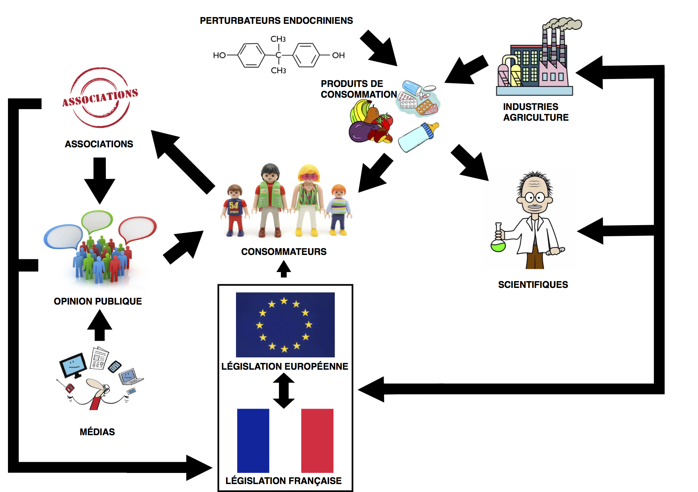

<html>
<head>

</head>
<body>

<article class="article">

<h1 style="text-align:center;" > Dans quelle mesure les perturbateurs endocriniens ont-ils remis en question la réglementation sanitaire basée sur les principes traditionnels de la science ? </h1>

"La question des perturbateurs endocriniens est une question majeure de santé publique."François Veillerette, fondateur de l'association Générations Futures

<a data-scroll id="tonextsection" href="https://controverses.github.io/perturbateurs-endocriniens/#introduction">

</a>

  <h1 style="text-align:center;">Introduction</h1> 
  
  

  Les perturbateurs endocriniens sont des substances chimiques d’origine naturelle ou anthropologique (issues des activités humaines) qui viennent interférer avec le système endocrinien des animaux et des Hommes, c’est-à-dire l’ensemble des organes qui sécrètent et régulent les hormones de l’organisme. Les hormones sont des molécules destinées à  transmettre des messages chimiques à l’organisme afin d’assurer son bon fonctionnement, celles-ci sont principalement transportées par la circulation sanguine. Ainsi, les perturbateurs endocriniens en imitant, en bloquant ou en perturbant l’action des hormones naturelles peuvent avoir des effets néfastes sur l’organisme et provoquer des anomalies métaboliques ou comportementales. Les hormones sont des molécules qui agissent à très faibles doses et ainsi, les perturbateurs endocriniens aussi ce qui en font des substances d’autant plus nocives. Avec le boom de l’industrie chimique des années 50 et l’explosion de notre utilisation de produits chimiques, les perturbateurs endocriniens sont aujourd’hui présents dans tous les écosystèmes de la planète et posent des problèmes importants tant pour les espèces animales que pour les Hommes. 
  
  

<a data-scroll id="tonextsection" href="https://controverses.github.io/perturbateurs-endocriniens/#sommaire">

</a>

<map name="sommairemap">
  <area shape="rect" coords="485,30,890,194" alt="Perturbateurs endocriniens" href="https://controverses.github.io/perturbateurs-endocriniens/scientifiqueaupublic.md/decouvertesscientifiques.html">
</map>

 
 

   
</article>

</body>
</html>
