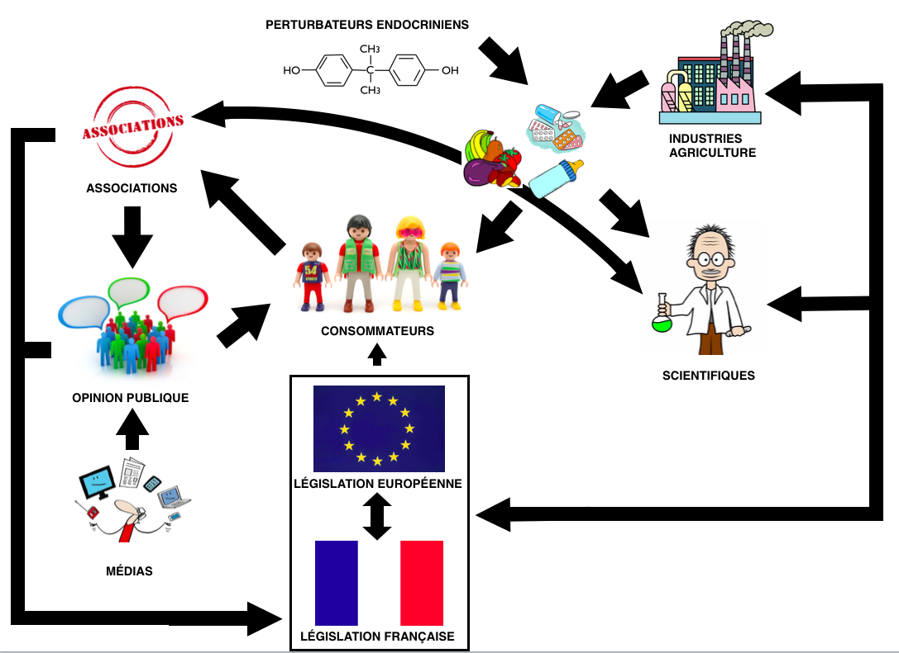

<html>
<head>

</head>
<body style="background-color:rgb(139, 201, 222);">

<article class="article">

  <h1 style="text-align:center; align:justify;">Introduction</h1> 

<a href="https://controverses.github.io/perturbateurs-endocriniens/annexe.md/fichesacteurs.html">Dr Patrick Levy</a>, toxicologue, médecin conseil de l'Union des Industries Chimiques (UIC) a expliqué lors d’un <a href="http://www.rfi.fr/emission/20160705-cerveau-pollution">débat</a> avec <a href="https://controverses.github.io/perturbateurs-endocriniens/annexe.md/fichesacteurs.html">Barbara Demeneix</a>:

<blockquote>"La définition des perturbateurs endocriniens de l’OMS fait consensus pour les scientifiques, mais <strong>pas consensus pour un contexte réglementaire</strong>, elle n’est pas suffisamment discriminante. Elle est beaucoup trop large. Elle ne permet pas de différencier les perturbateurs avérés de ceux qui n’ont qu’une activité biologique réversible et sans effet durable. On ne peut pas faire cette discrimination. Nous souhaitons un cadre réglementaire efficace.”</blockquote>

Les perturbateurs endocriniens sont des <strong>substances chimiques</strong> d’origine naturelle ou anthropologique (issues des activités humaines) qui viennent interférer avec le <strong>système endocrinien</strong> des animaux et des Hommes, c’est-à-dire l’ensemble des organes qui sécrètent et régulent les hormones de l’organisme. Les hormones sont des molécules destinées à transmettre des messages chimiques à l’organisme afin d’assurer son bon fonctionnement et sont principalement transportées par la circulation sanguine. Ainsi, les perturbateurs endocriniens, <strong>en imitant, en bloquant ou en perturbant</strong> l’action des hormones naturelles, peuvent avoir des effets néfastes sur l’organisme et provoquer des anomalies métaboliques ou comportementales.
 

De même que les hormones, les perturbateurs endocriniens agissent <strong>à de très faibles doses</strong>, ce qui en fait des substances d’autant plus nocives. Avec le boom de l’industrie chimique des années 50 et l’explosion de notre utilisation de produits chimiques, les perturbateurs endocriniens sont aujourd’hui <strong>présents dans tous les écosystèmes</strong> et posent d’ importants problèmes tant pour les espèces animales que pour les Hommes.

 Si l’émergence du fait scientifique des perturbateurs endocriniens date de la fin des années 1980 aux États-Unis, et du milieu des années 1990 pour la France, la <strong>prise de conscience des enjeux sanitaires</strong> qu’ils posent n'est réellement survenue qu’à partir du milieu des années 1990. Si les recherches scientifiques sur le sujet se poursuivent, il y a consensus scientifique quant à l’existence, la définition scientifique et les mécanismes d’action des perturbateurs endocriniens. En revanche, la controverse entourant les perturbateurs endocriniens se situe au niveau de leur réglementation. En effet, face aux dangers qu'ils posent, une réglementation de leur production et de leur utilisation semble indispensable afin de protéger l’environnement et les populations de leur exposition. Pourtant l’Union Européenne rencontre des <strong>difficultés à légiférer sur la question</strong>. De même, le gouvernement français, bien qu’il soit un des pays moteurs en termes de législation et de recherche sur les perturbateurs endocriniens, doit souvent modérer ses prises de position, en prenant en compte les intérêts des entreprises.
 

Ces difficultés à réglementer la question des perturbateurs endocriniens sont issues des problématiques scientifiques que ces substances ont posées. En effet, la façon de les appréhender <strong>ne peut se faire à l'aide des outils scientifiques standards</strong>, et de fait la recherche dans ce  domaine nécessite un renouveau des principes de base de la toxicologie. Les institutions ne peuvent donc plus s’appuyer sur les normes scientifiques traditionnelles sur lesquelles ils ont longtemps basé leur réglementation en matière de protection des populations et de l'environnement. Cette constatation induit le questionnement suivant :

<h1 align="justify">Dans quelle mesure les perturbateurs endocriniens ont-ils remis en question la réglementation sanitaire basée sur les principes traditionnels de la science ?</h1>

Dans un premier temps, nous retracerons l’établissement du fait scientifique des perturbateurs endocriniens et son émergence dans l’espace public. A la lumière de ces informations, nous analyserons les difficultés rencontrées par l’Union européenne quant à la réglementation de ces substances chimiques. Nous tenterons également de faire l’état de la controverse et de ses acteurs au niveau français. Enfin, nous étudierons comment face aux échecs des institutions réglementaires la société civile s'est ré-approprié la problématique et de quelle manière elle traite la question des perturbateurs endocriniens.

 <strong>Dans quel cadre s'inscrit notre projet ?</strong>

<strong align="center">Comparaison de la proportion de recherche entre le mot « endocrine disrupters » (en rouge) et le mot « perturbateurs endocriniens » (en bleu) pour pouvoir comparer l’intérêt en France à l’intérêt dans d’autres pays (en particulier les Etats Unis)</strong>  

<em>Qui sommes nous ?</em>  

Nous sommes quatre étudiantes en deuxième année de Double cursus « Sciences et Sciences Sociales » à Sciences Po Paris et Paris VI. Nous avons réalisé ce projet dans le cadre du cours « Étude de controverses » enseigné par Vincent Lepinay et Thomas Tari.   

<em>Pourquoi avoir choisi le sujet de la réglementation des perturbateurs endocriniens à l’échelle européenne et française ?</em>  

Nous avons décidé de nous pencher sur ce sujet car c’est une controverse qui fait intervenir des disciplines diverses et implique une multitude d’acteurs. De plus, c’est un sujet d’actualité, par exemple, on observe depuis décembre 2016 que le nombre de recherches Google sur les perturbateurs endocriniens a très fortement augmenté en France, avec un pic en Février 2017 alors qu’il n’a pas augmenté aux Etats Unis. Cette hausse de l’intérêt est certainement dû entre autres à deux événements majeurs : 

<ul>
<li>L’échec de la Commission Européenne en février 2017 à adopter une réglementation définissant les perturbateurs endocriniens.</li>
<li>La remise d’un rapport de Générations Futures, en Février 2017, sur la présence de perturbateurs endocriniens dans les cheveux de personnalités du monde de l’écologie.</li></ul>

    

Comparaison de la proportion de recherche entre le mot « endocrine disrupters » (en rouge) et le mot « perturbateurs endocriniens » (en bleu) pour pouvoir comparer l’intérêt en France à l’intérêt dans d’autres pays (en particulier les Etats Unis)

 

   
</article>
</body>
</html>
