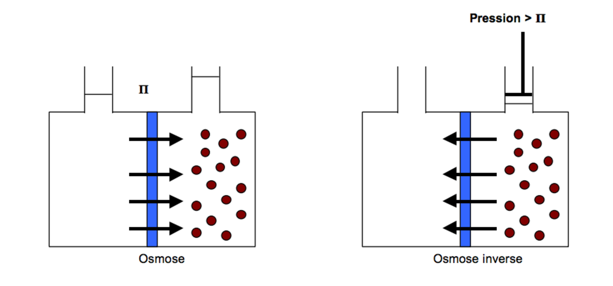
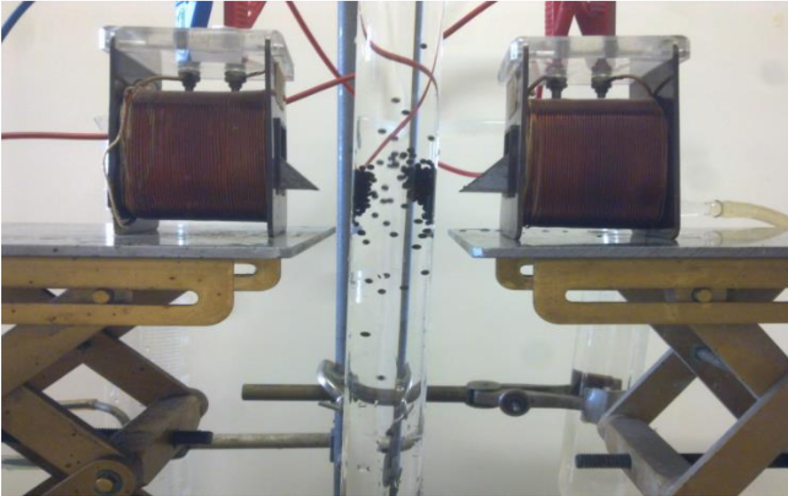

<html>
<head>
<style> 

.flex-container {
    display: -webkit-flex;
    display: flex;  
    -webkit-flex-flow: row wrap;
    flex-flow: row wrap;
    text-align: center;
}

.flex-container > * {
    padding: 15px;
    -webkit-flex: 1 100%;
    flex: 1 100%;
}

.article {
    text-align: left;
}

/* Style The Dropdown Button */
.dropbtn {
    background-color: #0B3B39;
    color: white;
    padding: 16px;
    font-size: 16px;
    border: none;
    cursor: pointer;
}

/* The container 
 - needed to position the dropdown content */
.dropdown {
    position: relative;
    display: inline;
}

/* Dropdown Content (Hidden by Default) */
.dropdown-content {
    display: none;
    position: absolute;
    background-color: none;
    min-width: 160px;
    box-shadow: 0px 8px 16px 0px rgba(0,0,0,0.2);
    z-index: 1;
}

/* Links inside the dropdown */
.dropdown-content a {
    color: white;
    padding: 12px 16px;
    text-decoration: none;
    display: block;
    position: relative;
}

/* Change color of dropdown links on hover */
.dropdown-content a:hover {background-color: powderblue}

/* Show the dropdown menu on hover */
.dropdown:hover .dropdown-content {
    display: block;
    position: absolute;
}

/* Change the background color of the dropdown button when the dropdown content is shown */
.dropdown:hover .dropbtn {
    background-color: #0B3B39;
}

footer {background: #aaa;color:white;}

@media all and (min-width: 768px) {
    .article {-webkit-flex:5 0px;flex:5 0px;-webkit-order:2;order:2;}
    footer {-webkit-order:3;order:3;}
}

<body style="background-color:powderblue;">

<article class="article">
  <h1>Peut-on vraiment se passer des perturbateurs endocriniens?</h1>
 
<strong>Les perturbateurs endocriniens sont partout
</strong>
 
Dans une étude publiée fin avril, l’UFC-Que choisir insiste sur l’omniprésence des perturbateurs endocriniens dans notre environnement. Comme l’explique le docteur Gérald Kierzek «la protection n’est pas simple puisque les perturbateurs endocriniens sont partout ». Les perturbateurs endocriniens seraient présents dans plus de 400 produits du quotidien  (aliments, médicaments, produits ménagers, cosmétiques...).

  

Cliquer sur les différents lieux de la maison! 

<strong> Comment s'en protéger? 
</strong>

Barbara Demeneix s'intéresse particulièrement à l’impact des perturbateurs endocriniens sur les femmes enceintes et prouve la manière dont il impact le développement du cerveau de leurs enfants. Elle conseille à ces femmes de:  
- manger bio 
- utiliser le moins de plats préparés contenus dans des plastiques 
- de ne surtout pas faire réchauffer au micro ondes des plats contenus dans les plastiques  
- éteindre les appareils électronique la nuit (ordinateur, portable, télévision..)  
- ne pas utiliser des crèmes et cosmétique qui contiennent du parabène et des phtalates 
- éviter les poêles en téflon mais plutôt des poêles en acier 

   
   
 Jean-Paul Curtay, nutrithérapeute donne différents conseils à retrouver sur le site :<a href="https://www.wedemain.fr/Les-perturbateurs-endocriniens-sont-partout-comment-les-eliminer-de-nos-vies_a1393.html ">Ici</a> 

   
  
<strong>→Alimentation: 
</strong> 

- Ne pas consommer de poissons grands prédateurs comme requin, espadon, mérou…trop pollués, ne pas consommer plus d’une fois par semaine les moyens prédateurs comme le thon et la daurade  

- Ne jamais consommer de foies ou d’abats de bêtes non biologiques et leurs dérivés (foie gras, pâtés…).  

- Préférer les produits bios (les trois produits non bio les plus riches en perturbateurs endocriniens sont les laitues, les tomates, les concombre).  

- Les agressions thermiques, en particulier au barbecue, peuvent aussi engendrer des perturbateurs endocriniens carcinogènes comme le benzopyrène. Il faut éviter le contact avec les braises qui devraient être non pas sous les aliments à cuire, mais à côté (barbecues verticaux) 

- Ne pas utiliser les verres en polystyrène (un dérivé benzénique) pour les boissons chaudes.  

<strong>→Médicaments et cosmétiques 
</strong> 
- Ne pas acheter de cosmétiques contenant des parabènes.  

- Eviter les médicaments gastro-résistants  

- Refuser les médicaments contenant du toluène – aussi reprotoxique -, en particulier plusieurs présentations courantes en France de vitamine D.  
 

  
<strong>→Vêtements, Logements, produits ménagers, d’entretien, désodorisants: 
</strong>  

- Réduire au maximum les contreplaqués et moquettes, tissus, qui contiennent des retardateurs de flamme et émettent des poussières, les poussières étant des concentrateurs de perturbateurs endocriniens qui sont ainsi inhalés.  

- S’il y a une moquette : la nettoyer une fois par mois à la vapeur 

- Ne pas utiliser d’insecticides chimiques.  

- Exiger des pompes à essence un bouchon hermétique qui empêche d’inhaler les vapeurs d’essence car elles contiennent encore en France 1% de benzène, qui est génotoxique et augmente les risques de leucémies.  

<strong>→Travail 
</strong>  

- Se renseigner auprès de la Médecine du Travail sur la présence ou non de perturbateurs endocriniens sur son lieu de travail et obtenir la qualité d’aération et de protection adaptée.   

<strong> Comment s'en protéger? 
</strong>

             WatchFrog: La biologie au service de la détection des perturbateurs endocriniens 

La directive 2000/60/CE appliquée par l’Union Européenne depuis le 22 octobre 2000 a pour objectif de “mettre fin à la détérioration de l’état des masses d’eau pour parvenir au bon état des rivières et eaux souterraines”. En particulier, cette directive impose à chaque état d'analyser l’eau de leur bassin et d’élaborer des stratégies pour l’améliorer. Compte tenu de l’importance accrue du problème des perturbateurs endocriniens, il a donc fallu créer des tests pour les détecter. 
Ainsi en 2006, deux chercheurs du CNRS (Barbara Demeneix et Grégory Lemkine) créent une méthode unique et innovante pour détecter les perturbateurs endocriniens et fondent alors une start-up, WatchFrog. 
L’idée est d’utiliser des larves d’amphibiens qui deviennent fluorescentes en présence de micropolluants. Le laboratoire utilise en effet des larves et des alevins au stade ‘post-oeuf’ (entre 0 et 8 jours, qui ne ressentent donc pas la douleur) dotés de bio-marqueurs qui s’allument au contact de perturbateurs endocriniens. Cette technique permet de plus de déterminer l’effet indésirable d’un ‘cocktail’ de différentes molécules. 

L’idée est d’utiliser des larves d’amphibiens qui deviennent fluorescentes en présence de micropolluants. Le laboratoire utilise en effet des larves et des alevins au stade ‘post-oeuf’ (entre 0 et 8 jours, qui ne ressentent donc pas la douleur) dotés de bio-marqueurs qui s’allument au contact de perturbateurs endocriniens. Cette technique permet de plus de déterminer l’effet indésirable d’un ‘cocktail’ de différentes molécules. 
Le laboratoire testent les échantillons envoyés par les entreprises et analyse sur le produit présente des perturbateurs endocriniens et si ces derniers sont à une dose réellement problématique et néfaste pour l’homme. Cette méthode est utilisée pour analyser l’eau mais également les aliments, les produits cosmétiques et les emballages. 

L’entreprise travail maintenant en partenariat avec Véolia, et a mis sur le marché une FrogBox: une boîte avec des têtards directement utilisable par le client. La FrogBox est disponible auprès des municipalités. 

<a href="http://www.watchfrog.fr/">Site Watchfrog </a> 

 <a href="http://eur-lex.europa.eu/resource.html?uri=cellar:5c835afb-2ec6-4577-bdf8-756d3d694eeb.0001.02/DOC_1&format=PDF">Directive européenne 2000/60/CE:  </a> 

<strong> Peut-on les remplacer? 
</strong> 

La première méthode pour se protéger des perturbateurs endocriniens consiste évidemment en une modification de nos habitudes de consomations et d’autres gestes simples disponibles sur <a href="https://www.wedemain.fr/Les-perturbateurs-endocriniens-sont-partout-comment-les-eliminer-de-nos-vies_a1393.html ">ce lien.</a> 

Toutefois, certaines molécules ont des propriétés particulières et essentiels dont on ne peut pas se passer. Les scientifiques sont donc à la recherche de solutions pour les remplacer par des molécules aux mêmes propriétés. 

→Une alternative aux phtalates:  
Les phtalates sont un groupe de produits chimiques utilisés principalement comme plastifiants des matières plastiques: il est donc ajouté aux matières plastiques comme le PVC pour le rendre plus souple, flexible et plus résistant. Ils sont essentiels à la fabrication des bottes, des textiles imperméables, des jouets ou encore des emballages alimentaires.. mais ils sont aussi utilisés dans les médicaments et les amalgames dentaires. 

Des expériences sur les animaux ont prouvé que les phtalates en concentration élevés conduisent à une baisse de la fertilité, à une atrophie testiculaire ou encore à une réduction du poids du foetus. 
Depuis 2005, l’AGRICE finance un programme de recherches sur les alternatives possibles aux phtalates. Il existe en effet d’autres composés comme les monoglycerides acétylés, les esters d’acide gras, citrates d’alkyl (triéthyl citrate), l’adipate de di-2-éthylhexyle, les phosphates d’alkyle-aryle mais ces produits sont trop chers, ne permettent pas d’obtenir une souplesse aussi importante et peuvent pour la plupart être aussi néfaste que les phtalates. 
Des start-ups biotechnologiques comme Novance, Roquette ou Danisco proposent des alternatives végétales qui pour l’instant semble remplir les caractéristiques souhaitées. 

Certaines industries ne préfèrent pas attendre une réglementation plus stricte de l’UE et se tournent dès maintenant vers la production et la vente de produits sans perturbateurs endocriniens. Ils basent leur stratégie marketing sur la dangerosité des phtalates, comme le montre la vidéo ci-dessous sur l’entreprise ayant lancé il y a peu une gamme de vaisselle jetable biodégradable en bambou ou en pulpe de canne à sucre. 

→ Une alternative aux parabènes:  
Les propriétés antibactérienne et antifongique du parabène en font un conservateur idéal pour les produits cosmétiques, les aliments et les médicaments. En 2010, leur utilisation est controversée : ils activent les récepteurs des oestrogènes, et agissent possiblement sur la fertilité et les tumeurs comme le cancer du sein. Le benzyl alcool DHA aussi appelé Cosgard ou Geogard 221 est un produit de substitution couramment utilisé. Il empêche notamment le développement de levures et moisissures dans les produits contenant de l’eau et ai certifié “écologiquement correctes” selon les normes de l’UE. 

<a href="http://www.consoglobe.com/geogard-221-alternative-aux-parabens-cg ">Plus d'informations sur ce lien.</a> 

<strong> Remarque:
</strong> 

Dans les cosmétiques en particulier, une mention “sans paraben” ne garantit pas de l’absence de substances tout aussi dangereuse comme le methylisothiazolinone. 

<strong> Conclusion: 
</strong>  

Aujourd’hui, on constate qu’il n’existe pas suffisamment de recherches sur les produits de substitution et que la plupart de ceux qui existent sont souvent aussi dangereux que les produits de base.  Ce manque peut être expliqué par la mauvaise volonté des industriels mais aussi des parlementaires européens. En effet, comme d’autres facteurs environnementaux peuvent également expliquer l’augmentation de certaines pathologies, les lobbies industriels empêchent les législateurs d’instaurer une réglementation plus stricte. Il y a quelques années, les députés français souhaitent interdire tout simplement les produits contenant des phtalates et des parabènes mais l’idée fut abandonnée sous la pression des industrielles de la chimie et du plastique. De plus, tant qu’il n’existe pas de produits de substitution satisfaisant il est très dur d’invoquer le principe de précaution et d’interdire les produits dangereux car cela entraînerait de grave répercussions sur l’économie du pays. Or on constate que les industriels rechignent souvent à investir dans le secteur Recherche et Développement dans le but de se préparer à une prochaine interdiction car cela est très coûteux. De plus, pourquoi investir dans la recherche de produit moins toxiques mais beaucoup moins efficaces tant qu’il n’existe pas de réglementation stricte? 

<strong>Peut-on les supprimer? 
</strong>   

Il existe de nombreuses méthodes pour éliminer les perturbateurs endocriniens contenus dans l’eau. Philippe Bréant, directeur du programme Eau Potable à Veolia expliquait dans une conférence en janvier 2012 les différentes méthodes actuellement utilisées.  

Au sein de l’Union Européenne, seule une partie des produits chimiques sont actuellement contrôlés mais la législation s’intensifie d’années en années. Une cinquantaine de paramètres, comme les bactéries (indiquant une contamination fécale), les pesticides et les nitrates, sont donc à surveiller obligatoirement.  

La clarification est l’étape du cycle de l’eau qui permet d’éliminer les principales matières organiques dissoutes d’une eau brute. En fonction des polluants présents dans l’eau, les méthodes utilisées diffèrent. L’épuration de l’eau se termine par la filtration, qui permet de supprimer la plupart des perturbateurs endocriniens. 3 matériaux sont fréquemment utilisés: le sable (à base de silice qui permet la rétention des particules), l’anthracite (à base de carbone obtenu par calcination de matière végétale) et le charbon actif (également à base de carbone). 
Toutefois, la filtration se fait de plus en plus au moyen de membranes. Cette technique est plus efficace mais elle reste onéreuse. 
Les membranes sont utilisés pour réaliser une osmose inverse.  

Explication de l’osmose: 
Supposons qu’une membrane fine et semi-perméable sépare deux liquides. Les concentrations des deux solutions ne sont pas identiques de chaque côté de la paroi, créant ainsi une pression osmotique.  On observe alors un transfert de solvant de la solution la moins concentrée vers la solution la plus concentrée. En effet, la membrane va laisser passer le solvant pour équilibrer les concentrations. 

L’osmose inverse consiste à inverser le passage du solvant en appliquant une pression supérieure à la pression osmotique du côté de la solution à traiter, c’est à dire, dans notre cas, l’eau brute. Cette technique permet de contenir les polluants (perturbateurs endocriniens) à l'extérieur de la paroi (à droite sur le schéma de droite ci-dessous) et d’obtenir une eau filtrée à gauche. 

<a href="http://www.fndae.fr/documentation/PDF/fndae14.pdf ">Plus d'informations sur ce lien.</a> 
  

De nombreuses chimistes travaillent aujourd’hui sur des solutions de traitement de l’eau plus rapides et efficaces. Nous avons rencontré Agnès Bée, directrice adjointe de l’UFR de Chimie de l’Université Pierre et Marie Curie, qui nous a présenté un prototype originale afin d’éliminer les perturbateurs endocriniens de notre eau. Layala Obeid, une de ces étudiantes à présenter récemment une thèse sur cette nouvelle méthode qui utilisent des nouveaux matériaux magnétiques appelés “magsorbants” pour extraire les polluants. 

Ces “magsorbants” sont des billes magnétiques de taille millimétrique constituée d’alginate et de chitosane (bio-polymères végétales et de faibles coûts) dans lesquelles sont encapsulées des nanoparticules magnétiques.

Ces polymères ont des propriétés absorbantes et permettent de capter les différents polluants présents dans l’eau. Les billes étant magnétiques elles peuvent être retirés du milieu à dépolluer très facilement au moyen d’un gradient de champ magnétique (ou plus simplement d’un aimant). 
 

<a href="https://tel.archives-ouvertes.fr/tel-01207492/document">Lien vers la thèse.</a> 
  

</body>
</html>

<footer>Copyright &copy; The Best</footer>

<body>

