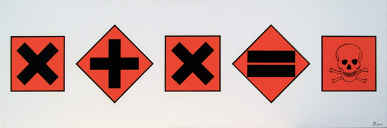
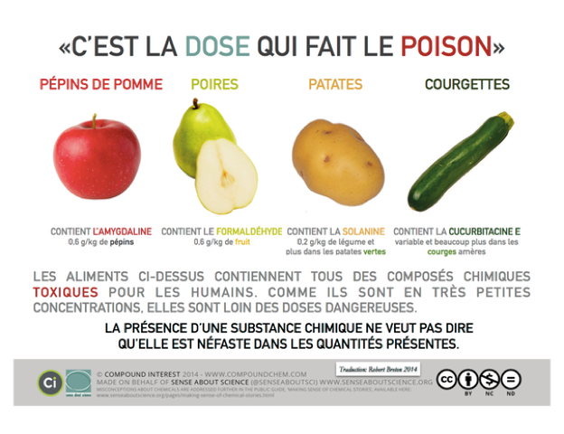
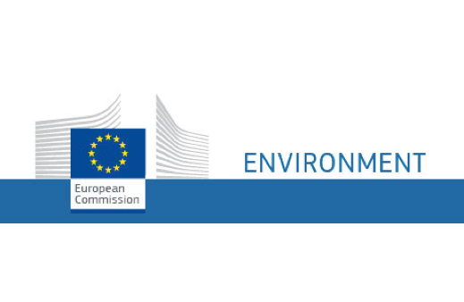
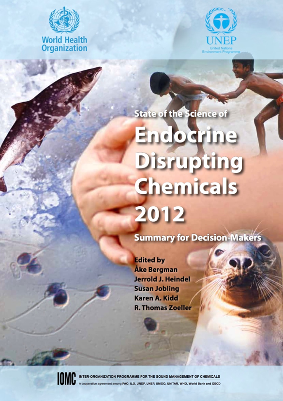
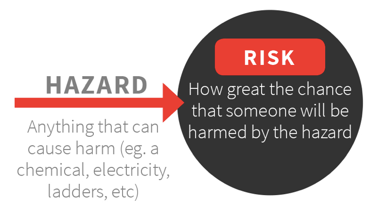
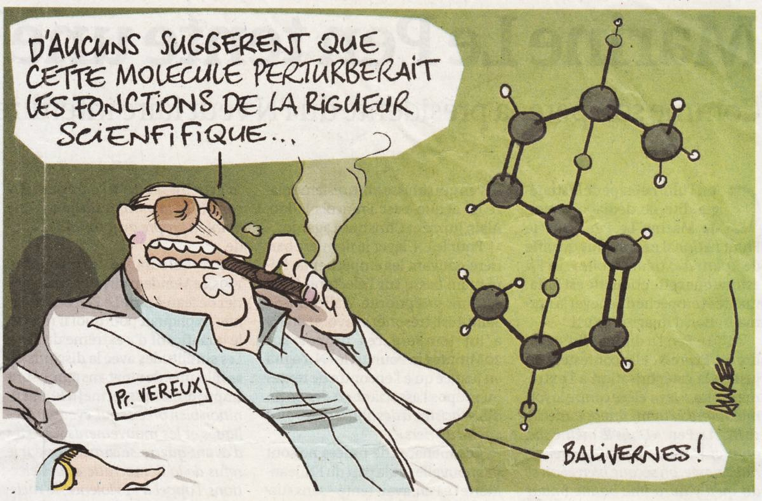
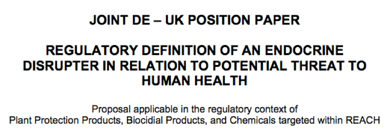
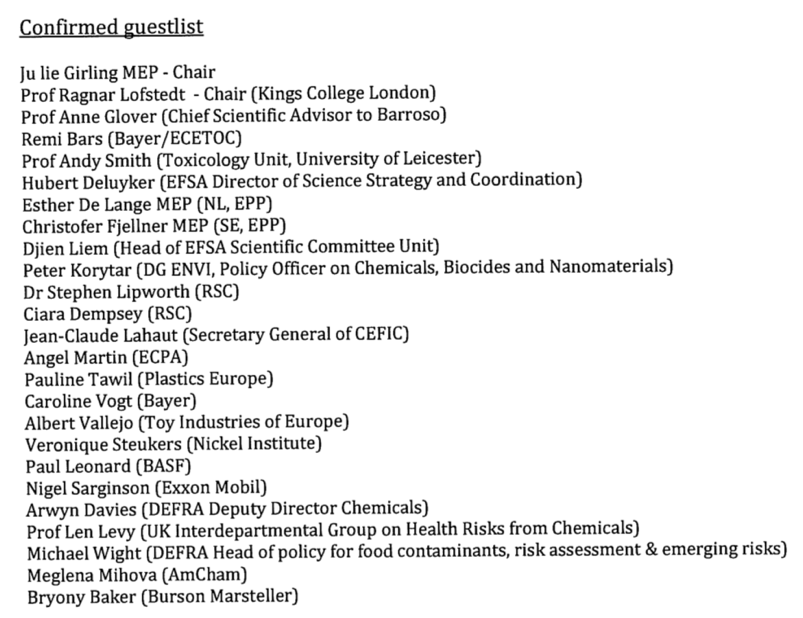
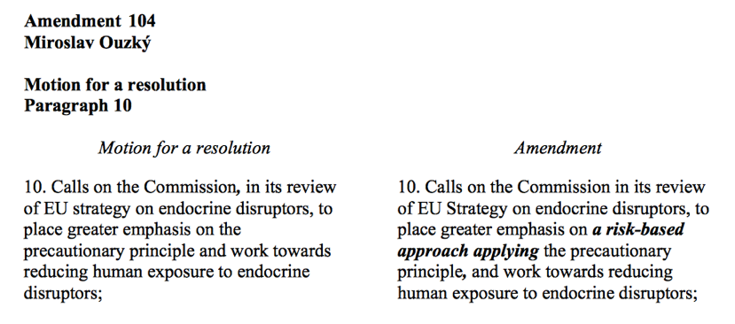

<html>
<head>

</head>

<body style="background-color:#9A85A3;">

<article class="article">

<ul>
  <li><a href="#qualification">Qualification et quantification du risque</a></li>
  <li><a href="#critères">Etablir des critères pour réglementer</a></li> 
</ul>

  <h1 align="center">De rapports en contradiction à des difficultés de réglementation</h1>
  
  

  
  
 
 <strong></strong> Si elle n’est pas scientifique, la controverse autour des perturbateurs endocriniens est bien règlementaire.
La définition et les critères permettant d’identifier les perturbateurs sont en débat au sein de l’Union Européenne depuis une dizaine d’années déjà, et le dossier n’est toujours pas clos. Du fait du marché unique, les règlementations concernant les produits de consommation se font à l’échelle européenne. Elles sont d’abord en discussion au sein de la Commission européenne, qui dispose de plusieurs groupes d’experts et interagit avec les différentes parties prenantes : entreprises, organisations non gouvernementales, Etats membres… Lorsqu’un semblant de consensus se dessine, la Commission élabore un projet de loi qu’elle soumet au Parlement afin qu’il soit voté. Pourtant, dans le cas des perturbateurs endocriniens, ce n’est pas si simple. Le processus est bloqué au niveau de l’identification de ce type de substances. Dès la fin des années quatre-vingt-dix, le Parlement Européen et la Commission de la Communication au Conseil adoptent une stratégie communautaire concernant les perturbateurs endocriniens, constatant « l’inadaptation des outils réglementaires pour protéger les citoyens des effets potentiellement néfastes des perturbateurs endocriniens ». Ils présentent dans le même temps une série de mesures devant être échelonnées sur une dizaine d’années. Dès l’année 2000, la Commission Européenne établit une liste de 533 substances suspectées d’être des perturbateurs endocriniens. Mais très vite, des obstacles surgissent et repoussent les échéances.
 
  
  <h2>Qualification et quantification du risque: des rapports en contradiction</h2> 
  
  
 Les perturbateurs endocriniens sont présents dans une quantité impressionnante de produits du quotidien : pesticides, cosmétiques, plastiques, alimentaire… <strong> <a href="https://controverses.github.io/perturbateurs-endocriniens/scientifiqueaupublic.md/vulgarisationscientifique.html">(lien vers la partie qui aborde le sujet)</a> </strong>  Jusqu’ici, les scientifiques ont identifié pas moins d’un millier de substances qui sont probablement des perturbateurs, et disent que la liste est sûrement plus importante en réalité. Aussi, déterminer l’effet de chacune de ces molécules sur la santé humaine est particulièrement compliqué. Pourtant, il existe dans la communauté scientifique un consensus pour dire que ces substances perturbent le système hormonal et sont à l’origine de la recrudescence de certaines maladies. 

  
  <h4> Absence de consensus sur la régulation </h4>
  
  
 Pourtant, la Commission parle d’une <strong> absence de consensus</strong> à l’intérieur de la communauté scientifique <strong> <a href="https://controverses.github.io/perturbateurs-endocriniens/annexe.md/commission.md">(lien vers le questionnaire)</a> </strong> En fait, cette absence de consensus concerne la régulation à adopter pour les perturbateurs, c’est-à-dire lesquels interdire et de quelle manière (en établissant un seuil par exemple), et ces difficultés sont provoquées par la remise en cause des principes toxicologiques de base par les perturbateurs endocriniens.  
Pour cause, si l’on sait que les molécules catégorisées comme « perturbateurs endocriniens » présentent un danger pour la santé humaine, on ne sait pas à quel niveau. Cela est notamment dû à ce que l’on appelle <strong>l’effet cocktail</strong> : lorsque plusieurs perturbateurs endocriniens sont présents et agissent sur un individu, leur effet sur le système endocrinien peut être démultiplié. 

  

De plus, un être humain est confronté à un nombre infini de substances pouvant avoir un impact sur son système hormonal au cours de sa vie et l’émergence de maladies liées à la perturbation du système endocrinien se constate sur le très long terme. Par conséquent, dans son 
 <a href="http://www.who.int/ipcs/publications/en/toc.pdf">rapport de 2002 </a> , l’OMS souligne que : 

<blockquote>« Il pourrait ne jamais être possible d’avoir la certitude qu’une exposition spécifique cause une maladie ou dysfonction spécifique ».</blockquote>

 Cependant, le rapport attire l’attention sur le fait que les perturbateurs endocriniens sont susceptibles d’altérer la susceptibilité d’un individu à différents types de maladies tout au long de sa vie du fait de leur capacité à interagir avec le développement et le fonctionnement des organes et tissus.  
Aussi, l’argument traditionnel « la dose fait le poison » est écarté par de nombreux scientifiques dans le cas des perturbateurs endocriniens, et tendrait à être remplacé par « le temps fait le poison », l’exposition sur le long terme étant davantage à l’origine des perturbations.  
 
 

  

Pourtant, selon la Commission européenne, il existe toujours des doutes au niveau de la recherche scientifique quant à l’existence de réponses non monotoniques (NMDR), c’est-à-dire l’existence même de l’effet cocktail. En effet, les sources utilisées par la Commission sont extrêmement diverses et se contredisent. 
 

<h4> Un consensus sur la définition </h4>

 La Commission s’intéresse au problème depuis 1996 <strong> <a href="https://controverses.github.io/perturbateurs-endocriniens/annexe.md/chronologie.html">(voir chronologie)</a>  </strong> , soit cinq ans après l’émergence du sujet dans la communauté scientifique. Dès le début, elle a organisé plusieurs workshops à l’échelle européenne, a lancé de nombreux <a href="http://ec.europa.eu/environment/chemicals/endocrine/pdf/sec_2011_1001.pdf">programmes de recherche </a> et a mis en place différents groupes de réflexion.  

Par exemple, en avril 2003, le <strong>CREDO cluster</strong> voit le jour afin de mener 4 projets qui permettraient d’approfondir les connaissances scientifiques sur le sujet pour fournir une base de données à la Commission. Il regroupe 63 laboratoires pour un budget de 20 millions d’euros. A partir de juillet 2004, <strong>le projet REPROTECT</strong> associe 32 groupes de recherche européens parmi lesquels le Joint Research Center (JRS) de la Commission, dans un but de développement de méthodes de détection in vitro de produits toxiques, et pour un budget atteignant 13.2 millions d’euros au bout de 5 ans. La Commission investit également 14 millions d’euros dans <strong>le projet CASCADE</strong> regroupant 24 groupes de recherche provenant de neuf Etats-membres et visant à permettre une coordination durable de la recherche autour des résidus chimiques dans l’alimentation, en particulier des perturbateurs endocriniens.  

 

  

En 2009, la Direction Générale de l’Environnement (DG ENV) est désignée chef de file pour la prise en charge du sujet. Elle prend alors différentes mesures afin de s’informer davantage sur le sujet, en commençant par la mise en place de plusieurs groupes d’experts : en 2010, un <strong> <a href="https://controverses.github.io/perturbateurs-endocriniens/annexe.md/fichesacteurs.html">groupe ad-hoc</a></strong> voit le jour, constitué de 40 experts provenant des différents Etats-membres, d’agences publiques, de centre de recherche, d’autres DGs et de l’EFSA. L’année suivante, le <strong> <a href="https://controverses.github.io/perturbateurs-endocriniens/annexe.md/fichesacteurs.html">JRS</a> </strong>  monte un Expert Advisory Group (ED EAG) destiné à apporter des éléments techniques sur le sujet. Enfin, elle commande un rapport à un groupe de chercheurs de différentes universités britanniques (dont les noms se trouvent sur le rapport) mené par le professeur <a href="http://www.brunel.ac.uk/people/andreas-kortenkamp">Andreas Kortenkamp</a>, un spécialiste de la question, <a href="http://ec.europa.eu/environment/chemicals/endocrine/pdf/sota_edc_final_report.pdf">publié</a> en janvier 2012.
La même année, <strong> l’Organisation Mondiale de la Santé </strong> (OMS/WHO – World Health Organization) publie un <a href="http://apps.who.int/iris/bitstream/10665/78102/1/WHO_HSE_PHE_IHE_2013.1_eng.pdf">rapport</a> récapitulant les connaissances scientifiques sur le sujet. Rapidement, un consensus se forme parmi les acteurs entourant la Commission autour de la définition des PE qu’il propose : 

<blockquote> Un perturbateur endocrinien est "une substance ou mélange exogène altérant une ou plusieurs fonction(s) du système endocrinien et causant en conséquence des effets adverses sur la santé d’un organisme intact, de sa progéniture ou de sous-populations " </blockquote>
 

 

  

 Cette définition sert de base au groupe ED EAG, qui a posé comme <a href="https://eurl-ecvam.jrc.ec.europa.eu/laboratories-research/endocrine_disrupters/jrc-report-scientific-issues-identification-endocrine-disrupting-substances">éléments d'identification</a> d’un perturbateur endocrinien la <em> « démonstration d’un effet adverse pour lequel il existe une preuve convaincante d’un lien causal biologique plausible entre le mode d’action de la molécule et la perturbation du système endocrinien, et que celle-ci n’est pas une conséquence secondaire de la toxicité d’une autre substance non endocrine ». </em> 
 

<h4> Le véritable débat concerne l’identification et la réglementation des perturbateurs endocriniens</h4>

 Cependant, une fois la définition déterminée (c’est-à-dire qu’on sait de quoi on parle, en théorie), deux étapes supplémentaires s’imposent (ces trois étapes sont développées par le professeur Kortenkamp dans le <a href="http://ec.europa.eu/environment/chemicals/endocrine/pdf/sota_edc_final_report.pdf">rapport de 2012</a>) :

<ul>
<li> Comment <strong> identifier </strong> les perturbateurs endocriniens tels que définis ci-dessus (à l’aide de quels tests) ? </li>
<li> Comment traduire les résultats obtenus dans <strong>un cadre réglementaire </strong>(quels critères utiliser) ?</li>
</ul>

 Ces deux questions soulèvent des débats. La définition étant extrêmement vague, il est presque impossible d’identifier précisément les perturbateurs endocriniens. En effet, il est extrêmement compliqué de différencier les effets purement dus à un perturbateur de ceux liés au reste de l’environnement.  
En mars 2013, l’EFSA, une des principales agences de l’Union Européenne chargée de l’évaluation des risques au niveau alimentaire, publie un <a href="https://www.efsa.europa.eu/fr/press/news/130320">rapport</a> dénonçant le fait que les <strong>critères</strong> utilisés pour l’identification des perturbateurs endocriniens sont <strong>trop restrictifs</strong>. Partant des trois critères de définition d’un perturbateur endocrinien – induction d'un effet nocif, action endocrinienne et relation plausible entre les deux –, l'EFSA joue sur le fait qu'il est très difficile de distinguer un effet nocif d'un <strong>effet produisant une réponse physiologique</strong>. Ainsi, il ne serait pas possible de définir des critères spécifiques pour identifier des perturbateurs endocriniens, et chaque cas devrait être jugé séparément pour déterminer si un effet est une « modulation » ou un effet « nocif ». L’avis de l’EFSA soulève une difficulté : en faisant la distinction entre un effet nocif et un effet simplement physiologique, l'EFSA suggère que des mécanismes physiologiques peuvent protéger contre les effets de faibles doses et qu'un effet de courte durée n'est pas forcément néfaste. L’idée sous-jacente étant que l’organisme humain serait capable de <strong>s’adapter à une exposition aux perturbateurs</strong>, tant que celle-ci concerne une faible dose. Une même molécule pourrait donc être un perturbateur ou ne pas l’être selon la quantité dans laquelle elle est présente dans l’environnement d’un individu. 
Or, de nombreux scientifiques s’opposent à cette approche liant l’effet à la dose. Dans son <a href="http://ec.europa.eu/environment/chemicals/endocrine/pdf/sota_edc_final_report.pdf">rapport</a> publié en 2012, l’équipe du professeur Kortenkamp recommande l’abandon du <strong>critère de puissance</strong> comme déterminant éclairant la réglementation, notamment du fait de l’impossibilité de parvenir à un consensus quant à l’importance du danger des perturbateurs au sein de la communauté scientifique. Dans son article « <a href="http://www.pourlascience.fr/ewb_pages/a/article-perturbateurs-endocriniens-l-efsa-botte-en-touche-31501.php"> Perturbateurs endocriniens : l’EFSA botte en touche</a> », la scientifique Barbara Demeneix rappelle qu’au cours des premières semaines de développement d’un fœtus par exemple, <em> « il existe des moments clés du développement où une action sur le système hormonal de la mère, même transitoire, peut avoir des conséquences durables et irréversibles ». </em> 
 

 
 

<h2> Etablir des critères pour réglementer: hazard vs. moral risk</h2>

De ce débat visant à déterminer si le danger d’une exposition aux perturbateurs endocriniens est lié à la dose émerge une opposition qui sous-tend le débat existant au sein de la Commission : <strong>est-il possible de déterminer des seuils afin de réguler les Perturbateurs endocriniens </strong> ? En fait, le questionnement sous-jacent est le suivant : faut-il favoriser le principe de précaution en considérant que les effets des perturbateurs endocriniens sont probablement sous-estimés ou ne pas règlementer de façon outrancière en considérant que l’économie en pâtirait trop alors qu’on ne dispose pas d’informations assez fiables pour affirmer que les perturbateurs endocriniens sont dangereuxposent des problèmes sanitaires importants ? 
Cette tension se reflète dans les deux approches s’opposant autour de la mise en place de règlementations : l’approche <strong>risk-based</strong> (évaluation des risques) et l’approche <strong>hazard-based</strong> (suppression pour cause de danger). La première considère que la mise en place de seuils est nécessaire et que la réglementation doit être adaptée à la puissance/dose des produits et donc cibler les produits les plus dangereux, tandis que la deuxième considère que si l’inoffensivité d’un produit n’est pas démontrée, celui-ci doit être supprimé en se basant sur <strong>le principe de précaution</strong>. Aujourd’hui, la plupart des produits chimiques sont régulés au sein de l’Union Européenne selon une <a href="http://ec.europa.eu/environment/chemicals/endocrine/strategy/euapproach_en.htm">classification</a> en deux catégories : 

<ul>
<li> <strong>Hazard identification</strong> pour les produits présumés les plus dangereux selon des tests validés par l’OECD. </li>
<li> <strong>Risk assessment & risk management </strong>: vérification du risque présenté par une certaine substance puis en résulte une restriction dans les zones d’usage ou la quantité d’usage. </li>
</ul>

 

  

 Toutefois la Commission précise : 

<blockquote> « La perturbation endocrinienne n’est pour le moment pas abordée par ce système de classification [hazard identification], étant donné qu’il n’existe pas de méthodes agréées pour détecter si un produit chimique est un perturbateur endocrinien ».  </blockquote> 

 Cependant, on ne dispose pas non plus des outils nécessaires pour savoir s’il est possible d’établir ou non un seuil, selon le principe du NOAEL (<em>no observed adverse effect level</em>) qui définit ce seuil comme un niveau en-dessous duquel on n’observe aucun effet toxique sur la santé humaine. 
  

 Aussi, deux camps s’affrontent : le <strong>rapport Kortenkamp</strong> estime que du fait de la difficulté d’identifier les perturbateurs et du potentiel danger pour la santé humaine qu’ils présentent, ceux-ci doivent être considérés comme des <strong>CMR</strong> (carcinogenic, mutagenic and reprotoxic chemicals) pour lesquels on considère qu’ils représentent un danger et ce quelle que soit la quantité dans laquelle ils sont présents. Cette position est symbolisée par la <a href="http://www.brunel.ac.uk/__data/assets/pdf_file/0005/300200/The_Berlaymont_Declaration_on_Endocrine_Disrupters.pdf">déclaration de Berlaymont de 2013</a>, signée par 89 scientifiques : elle dénonce une réglementation européenne inadéquate du fait qu’elle ne prend pas en compte les méthodes internationalement approuvées dans la communauté scientifique. Elle ignore le fait que certains perturbateurs peuvent agir sans seuil, provoquant des perturbations à toute concentration. 
Cette approche selon le principe de précaution, soutenue par la plupart des organisations gouvernementales, est également défendue par l’Endocrine Society <strong> <a href="https://controverses.github.io/perturbateurs-endocriniens/annexe.md/fichesacteurs.html">(accès à la fiche) </a></strong> , une société scientifique internationale dédiée à la recherche en endocrinologie, dans son <a href="https://www.researchgate.net/publication/286453768_EDC-2_The_Endocrine_Society's_Second_Scientific_Statement_on_Endocrine-Disrupting_Chemicals">article</a> de 2015 : 

<blockquote> « Un nombre grandissant d’études épidémiologiques révèle des liens entre la présence des perturbateurs endocriniens et une variété de maladies ». </blockquote>

<blockquote> « Une approche précautionneuse est nécessaire pour limiter l’exposition aux perturbateurs endocriniens ». </blockquote> 

<blockquote> « Les principes fondamentaux des perturbateurs endocriniens démontrent pourquoi il est impossible de définir la « puissance » d’un perturbateur, pourquoi il est impossible de définir des seuils d’action, et pourquoi on ne peut ignorer le fait que la réponse du corps humain face aux perturbateurs est non linéaire malgré que ce point soit fortement controversé ».  </blockquote> 

 Le CREDO cluster aboutit aux mêmes conclusions, c’est-à-dire que l’approche conventionnelle permettant d’estimer des niveaux pour lesquels on n’observerait aucun effet indésirable sur la santé est inadéquate dans le cas des perturbateurs endocriniens. Un <a href="http://ec.europa.eu/environment/chemicals/endocrine/pdf/sec_2011_1001.pdf">rapport</a> de la Commission résumant la conclusion du groupe de la façon suivante : 

<blockquote> « De telles substances peuvent, même à une faible puissance et une faible exposition de l’individu, fonctionner ensemble pour produire un effet combinatoire signifiant si elles sont présentes en grand nombre ». </blockquote>

 

  

 A l’inverse, l’EFSA dans son <a href="https://www.efsa.europa.eu/fr/press/news/130320">rapport</a> de 2013 conclue que : 

<blockquote> Les perturbateurs endocriniens « peuvent être traités de la même façon que la plupart des autres substances présentant un danger pour la santé humaine et l’environnement, c’est-à-dire que l’évaluation de risque [risk assessement] est envisageable au même titre que l’interdiction pour cause de danger [hazard assessement]. » </blockquote>

 Or, cet avis est partagé par les groupes de pression industriels tels que l’ECPA, une institution représentant les intérêts des groupes agricoles européen : son site « <a href="http://www.reasonabledebate.eu/">reasonable debate</a> » a été mis en place dans le but de défendre une réglementation basée sur les doses. L’argument principal développé est : « interaction n’est pas synonyme de perturbation ». 

<iframe width="640" height="360" src="https://www.youtube.com/embed/9ZsHlyKtZYo" frameborder="0" allowfullscreen></iframe>

Sur le site internet de l’ECETOC (une organisation cherchant à aider l'industrie à minimiser les effets négatifs sur la santé humaine et l'environnement pouvant découler de la fabrication et de l'utilisation de produits chimiques), on retrouve un article de Richard W.Lewis, chercheur chez <strong>Syngenta</strong>, une société spécialisée dans la chimie et l’alimentaire et appartenant à l’ECETOC. Intitulé « <a href="http://www.sciencedirect.com/science/article/pii/S0378427413013088">guide pour identifier les perturbateurs endocriniens</a> », il se présente en faveur de l’approche régulatrice liée à <strong>la dose</strong> (a weight-of-evidence approach). Les industries ne sont pas les seules à intervenir en faveur d’une approche risk-based : en mai 2011, <strong>l’Allemagne et l’Angleterre</strong> publient un <a href="http://www.bfr.bund.de/cm/343/regulatory_definition_of_an_endocrine_disrupter_in_relation_to_potential_threat_to_human_health.pdf">document commun</a> dans lequel ils se positionnent en faveur de l’établissement de seuils pour réguler les perturbateurs endocriniens. Selon le critère de puissance donc, seuls les plus dangereux perturbateurs endocriniens seraient retirés du marché, tandis qu’on laisserait aux autres substances le bénéfice du doute.

  

<h4> Le débat du côté du Parlement </h4>

 Le Parlement européen semble être un pionnier dans le domaine puisqu’il est à l’origine de plusieurs législations visant à impulser la prise de décisions au niveau des perturbateurs endocriniens. Suite à une première résolution de 1998, le <a href="http://eur-lex.europa.eu/legal-content/FR/TXT/PDF/?uri=CELEX:02006R1907-20161011&from=EN">règlement REACH</a> est adopté en 2006. Concernant les substances chimiques préoccupantes, il dispose que la Commission doit déterminer avant le 1er juin 2013 si l’établissement d’un seuil est pertinent ou non dans le cas des perturbateurs endocriniens. Trois ans plus tard, le <a href="http://eur-lex.europa.eu/LexUriServ/LexUriServ.do?uri=OJ%3AL%3A2009%3A309%3A0001%3A0050%3AFR%3APDF">règlement 1107/2009</a> concernant la mise sur le marché des produits phytopharmaceutiques fixe une nouvelle date butoir en demandant à la Commission de présenter une définition scientifique et des critères pour identifier les perturbateurs endocriniens avant le 14 décembre 2013, demande qu’il réitère dans le <a href="http://eur-lex.europa.eu/legal-content/FR/TXT/PDF/?uri=CELEX:32012R0528&from=fr">règlement 528/2012</a> de mai 2012 concernant la mise sur le marché des biocides.  
Cependant, les débats vont bon train dans l’enceinte parlementaire et reflètent ceux qui existent au niveau de la Commission. Dans leur ensemble, les parlementaires semblent favoriser une approche hazard-based, évoquée en 2009 et défendue dans le <a href="http://www.europarl.europa.eu/sides/getDoc.do?pubRef=-//EP//NONSGML+REPORT+A7-2013-0027+0+DOC+PDF+V0//EN">rapport</a> mené par la députée socialiste suédoise Asa Westlund en avril 2012. Mais ils sont en réalité divisés sur le sujet, notamment entre partis écologistes/socialistes et conservateurs. En janvier 2013, la députée britannique conservatrice Julie Girling organise un workshop intitulé “Risk versus Hazard – with reference to the Westlund report on Endocrine disruptors”, visant à discuter du bien-fondé du rapport Westlund et de l’approche hazard-based. Elle parle d’un «  <a href="http://www.euractiv.com/section/science-policymaking/news/mep-calls-for-parliamentary-risk-panel-to-tame-green-scaremongering/">lobby de l’environnement</a> » et considère les régulations des perturbateurs endocriniens comme une menace au libre-échange. Dans son <a href="https://www.wsj.com/articles/the-junk-science-threat-to-free-trade-1390507281?tesla=y">article</a> « The Junk Science Threat to Free Trade » publié en 2014 dans le Wall Street Journal, elle écrit que : 

<blockquote> La toxicité des perturbateurs endocriniens pour la santé humaine est « hypothétique au mieux, possiblement illusoire et certainement jamais établie scientifiquement ». </blockquote>

 Elle dénonce le fait que les perturbateurs endocriniens sont « instrumentalisés par les activistes anti-produits chimiques » et doivent être réglementés par un système qui évalue leurs véritables impacts, « basé sur des données scientifiques solides » (sound science), par opposition à ce qu’elle appelle de la fausse science (junk science). Pourtant, parmi les <a href="https://www.asktheeu.org/en/request/662/response/2566/attach/7/Annex 4 to reply Horel 30 Aug2013.pdf">acteurs invités</a> à son atelier, on ne retrouve aucun laboratoire indépendant, ni aucune organisation non gouvernementale : seulement des représentants d’industries ou de lobbies (ECETOC, Bayer, ECPA, BASF, ExxonMobil, …). 

  

 Girling et les députés qui la soutiennent, entre autres Oreste Rossi (du groupe eurosceptique Europe of Freedom and Democracy - EFD), Pilar Ayuso (du groupe conservateur European People’s Party - EPP), Cristina Gutierrez-Cortines (EPP) et Andres Perello Rodriguez (du groupe socio-démocrate - S&D), souhaitent une modification par <a href="http://www.europarl.europa.eu/sides/getDoc.do?pubRef=-%2F%2FEP%2F%2FNONSGML%2BCOMPARL%2BPE-500.605%2B01%2BDOC%2BPDF%2BV0%2F%2FEN">amendements</a> du rapport Westlund, en remplaçant notamment le principe de précaution par une approche selon le critère de puissance. 

  

 Toutefois, l’approche hazard-based disposant d’une bonne majorité au Parlement, le rapport Westlund aboutit en mars 2013 à une <a href="http://www.europarl.europa.eu/sides/getDoc.do?type=TA&reference=P7-TA-2013-0091&format=XML&language=EN">résolution</a> précisant que les effets de n’importe quelle combinaison de perturbateurs endocriniens possible doivent être prise en considération et qu’étant donné que l’état actuel des connaissances scientifiques sur le sujet ne fournit pas une base suffisante pour mettre en place une limite en dessous de laquelle des effets indésirables ne se produiraient pas, les perturbateurs endocriniens doivent être considérés comme des substances sans seuil (non-threshold substances). 

   
</article>

</body>
</html>
