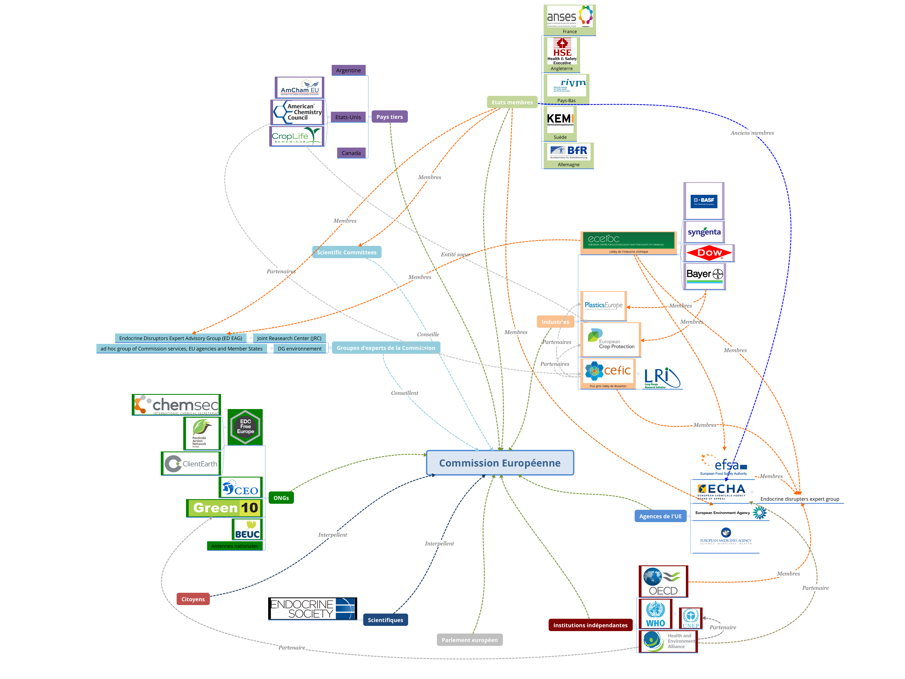
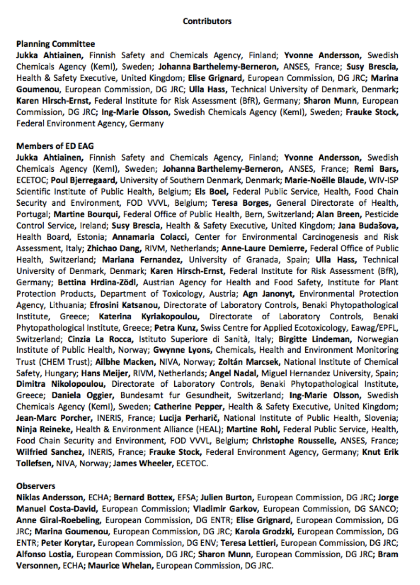
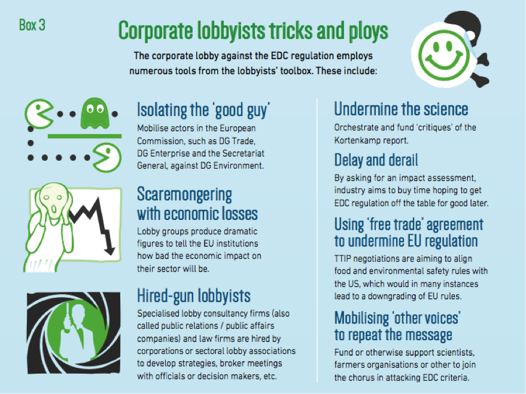
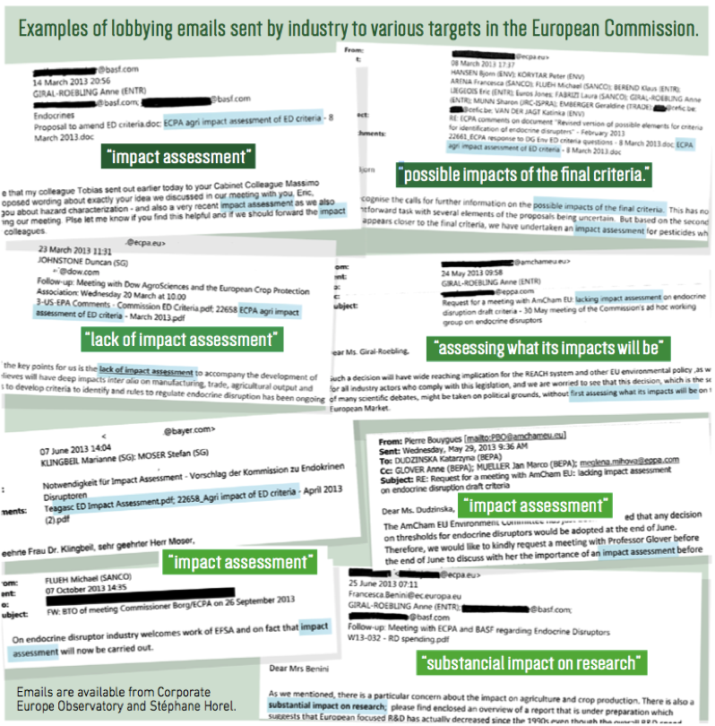
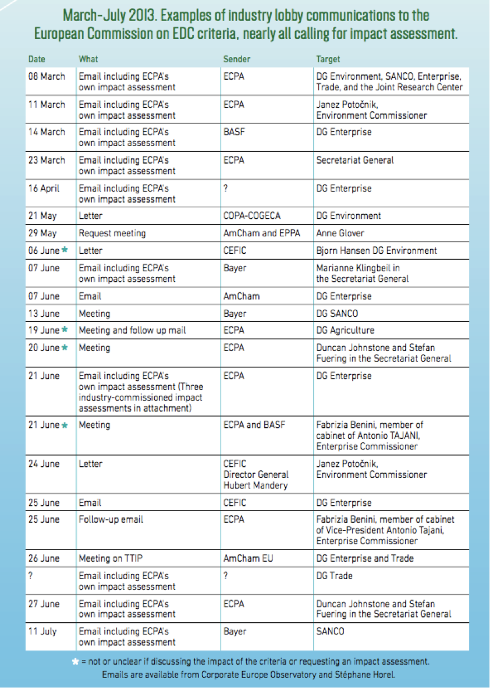

<html>
<head>

</head>

<body style="background-color:#9A85A3;">

<article class="article">
  <h1 align="center">Quels ressorts dans la mise en place d'une législation ?</h1>
  
  <h2> Alimenter la controverse scientifique ? La "manufacture du doute" </h2>
  
  
<blockquote> “How a major EU public health initiative was effectively obstructed by corporate lobby groups in tandem with actors within the European Commission” - A toxic affair </blockquote>

  
  
  
  
 Ainsi, différents rapports scientifiques s’opposent, à l’image des divergences observées entre la déclaration de Berlaymont et le rapport de l’EFSA. Mais peuvent-ils véritablement tous être considérés comme scientifiques ? 
Le rapport de l’EFSA de 2013, par exemple, est dénoncé par Stéphane Horel <strong> 
  <a href="https://controverses.github.io/perturbateurs-endocriniens/annexe.md/fichesacteurs.html">(lien vers la fiche acteur) </a> </strong> , journaliste indépendante travaillant sur les perturbateurs endocriniens depuis 2006, du fait que les scientifiques travaillant dans cet organisme présentent des <strong>conflits d’intérêts</strong> parfois non déclarés. Cela signifie que les scientifiques travaillent ou ont travaillé en collaboration avec des parties prenantes du sujet, comme des <strong>industries</strong> dont la production est menacée par les règlementations ou des <strong>agences nationales</strong> relayant le message du gouvernement parfois en opposition avec celui des scientifiques indépendants. Dans son document « Conflicts of interests at EFSA » de 2012, elle estime que, sur dix-huit membres, huit ont collaboré avec le secteur privé (industrie chimique, pharmaceutique, cosmétique, ou encore industrie du tabac, des pesticides ou des biotechnologies) dont trois (Diane Benford, Anthony Hardy, Josef Schlatter) avec le groupe de lobbying International Life Sciences Institute  (ILSI) <strong> 
  <a href="https://controverses.github.io/perturbateurs-endocriniens/annexe.md/fichesacteurs.html">(lien vers la fiche acteur) </a> </strong> et une avec le CEFIC  
  <a href="https://controverses.github.io/perturbateurs-endocriniens/annexe.md/fichesacteurs.html">(lien vers la fiche acteur) </a>(Gisela Degen). La thèse de Daniel Pickford, un écotoxicologiste anglais, a été financée par Syngenta 
  <a href="https://controverses.github.io/perturbateurs-endocriniens/annexe.md/fichesacteurs.html">(lien vers la fiche acteur) </a> . Trois autres sont jugés en conflit d’intérêts par Stephane Horel du fait de la position prise par leur pays ou l’organisme qui les emploie. Ainsi, Karen Hirsch-Ernst et Thomas Platzek sont deux toxicologistes travaillant pour le German Federal Institute for Risk Assessment (BfR). Or, celui-ci a, en 2011, pris position en faveur de critères de régulation basés sur la puissance des perturbateurs endocriniens via l’établissement d’un palier. C’est également le cas du gouvernement anglais, pour lequel travaille Susy Brescia (Head & Safety Executive). Enfin selon le document, seulement quatre des dix-huit experts avaient auparavant effectué des recherches scientifiques sur les perturbateurs endocriniens, et aucun n’était un spécialiste de l’endocrinologie humaine. L’intervention de l’EFSA dans la controverse pose d’autant plus question que ce n’est qu’en août 2012 que la DG SANCO (santé et consommateurs) signe un mandat permettant à l’agence de se saisir du dossier, alors même qu’il était sous la direction de la DG ENV (Direction générale liée à l’environnement), lui demandant de compléter le travail déjà effectué par la DG ENV, le JRS et leurs groupes de recherche associés. 

<h2> L'EFSA au coeur de plusieurs controverses</h2>

 Stéphane Horel a enquêté sur le contexte dans lequel émerge ce fameux rapport de 2013. Peu de temps avant sa publication, l’un des rédacteurs du rapport a envoyé un mail à ses collègues afin de leur faire part de ses préoccupations. En effet, le document arrivait à la conclusion opposée de celle du rapport WHO-UNEP, sur lequel se base en grande partie la Commission. L’auteur pensait qu’il serait difficile de le défendre, et qu’il était donc nécessaire de le refaire ou du moins le modifier afin que l’opposition apparaisse moins marquée. A cela, le responsable du groupe, Bernard Bottex, a répondu par la positive : 

<blockquote> « Nous devons reconsidérer nos conclusions : les options 2 et 3 dans lesquelles nous expliquons que [les perturbateurs endocriniens] peuvent être considérés comme la plupart des autres produits chimiques, c’est-à-dire sujets à une évaluation selon le risque (risk assessement), nous isolent du reste du monde et de ce fait vont probablement être difficiles à défendre, du fait des incertitudes, du manque d’information et de l’absence de méthodes. N’importe quelle proposition pour reformuler en prenant en compte ces nouveaux paramètres est la bienvenue ». </blockquote>

 Pourtant, la conclusion finale du rapport, comme évoquée plus haut, n’a pas été modifiée, bien que le rapport de l’EFSA se garde de recommander explicitement l’approche risk-based qui serait en contradiction avec la politique de la DG ENV.
L’EFSA a également été au centre d’une controverse autour du <strong>bisphénol A</strong> : en janvier 2015, alors que la généralisation de l’interdiction de la substance entre en vigueur en France (il avait été interdit dans les biberons en 2011), l’agence publie un rapport s’opposant aux conclusions de l’ANSES, agence scientifique du gouvernement français, qui estime que les seuils proposés par l’Union Européenne sont probablement trop élevés. Suite à cela, Ségolène Royal, ministre de l’écologie, « s’interroge sur le poids des lobbys » dans les décisions de l’EFSA lors d’une séance à l’Assemblée Nationale, selon un article du journal <em>Libération</em>. 

<h2>La nécessité d'une garantie d'indépendance pour la fiabilité des recherches</h2>

 La dénonciation de ces conflits d’intérêts par Stéphane Horel peut amener à se demander s’il n’est pas difficile, voire impossible, pour les chercheurs de pouvoir travailler sans être à un moment financé par des entreprises ou des parties prenantes et sans que cela soit retenu contre eux. 
Ici, il faut bien noter que ce n’est pas le manque d’honnêteté intellectuelle des scientifiques liés à des lobbies qui est dénoncé, mais la nécessité de se baser sur des recherches de scientifiques qui n’ont aucun intérêt à faire peser la balance dans un sens ou dans un autre. Le <strong>Corporate Europe Observatory </strong>(CEO) met en garde contre une vision “diabolique” de l’industrie qui tendrait à s’infiltrer dans les rangs de l’agence, mais pense que l’influence de l’industrie doit s’exercer à travers un processus de relations de long-terme. En octobre 2013, il publie un article dénonçant le manque d’indépendance de l’EFSA :

<blockquote> « Plus de la moitié des 209 scientifiques de l’agence ont des liens directs ou indirects avec les industries qu’ils sont supposés réguler ». </blockquote>

 Le problème selon l’institution provient des règles d’embauche de l’agence : 

<blockquote> « N’importe quel scientifique ayant des liens avec le secteur commercial peut toujours être accepté du moment que ceux-ci ne sont pas en relation avec le sujet sur lequel il travaille ». </blockquote>

<h2> Conflit endocrinien, perturbateurs d’intérêts : quels conflits d’intérêts autour de la Commission ?</h2> 

 Bien que l’EFSA soit la source technique de l’UE la plus décriée sur le sujet, la plupart des groupes d’experts sur lesquels se base la Commission contiennent des membres appartenant à des parties prenantes telles que les industries concernées par la régulation ou les Etats-membres de l’Union ayant chacun leur propre vision du problème, comme il est possible de le voir sur le schéma. 

 Tout d’abord, les membres de l’<em>Endocrine Disruptors Expert Advisory Group</em> sont nommés par les Etats-membres. Or, comme il est possible de le constater sur la liste des membres de l’ED EAG tirée d’un des rapports du Joint Research Center de 2013 (Key scientific issues relevant to the identification and characterisation of endocrine disrupting substances), il peut s’agir de chercheurs appartenant à des universités nationales, mais également d’agences nationales telles que RIVM aux Pays-Bas, l’ANSES en France ou le Federal Institute for Risk Assessement allemand (BfR), qui sont sous contrôle du gouvernement. Aussi, il est important de se demander si <strong>l’impartialité scientifique</strong> prime sur la représentation de la <strong>stratégie nationale</strong>. Enfin, on retrouve tout autant des membres d’ONGs telles que HEAL et Chem Trust (Ninja Reineke et Gwynne Lyons) que des membres de groupes de pression d’industries comme l’ECETOC, un lobby de l’industrie chimique particulièrement influent auxquels appartiennent entre autres BASF, Bayer, Syngenta ou Dow (James Wheeler).  

 Enfin, il est important de souligner que les groupes de pression travaillant en collaboration avec l’Union Européenne ne sont pas de simples défenseurs des industries qu’ils représentent. Par exemple, le président de l’European Crop Protection Association (ECPA), Martin Dawkins, est le responsable de la région Moyen-Orient/Afrique chez Bayer, tandis que Patrick Thomas, le président de PlasticEurope est également PDG de l’assemblée générale de Bayer MaterialScience devenu Covestro, une des plus grosses manufactures de polymères.

<h2> Un processus démocratique ou scientifique ? </h2>

 La collaboration avec les entreprises est un phénomène banalisé et considéré comme nécessaire pour le bon fonctionnement de la Commission : dans le questionnaire auquel la DG SANTE (anciennement DG SANCO) a répondu, elle affirme : 

<blockquote> « Les décisions qui concernent les perturbateurs endocriniens sont susceptibles d’avoir des impacts dans plusieurs domaines. C’est pourquoi la Commission travaille en collaboration étroite avec toutes les parties prenantes ». </blockquote>
 

 Certains parlent de “bureaucratie auxiliaire” ou d’”expertise gratuite”, à l’image de Martin Pigeon, militant chercheur au CEO lors de la conférence « Perturbateurs endocriniens : des connaissances scientifiques à l’action publique » du 21 avril 2017. Grâce à ce mécanisme de collaboration, la Commission dispose d’informations supplémentaires sur les stratégies des entreprises afin d’éclairer le processus décisionnel tandis les entreprises sont tenues au courant de l’avancée des débats sur la législation des perturbateurs, entre autres via un mécanisme de feedback leur permettant de donner leur avis sur la question. La Commission juge d’ailleurs elle-même être assez transparente sur le sujet, la plupart des échanges sur le sujet étant rendus publics, et estime être assez stricte sur la législation : 

<blockquote> « Les régulations européennes sur les pesticides et les biocides font partie des plus strictes et des plus protectives dans le monde : les substances ne sont approuvées que si une évaluation menée par les experts des Etats membres et revue par l’EFSA ou l’ECHA démontre que sous des conditions réalistes elles ne produisent aucun effet indésirable sur la santé humaine ou animale ou sur l’environnement. » </blockquote>

 Mais le problème dénoncé par les ONGs entre autres n’est pas tellement la collaboration de la Commission avec les industries mais le fait que leur avis, ou que l’avis d’agences dont les membres sont en conflit d’intérêt soient pris en compte au même titre que celui des scientifiques indépendants : dans le questionnaire, la Commission précise que « pour chaque substance, les agences scientifiques [agences de l’UE NDLR] ne s’intéressent pas seulement aux recherches effectuées par l’industrie mais également à la littérature scientifique revue par des pairs ». Cela signifie que la Commission utilise les deux sources, mais surtout les considère équivalentes. Elle s’assure tout de même que l’ensemble des groupes qui la conseillent suivent une certaine déontologie, appelée GLP (good laboratory practice) dont les critères sont déterminés par l’OECD. En fait, pour la Commission, la mise en place d’une législation est partie intégrante de la démocratie européenne, ce qui justifie que celle-ci intègre des discussions avec l’ensemble des parties prenantes. 
 

<h2> Le lobbying : création d’une alternative scientifique ?</h2>

 Au sein de l’Union Européenne, les lobbies sont nécessaires car la Commission européenne dispose de moyens dérisoires par rapport à ses pouvoirs et responsabilités. En produisant des propositions de textes législatifs, ils permettent aux commissaires européens d’avancer plus rapidement sur la production de législation. Selon la journaliste Stéphane Horel, les lobbies cherchent à imposer leur vision dès le début du processus législatif, c’est pourquoi ils se concentrent autour de la Commission. En 2015, Stephane Horel et le CEO publient conjointement le rapport « A toxic affair » dans lequel ils dénoncent l’entretien d’une fausse controverse par les groupes industriels. Le même constat est effectué par David Michaels dans son livre « Doubt is their product : how industry’s assault on science threatens your health”. Selon Martin Pigeon: 

<blockquote>  « En utilisant et en amplifiant ce doute, l’industrie parvient à tourner la science contre elle-même ». </blockquote> 

 Dans « A toxic affair », Stéphane Horel développe les points principaux de la stratégie développée par les groupes de pression pour entretenir cette controverse et ralentir le processus législatif :  

 Selon le rapport, l’entretien de la controverse scientifique par les industriels se fait grâce à <strong>la multiplication des sources du même message</strong>, principalement via les liens entretenus avec les diverses sources d’information de la Commission. Le but étant de faire croire à une absence de consensus au sein de la communauté scientifique en diffusant un message alternatif, ici celui de la possibilité de mettre en place des seuils pour réguler les perturbateurs endocriniens ou du moins de l’inutilité d’une réglementation trop restrictive du fait des incertitudes subsistant autour de la mesure de leur danger pour la santé humaine. 
Tout d’abord, la présence de membres des lobbies dans les agences et groupes d’experts de l’Union Européenne (EFSA, ED EAG, …) facilite la diffusion de leur message. 
Le relai de cette idée est également permis par le phénomène du <strong>« revolving door »</strong>, c’est-à-dire l’embauche dans les grands groupes d’anciens parlementaires ou inversement l’entrée en politique d’anciens dirigeants de groupes industriels. Le CEO a par exemple réalisé une liste des commissaires ou parlementaires ayant par la suite été embauchés dans des entreprises privées cherchant à faire pression sur les institutions. Par exemple, Isabel Ortiz, membre de la DG entreprise, a été embauchée par FoodDrink Europe. 
Par ailleurs, les lobbies publient eux-mêmes des documents citant les études dont la conclusion va dans le sens de leurs intérêts afin de poursuivre la construction de leur crédibilité. Ainsi, en mai 2012 paraît une critique du rapport Kortenkamp rédigée par cinq scientifiques, dans le journal académique Critical Reviews in Toxicology. Or, celle-ci est sponsorisée par l’American Chemistry Council (ACC) et les cinq auteurs ont travaillé comme consultants pour différentes industries.  
Enfin, Pesticide Action Network (PAN) Europe dénonce dans un document une collaboration de la DG SANTE avec les Directions Générales économiques dans le dos de la DG ENV et en faveur des industries, en mandatant l’EFSA pour refaire le travail de la DG ENV.

<h2> Les actions de la Commission Européenne pour plus de transparence </h2> 

 Face aux accusations des ONGs et de certains journalistes et scientifiques, la Commission Européenne cherche à faire preuve de plus de transparence. Jean-Claude Juncker a ainsi dès le début de son mandat affirmé sa volonté d’accroître les exigences de transparence de la Commission en adoptant en novembre 2014 deux décisions requérant que pour chaque meeting entre des membres de la Commission ou des Directions Générales et des organisations, un maximum d’informations soit rendu public. De même, en principe, seules les organisations figurant dans le Registre de transparence peuvent dorénavant rencontrer des membres de la Commission. Depuis Janvier 2015, le registre exige que soient fournis des renseignements supplémentaires sur la participation à des forums ou des structures similaires de l'UE par exemple mais aussi sur les dossiers législatifs en cours. 

<h2> Basculement sur une problématique économique </h2>

<blockquote> « La controverse scientifique s’était finalement dégonflée au cours de l’été 2013, un consensus scientifique ayant émergé autour de la nécessité d’une nouvelle réglementation ad hoc pour les perturbateurs endocriniens. Le coup de théâtre qui avait malgré tout permis d'éviter cette réglementation avait été la demande d’une étude d’impact économique par la Commission européenne ». Magali Reinert, Article Novethic 2017.  
“The full knockout of DG Env was achieved by DG SANCO when the Secr-Gen. stopped the work of DG Env in July 2013 and demanded an impact assessment, making the costs for industry the major topic in a health regulation”.
Rapport du Pesticide Network Organization. </blockquote>

<h2>  « Lobbying blitzkrieg »</h2>

 Le 7 juin 2013, la DG ENV sort finalement son rapport sur les perturbateurs endocriniens, rassemblant les connaissances scientifiques sur le sujet et en déduisant des recommandations à l’adresse de la Commission afin d’élaborer son projet de loi. Elle invite les autres Directions Générales de la Commission à donner leur avis.  
	Deux mois auparavant, alors que sortait le fameux rapport de l’EFSA, « Scientific Opinion on the hazard assessment of endocrine disruptors », l’European Crop Protection (ECPA) publiait un document estimant entre 3 et 4 milliards d’euros les coûts économiques d’une réglementation sur les PE telle que prévue par la DG ENV. Le mois de juin voit aussi s’ouvrir les négociations pour le traité transatlantique TTIP entre l’Europe et les Etats-Unis. Aussi, la DG ENV publie son rapport dans un contexte d’intérêt accru des entreprises pour les législations sur les produits chimiques et en particulier les perturbateurs endocriniens. 
Dix jours après la publication du rapport, Anne Glover, la conseillère scientifique en chef du président de la Commission, reçoit une lettre ouverte, rédigée par un comité de 56 scientifiques mené par Daniel Dietrich, un toxicologiste de l’Université de Konstanz, et intitulée « Des précautions scientifiques infondées influencent les recommandations de la Commission Européenne sur les régulations des perturbateurs endocriniens, défiant le sens commun, la science établie et les principes d’une régulation en fonction du risque (risk assessement) ». Dans cette lettre est dénoncé le fait que la Commission ne s’appuie pas assez sur l’EFSA, décrite comme « la propre autorité experte de la Commission », ni sur les conseils de ses Etats membres ou de ses propres experts. Le message, publié dans quatorze revues scientifiques, souhaite que la législation se base sur une caractérisation de potentiels réels, établis sur des personnes humaines et pas seulement à partir d’expériences en laboratoire qui négligeraient certains paramètres environnementaux et la capacité d’adaptation du corps humain aux stimulations auxquelles il est confronté. 

<blockquote> “If the Commission will adopt a policy stating that it is impossible to define a safe limit or threshold' for a substance that classifies as an EDC, this would 'reverse current scientific and regulatory practices and, more importantly, ignore broadly developed and accepted scientific development and accepted knowledge regarding thresholds of adversity”
“The currently drafted framework is based on virtually complete ignorance of all well-established and taught principles of pharmacology and toxicology” </blockquote>

 La diffusion de cette lettre, rendue publique le 5 juillet, entraîne le lancement d’une étude d’impact économique par Catherine Day, secrétaire générale de la Commission, à la DG ENV et la DG SANCO. Selon Stephane Horel, la stratégie des entreprises est alors de gagner du temps, la volonté d’entretenir la confusion au niveau scientifique ayant échoué (une étude d’impact dure minimum 12 mois).  
Les scientifiques sont à nouveau divisés sur la question : en août, une réponse à la lettre ouverte paraît dans la revue Environmental Health News. Elle est signée par 41 scientifiques travaillant sur le sujet, dont deux ayant participé au rapport Kortenkamp et quatre au rapport WHO-UNEP. En novembre, une seconde réponse, cette fois signée par 104 scientifiques de l’Endocrine Society, dénonce le soutien au statu quo des rédacteurs de l’éditorial alors même qu’il existe un grand nombre de preuves indiquant que la réglementation actuelle est inefficace pour protéger les populations des produits chimiques. Ils soulignent une approche « déconcertante » et « sans fondement » qui ne cite aucune source scientifique mais seulement des « concepts et des données dépassés ». Les chercheurs ne sont pas les seuls à réagir : huit parlementaires européens rédige un courrier à M. Barroso, dans lequel il s’étonne que le rapport soit sorti en plein processus de définition des critères scientifiques d’évaluation sanitaire : 

<blockquote>"Faire une étude d’impact dès maintenant semble confondre la science avec l’élaboration des politiques, et le danger avec le risque".</blockquote>

 En octobre, Stephane Horel publie conjointement avec Brian Bienkowski, éditeur pour Environmental Health News un article révélant les conflits d’intérêt des scientifiques signataires de la lettre ouverte. Selon ce document, sur les 18 co-auteurs de l’éditorial, 17 ont collaboré avec l’industrie. 
http://www.environmentalhealthnews.org/ehs/news/2013/eu-conflict-list
De plus, la journaliste révèle dans son rapport plusieurs mails signés par le CEFIC, l’ECPA, BASF… envoyés en juin 2013 et réclamant une telle étude. 

 Enfin comme le dit David Gee de l’Agence Européenne de l’Environnement dans le film Endocr(t)rinement, un documentaire réalisé en 2014 par Stéphane Horel, il est plus probable que l’issue soit favorable aux industries, les intérêts économiques étant beaucoup plus simples à évaluer que les intérêts environnementaux (du fait notamment qu’il s’agit d’enjeux à long terme sur la société dans son ensemble). 

<h2> « Cry wolf »</h2>

 Les industriels mettent en avant la menace économique sur plusieurs secteurs, en particulier l’industrie et l’agriculture, si une nouvelle réglementation était mise en place. Pourtant, le coût sanitaire de quelques perturbateurs endocriniens est déjà évalué à plus de 150 millions d’euros (selon Stéphane Horel 158 milliards d’euros par an dans l’UE). Dans un rapport de 2015, l’organisation non gouvernementale ChemSec évoque l’idée selon laquelle les entreprises exagèrent les coûts afin de protéger leurs intérêts, illustrée par le terme « cry wolf », littéralement « crier au loup ». Par exemple, Food drink Europe, lobby de l’industrie alimentaire, fait intervenir l’argument d’un risque de crise alimentaire dans le cas où certains produits seraient interdits du fait des perturbateurs qu’ils contiennent et non remplacés.

<h2> Le TAFTA/TTIP</h2>

 En attendant, les négociations autour du TTIP (Partenariat transatlantique de commerce et d'investissement) offrent un nouvel argument aux industriels. Elles sont d’ailleurs sûrement une des causes de la demande par l’industrie d’une étude d’impact. Un des objectifs de cet accord est d’harmoniser les réglementations pour faciliter les échanges. Le CEO dénonce :

<blockquote> "Les industries se sont jetées sur ces négociations comme l’occasion parfaite de se débarrasser de la règlementation des perturbateurs endocriniens"</blockquote>

 En effet, les acteurs industriels de la controverse sont également des acteurs étrangers. En 2012, Croplife America et l’American Chemistry Council (ACC) écrivent à l’Office of Chemical Safety and PP pour lui faire part de leurs inquiétudes concernant la régulation européenne. La position de Croplife America est résumée dans un document de mai 2013 envoyé à Douglas Bell, représentant de l’administration américaine pour le commerce (USTR) : 

<ul>
<li> Le <strong>critère de suspension des perturbateurs endocriniens</strong> à base de danger tel que défini dans le règlement 1107/2009 de l’UE ne doit pas impacter le commerce entre l’Europe et les Etats-Unis. </li>
<li> Le contrôle de produits au sein de l’UE par leur <strong>interdiction</strong> plutôt que par une évaluation de risque ne doit pas impacter le commerce entre l’Europe et les Etats-Unis.</li>
<li> Il est du devoir du gouvernement américain de se défendre en utilisant l’autorité de l'accord sur l'application des mesures sanitaires et phytosanitaires (accord SPS) de l’Organisation Mondiale du Commerce (OMC) si l’UE poursuit le régime réglementaire qu’elle propose pour les perturbateurs endocriniens sans une approche basée sur une évaluation des risques. </li>

</ul>

 L’intervention des américains dans la controverse est facilitée par la collaboration des groupes américains et européens, à l’image de celle entre le CEFIC et l’ACC ou entre Croplife et l’European Crop Protection Agency. En 2014, ceux-ci publient conjointement une critique du rapport WHO-UNEP de 2012, affirmant que celui-ci ne devrait pas être utilisé comme base pour la mise en place de politiques publiques autour des perturbateurs endocriniens étant donné qu’il ne fournit pas une information objective de l’état de la science sur le sujet.  
Les entreprises américaines ne sont pas les seules à se préoccuper de la régulation des perturbateurs endocriniens en vue de défendre leurs intérêts commerciaux : la Commission interagit également avec l’Argentine ou le Canada, comme lors de la conférence du 1er juin 2015 à Bruxelles. 
Toutefois, les groupes industriels font face au rejet du TTIP par le grand public, comme en témoigne la manifestation du 18 avril 2015 ayant réuni 2000 participants dans la capitale belge, ou à Berlin le 10 octobre de la même année avec entre 50 et 100 000 manifestants selon un article du Figaro. Aussi, en 2014, la DG commerce informe le CEFIC sur la nécessité de rassurer le grand public sur le traité.

<h2> La poursuite de la mobilisation en faveur d’une législation plus stricte</h2>

 En octobre 2013, Anne Glover a réuni les deux camps de scientifiques (les signataires du rapport contre la réglementation prévue et les signataires de la lettre ouverte). Cette réunion aboutit à la signature d’un consensus. Mais l’étude d’impact était déjà en marche et la Commission n’a pas souhaité l’interrompre. Trois mois plus tard, lors de la publication de la feuille de route qui avait été confiée à la DG SANCO et à la DG ENV, on constate un retour du critère de puissance. 
	Avec le lancement de l’étude d’impact, la date limite imposée par le Parlement à la Commission pour établir une législation est dépassée. Aussi, en juillet 2014, la Suède, rejointe par la France puis l’ensemble du Parlement et du Conseil (21 pays membres s’étant prononcé en faveur de ce mouvement, seul le Royaume-Uni s’est abstenu), dépose un « recours en carence » devant la Cour de justice de l’Union Européenne pour non-respect des délais, aboutissant en décembre 2015 à la condamnation de la Commission par la CJUE. 
	Ce ne sont pas les seules pressions auxquelles fait face la Commission. En janvier 2015, le Parlement adresse une lettre critique au Commissaire de la santé Vytenis Andriukaitis, le pressant de travailler en faveur d’une approche horizontale des perturbateurs, en adéquation avec les travaux scientifiques et non pas seulement basé sur les impacts économiques. Les députés l’interpellent à nouveau au cours des questions orales de février 2016, notamment au sujet de l’étude d’impact, que celui-ci présente comme un « outil essentiel » pour guider les décisions de la Commission.  
	L’étude d’impact économique est publiée en juin 2016 par la Commission et de nouvelles propositions naissent au sein de la Commission en se basant sur les conclusions de l’étude. Le texte proposé par le Joint Research Center se base certes sur les critères de l’OMS mais prévoit un certain nombre de dérogations. Selon cette dernière, « c’est la première fois dans le monde entier que des critères d’identification des perturbateurs endocriniens sont mis en place dans un but législatif ». 
Mais il faut encore que le projet de loi soit examiné et accepté par le Parlement. Or, le texte prévoit d’interdire les substances ayant un effet avéré sur l’homme, et non pas celles pouvant avoir un effet néfaste ; la différence réside dans le fait que pour prouver un effet avéré, les données recueillies sur des animaux ne suffisent pas, il faut recueillir des données équivalentes précises et certaines concernant l’homme. Le niveau de preuves à obtenir est donc très difficile à atteindre. Cette définition très restrictive mènerait à ne retenir qu’un petit nombre de substances et donc in fine à n’interdire qu’une infime partie des substances réellement nocives pour l’homme. Aussi, dès sa publication, les Etats membres se retrouvent divisés au sein du Parlement. Le vote initialement prévu pour le 21 décembre 2016 puis pour le 28 février 2017 a ainsi été reporté par la Commission Européenne face à l’impossibilité de réunir une majorité des Etats membres autour de cette définition. Le 7 avril 2017, plusieurs scientifiques ont adressé une lettre ouverte au Commissaire de la santé. Ils dénoncent l’ajout d’une clause stipulant qu’un biocide qui serait développé afin de perturber le système hormonal d’une espèce ne serait pas classé comme perturbateur endocrinien. Selon Rémy Slama 
  <a href="https://controverses.github.io/perturbateurs-endocriniens/annexe.md/fichesacteurs.html">(lien vers la fiche acteur) </a>, épidémiologiste à l’Institut national de la santé et de la recherche médicale (Inserm) de Grenoble, président du conseil scientifique du Programme national de recherche sur les perturbateurs endocriniens, et l’un de ces signataires, « c’est comme si on demandait aux industriels de développer une substance pour absorber l’énergie dans un réfrigérateur et qu’au cas où elle serait libérée dans l’atmosphère, on ne la classerait pas comme gaz à effet de serre, sous prétexte que cette propriété est voulue. Du point de vue scientifique, ça n’a aucun sens. Un perturbateur endocrinien doit être défini en fonction de son action sur la santé et sur le système hormonal et non pas en fonction de la finalité pour laquelle il a été développé ».  

Comme le dit Stéphane Horel dans « A toxic affair », « la bataille autour de cette controverse politique de santé publique et environnementale dans l’Union Européenne est loin d’être terminée ».

   
</article>

</body>
</html>
