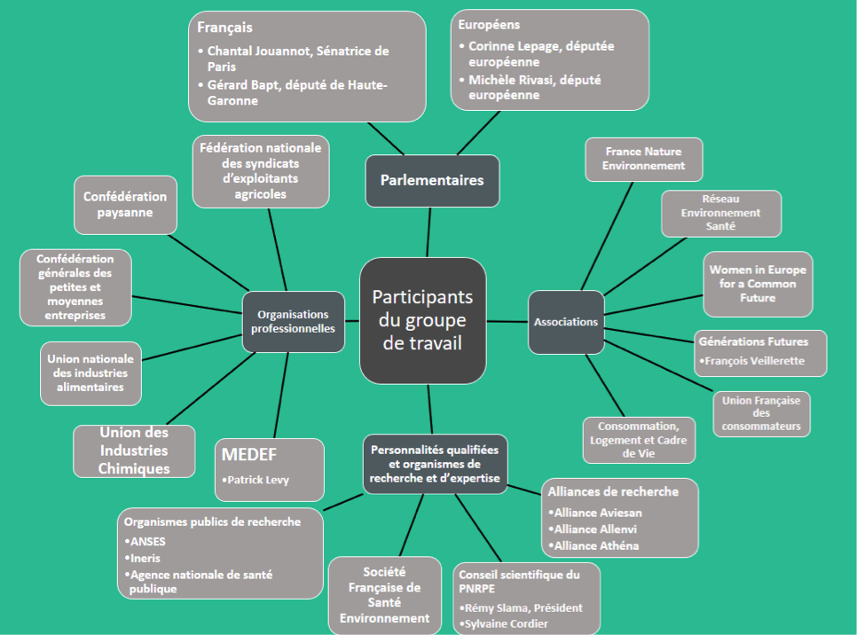

<html>
<head>

</head>

<body style="background-color:rgb(44, 195, 161);">

<article class="article">

<ul>
  <li><a href="#stratégie">La Stratégie Nationale sur les PE</a></li>
  <li><a href="#texte"> Le texte de la stratégie</a></li> 
  
</ul>
  
  <h1 align="center">Les actions du gouvernement Français : jongler entre prérogatives de l’Union Européenne, intérêts des industries et attentes des scientifiques et de l’opinion publique</h1>
 
<h2> <strong>La réglementation : le cas exceptionnel du bisphénol A (BPA)   </strong> </h2>

 L’essentiel des réglementations encadrant les produits chimiques est pris au niveau de l’Union Européenne. Cela permet de ne pas entraver le principe de libre échange, ce qui serait le cas si on mettait en place des réglementations plus restrictives au niveau national. En termes de prévention des risques, l’approche est aussi plus efficace au vu de l’importance du commerce intra-européen. Toutefois, si la France estime que des « mesures d’urgence » doivent impérativement être mises en œuvre au niveau national, elle peut prendre des mesures appropriées, notamment dans le cadre de clauses de sauvegarde de certains règlements communautaires. Obligatoirement notifiées à la Commission européenne, ces dernières pourraient alors être précurseurs de mesures européennes, comme le cas de l’interdiction du bisphénol A dans les biberons. 

 En effet, le 27 juillet 2009, M. Yvon Collin, sénateur du Tarn-et-Garonne, et plusieurs de ses collègues, déposent au Sénat un texte proposant l’interdiction du BPA dans les biberons. L’une des nouveautés instaurées par le scandale du Bisphénol A est la gestion des perturbateurs endocriniens au niveau politique, et non plus seulement au niveau des autorités sanitaires et juridiques, comme cela avait été le cas auparavant avec le <a href="https://controverses.github.io/perturbateurs-endocriniens/scientifiqueaupublic.md/emergencedansledebatpublic.html#retentissements">distilbène</a>. Ce texte donne lieu à l’adoption de la loi du 30 juin 2010 relative à l’interdiction du BPA dans les biberons qui aboutit elle-même à une décision harmonisée de la Commission Européenne (directive 2011/8/UE) en janvier 2011, interdisant l’utilisation du BPA dans les biberons pour nourrissons en polycarbonate. 

 
 

  

 

Suite à cela, le 22 juin 2011, MM. Gérard BAPT , Jean-Marc Ayrault et Jean-Louis Touraine décident d’aller plus loin et déposent à l'Assemblée Nationale une proposition de loi prévoyant la « suspension de la fabrication, de l’importation, de l’exportation et de la mise sur le marché de tout conditionnement, contenant ou ustensile comportant du bisphénol A et destiné à entrer en contact direct avec des denrées alimentaires ». Cette loi plus générale, la loi n°2012-1442, est finalement adoptée le 24 décembre 2012. Elle précise néanmoins que le Gouvernement, sur avis de l'Agence Nationale de Sécurité Sanitaire et de l'Alimentation (ANSES), pourrait autoriser « la reprise de ces opérations ». Malgré cette précision, <a href="https://controverses.github.io/perturbateurs-endocriniens/annexe.md/fichesacteurs.html">Plastic Europes</a> , lobby regroupant les principaux fabricants européens de matières plastiques, a attaqué la loi au nom de la « liberté d'entreprendre », la jugeant non conforme aux droits et libertés, en déposant une question prioritaire de constitutionnalité (QPC). Statuant sur la QPC, le Conseil Constitutionnel a finalement décidé que si l’importation et la vente sur le marché national de tels produits pouvaient être interdites, leur fabrication en France pour l’exportation ne pouvait pas l’être, puisque leur commercialisation à l’étranger était autorisée. Ainsi, par des moyens juridiques, l’industrie a pu faire primer ses intérêts sur la volonté du législateur français.

<h2>La Stratégie Nationale sur les Perturbateurs endocriniens (SPNE)</h2> 

 Lors de la Conférence Environnementale de septembre 2012, le gouvernement s’est engagé à mettre en place une stratégie nationale sur les perturbateurs endocriniens. Le Ministère des Affaires sociales, de la Santé et des droits des femmes, et le Ministère de l’Ecologie, du Développement durable et de l’Énergie ont donc missionné un groupe de travail sur ce sujet. Sur la base des recommandations de ce groupe de travail, une stratégie nationale sur les perturbateurs endocriniens a finalement été élaborée et adoptée par le Gouvernement le 29 avril 2014.

 <i>Composition du groupe de travail (institutions et personnalités pertinentes)</i>

  

 <i>Points de désaccord du groupe de travail :</i>

<h2>Le texte de la Stratégie </h2>

Finalement, le texte de la Stratégie Nationale sur les Perturbateurs endocriniens (SPNE) prend peu en compte l’avis des entreprises.  

<h4>Recherche, valorisation, surveillance <h4>

Le gouvernement souhaite inscrire la thématique des perturbateurs endocriniens comme un axe essentiel de la recherche en santé environnementale.
Le Ministère de l’Environnement veut également introduire une plateforme public-privé chargée de mettre au point des méthodes pour détecter les perturbateurs endocriniens. Ces méthodes pourraient ensuite être proposées à <a href="https://controverses.github.io/perturbateurs-endocriniens/france/programmesderecherches.html#public">l'OCDE</a> (Organisation de Coopération et de Développement Economique). En effet, cette organisation multinationale définit des lignes directrices sur les méthodes de tests de produits chimiques, qui sont souvent les seules acceptées par l’industrie. Une étude de faisabilité et d’intérêt de cette plateforme est en cours.

<h4>Expertise sur les substances </h4>

 Le Gouvernement amplifie la démarche d’évaluation des dangers et risques de substances susceptibles d’être perturbateurs endocriniens. Il confie à l’ANSES, l’expertise d’au moins une quinzaine de substances chimiques sur 3 ans.

<h4>Réglementation et substitution des perturbateurs endocriniens</h4>

En fonction des conclusions des expertises, les substances concernées doivent faire l’objet de mesures réglementaires adaptées, portées en priorité au niveau européen. La France veut défendre sa définition des <a href="https://controverses.github.io/perturbateurs-endocriniens/france/franceinterpelleue.html">perturbateurs endocriniens</a> et proposer des mesures jugées nécessaires en vertu de son pouvoir d’initiative au niveau européen. En complément des mesures réglementaires, la France accompagne les industriels dans leurs démarches de substitution de substances dangereuses. Par exemple, un <a href="https://substitution.ineris.fr/fr ">Service national d’assistance</a> pour la substitution des bisphénols est mis en place par l’INERIS à la demande du Ministère en charge de l’Environnement en janvier 2013. 

<h4>Formation et information</h4>

Le gouvernement veut développer l’information et la sensibilisation des professionnels et du grand public à la question des perturbateurs endocriniens, pour permettre à chacun d’orienter ses choix et de limiter son exposition. 

 <strong> Réactions après la mise en place de cette stratégie : Colloque Adebiotech (think tank) – Perturbateurs endocriniens : enjeux industriels, de santé et d’environnement – 8 juillet 2014</strong> 

 <a href="http://www.adebiotech.org/pert/">Colloque</a> sponsorisé par BASF (leader mondial de l’industrie chimique), citation de BASF à la fin du compte-rendu du colloque : 

 <blockquote> «	Cet état de méfiance permanente face à toute innovation entraîne un excès de « précautionnisme » réglementaire, voire parfois une véritable surrèglementation, comme en témoigne la stratégie nationale sur les perturbateurs endocriniens, qui brouille l'horizon et la visibilité des industriels de tous les secteurs, compromettant de fait leur capacité d’investissement et de développement en France. Nous sommes ainsi intimement convaincus que le rapport bénéfices / risques de toute innovation ou solution doit être évalué par une approche rationnelle fondée sur des données scientifiques fiables sans une surexpression du principe de précaution. »</blockquote> 
 

 Discours de Michel Urtizberea, BASF, toxicologue spécialisé dans les perturbateurs endocriniens : 

<blockquote> « Malgré sa contribution active à la SPNE, l’industrie qui réclamait la prise en compte de points importants comme la puissance des effets observés et l'approche par le poids de la preuve, n'a pas obtenu que ces demandes soient intégrées dans la version finale de la SNPE portée par le Gouvernement. » </blockquote>

   
</article>

</body>
</html>
