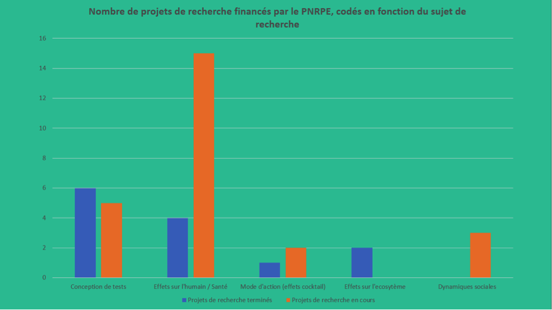
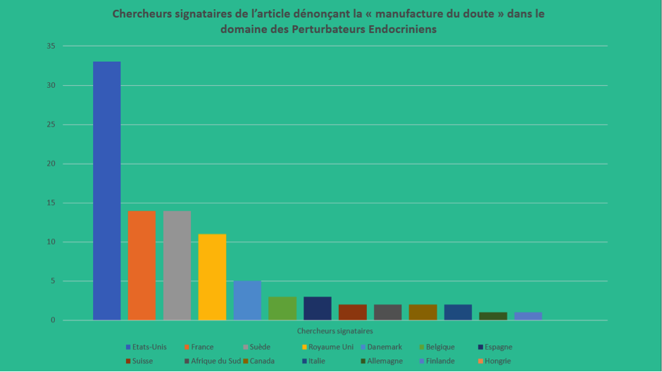

<html>
<head>

</head>

<body style="background-color:rgb(44, 195, 161);">

<article class="article">

<ul>
  <li><a href="#PNRPE">PNRPE</a></li>
  <li><a href="#autres"> D’autres programmes</a></li> 
  <li><a href="#privé">Des programmes publics – privés</a></li> 
  <li><a href="#public">Public et privé, une volonté commune</a></li> 
  <li><a href="#lien">Lien avec des programmes EU/étrangers</a></li> 
</ul>

<h1 align="center">Programmes de recherche</h1>

 Si le PNRPE est un programme national de recherche qui cible les perturbateurs endocriniens, de nombreux programmes et plans d’action mis en place par le gouvernement s’intéressent aux perturbateurs endocriniens sans qu’ils en soient le sujet principal. En effet, la caractéristique même des perturbateurs endocriniens est qu’ils sont maintenant présents partout : dans les produits industriels, dans notre environnement (eau, terre, air) et dans notre corps. Ainsi, des chercheurs de plusieurs disciplines se sont intéressés à des sujets très différents en lien avec les Perturbateurs endocriniens. Les financements sur le sujet sont donc faibles mais nombreux et disparates.  

  

 Aujourd’hui, la majorité des recherches, aussi bien académiques que privées, se focalisent sur la mise au point de méthodes pour détecter les perturbateurs endocriniens dans des endroits divers (eaux, aliments, objets de consommation courante…) et apprécier leur effet sur l’organisme. Ces méthodes représentent un intérêt certain, puisque qu’elles peuvent ensuite être adoptées comme lignes directrices au sein de l’OCDE. Ces lignes directrices sont souvent, avec les directives européennes, la seule « réglementation méthodologique » que les entreprises acceptent et qui peuvent être utilisées pour pouvoir qualifier une substance de perturbateur endocrinien.

 

 
   

Le Gouvernement français doit souvent prendre en compte les intérêts des entreprises dans une perspective économique, c’est pourquoi les entreprises peuvent être présentes dans le comité d’orientation du Programme de Recherche National sur les Perturbateurs Endocriniens, ou mener des programmes de recherche en collaboration avec des agences nationales. 

<h2>Le Programme National de Recherche sur les Perturbateurs endocriniens (PNRPE)</h2>

Il s’agit d’un programme national de recherche sur les perturbateurs endocriniens créé en 2005 pour <i>« soutenir des recherches fondamentales et appliquées en appui à l’action publique sur les questions ayant trait à la perturbation endocrinienne »</i>. Il est piloté par le ministère en charge de l’Ecologie et du Développement durable. Le programme lance des appels à projets de recherche. A ce jour, 39 projets de recherche ont été financés, avec 5 millions d’euros, dont 0,4 millions sont financés par l’Ademe (Agence de l’Environnement et de la Maîtrise de l’Energie) et 4,6 M€ sont financés par le Ministère de l’Environnement. Selon Barbara Demeneix, membre du comité scientifique, cet argent n’est pas suffisant pour mener toutes les recherches qui méritent d’être menées sur ce sujet. 

Le comité d’orientation du PNRPE est composée d’acteurs très divers, aussi bien des agences gouvernementales que des associations et des entreprises. Or, ce comité décide quels programmes de recherches sont prioritaires afin d’appuyer au mieux les politiques publiques. Dans cette agence financée par le gouvernement, les intérêts des différents acteurs sont donc obligatoirement pris en compte. 
 

 <strong>Liste des membres du comité d’orientation : </strong>    Ministère de l’écologie, du développement durable et de l’énergie, Agence de l’Eau Seine Normandie, Agence De l’Environnement et de la Maitrise de l’Energie, Agence nationale de Sécurité Sanitaire, de l’alimentation, de l’Environnement et du Travail, Agence Nationale de la Recherche, Commissariat à l’Energie Atomique, <strong>Générations Futures  </strong>, Ministère de l’Enseignement Supérieur et de la Recherche, Ministère de la santé et des sports, Office Nationale de l’Eau et des Milieux Aquatiques, <strong>Suez Environnement.</strong> 

 Le Comité scientifique du PNRPE est, quant à lui, formé uniquement de chercheurs, parfois très engagés politiquement. En effet, la plupart de ces chercheurs ont signé <a href="http://www.lemonde.fr/idees/article/2016/11/29/halte-a-la-manipulation-de-la-science_5039860_3232.html">l'appel à la Commission Européenne</a>, demandant une définition claire, sans notion de puissance des perturbateurs endocriniens. 
 

 <strong>Membres du comité scientifiques (en gras, les scientifiques ayant signé l’appel à l’UE) : (11/21)</strong>    <strong>Remy Slama </strong>  (Inserm, président du Comité scientifique depuis 2008), Jacques Auger (APHP), Patrick Balaguer (Inserm Montpellier), Yannick Bathe (CSI-CNRS), Catherine Bennetau-Pelissero (Inserm Bordeaux),<strong> Jean Pierre Bourguignon  </strong> (CHU de Liège), <strong>François Brion  </strong> (Ineris), Thierry Caquet (INRA Rennes),<strong> Marie Christine Chagnon </strong>  (ENSBANA), <strong>Sylvaine Cordier</strong> (Inserm, IRSET, Rennes), <strong>Xavier Coumoul </strong>  (Inserm, Paris Descartes), Jean Pierre Cravedi (INRA toulouse), <strong>Barbara Demeneix  </strong> (CNRS-MNHN), James Devillers (CTIS), <strong>Sylvia Fasano </strong>  (Université de Naples), Yves Levi (Université Paris Sud), Nicolas Olea-Seranno (Université de Grenade) <strong>Martine Perrot-Applanat  </strong> (CNRS), Alexandre Pery (INERIS, METO), <strong>Jean-Marc Porcher </strong>  (INERIS), <strong>Daniel Vaiman  </strong> (INSERM, Institut Cochin) 

 Le but affiché du PNRPE est de s’assurer qu’aucun axe de recherche n’est écarté. Cependant, les recherches sont majoritairement tournées vers l’impact des perturbateurs endocriniens sur la santé humaine et sur la conception de tests sur les perturbateurs endocriniens (présence, dangerosité).

<h2>D’autres programmes </h2>

L’Agence Nationale de la Recherche (ANR), sous la tutelle du Ministère de l’enseignement supérieur et de la recherche (MESR), soutient, depuis sa création en 2005, des travaux relatifs aux perturbateurs endocriniens. Parmi ces programmes, on peut citer le programme national de recherche en santé – environnement – travail (PNR EST) de l’Agence nationale de sécurité sanitaire de l’alimentation, de l’environnement et du travail (ANSES). Plus récemment, le programme « Comprendre et prévoir les évolutions de l’environnement 2014 » a vu un projet sur « l’impact des PE sur la communication sexuelle des insectes ».

L’INERIS (Institut National de l’Environnement Industriel et des Risques), sous la tutelle du Ministère de l’Environnement et du Développement Durable, soutient également des partenariats de coopération Universités-organismes de recherche, comme le Réseau Antiopes qui réunit des dizaines d’équipes issues des organismes de recherche dans le domaine de la toxicologie. 

L’INRA (Institut National de la Recherche Agronomique), dépendant du Ministère de la Recherche et du Ministère de l’Agriculture, a également soutenu le réseau EcoBASC qui s’intéresse à la connaissance du devenir et des flux des contaminants chimiques au sein des écosystèmes aquatiques et terrestres, comme les perturbateurs endocriniens. 

L’INRA (Institut National de la Recherche Agronomique), dépendant du Ministère de la Recherche et du Ministère de l’Agriculture, a également soutenu le réseau EcoBASC qui s’intéresse à la connaissance du devenir et des flux des contaminants chimiques au sein des écosystèmes aquatiques et terrestres, comme les perturbateurs endocriniens. 

<h2>Des programmes publics – privés</h2>

De nombreuses entreprises se sont engagés sur la question des perturbateurs endocriniens. Par exemple, Suez (anciennement Suez Environnement) a lancé en 2006 le programme AMPERES, en partenariat avec l’Irstea (Institut national de recherche en sciences et technologies pour l’environnement et l’agriculture) sur l’identification des micropolluants et l’efficacité des traitements sur les stations existantes. Ce projet a été cofinancé par l’Agence Nationale de la Recherche. La conclusion du programme est intitulée :  

 <blockquote>  « Les stations d’épuration arrêtent 85% des substances prioritaires. Des efforts restent à faire sur les autres substances étudiées, rejetées dans les eaux usées. » </blockquote> 

<h2>Public et privé, une volonté commune : développer des tests adoptés ensuite par l’OCDE</h2>

Les acteurs privés dénoncent le manque de tests pour établir la présence de perturbateurs endocriniens dans certains composants et leurs effets sur l’organisme. Pour eux, cela est un obstacle à toute réglementation sur une substance chimique. Les entreprises, qui pour des soucis d’images, veulent établir la présence des perturbateurs endocriniens dans leurs produits, peuvent faire appel au <a href="https://controverses.github.io/perturbateurs-endocriniens/senpasser/substituersupprimer.html">laboratoire Watchfrog</a>, ou faire faire leurs propres tests. Toutefois, cela reste une démarche non obligatoire.
 

Les entreprises ne veulent pas se faire dicter leurs démarches par les autorités nationales car cela pourrait les désavantager économiquement par rapport à des entreprises installées dans d’autres pays. Seules les lignes directrices de l’OCDE, avec les directives de l’Union Européenne, sont mises en place à un niveau de réglementation assez élevées pour être acceptées par les entreprises. C’est pourquoi les organismes de recherche français ont pour objectif de développer des méthodes de tests, qui seront ensuite proposées à l’OCDE. L’OCDE peut ou non les accepter. Si l’OCDE les accepte, l’Etat pourra utiliser ces méthodes pour tester certains produits et alors interdire leur production sur le marché, en cas d’une présence avérée de perturbateurs endocriniens. 

La prévision d’une plateforme pour la mise au point de test dans la Stratégie Nationale sur les Perturbateurs Endocriniens a pour but d’accélérer la recherche française sur le sujet.
 

 
 
 <strong>Les lignes directrices de l’OCDE sur les perturbateurs endocriniens</strong>  C’est par le biais du volet « Sécurité des produits chimiques et biosécurité » de la Direction de l’Environnement que l’OCDE met en place des lignes directrices sur les méthodes de tests permettant d’évaluer la dangerosité des produits chimiques. Ces lignes directrices sont adoptées après proposition des Etats membres. Elles permettent alors de supporter les décisions des autorités de régulation relatives au risque de certains produits, quand ils reçoivent des résultats de tests. 

 
 
 On observe que les Etats Unis, la France, le Danemark, la Suède et le Japon sont à l’origine de la majorité des propositions.

<h4 align="center">Projets pour la détection ou le test de produits chimiques pour la perturbation endocrinienne, actuellement en cours d’évaluation par l’OCDE: </h4>
     
<table>
    <tr>
       <th>Projets </th>
       <th>Pays meneurs</th>
   </tr>
   <tr>
       <td>Fish Life-Cycle Test/Medaka Multi-Generation Test</td>
       <td>Etats Unis / Japon / Allemagne</td>
   </tr>
   <tr>
       <td>Fish Reproduction/Partial Lifecycle Test</td>
       <td>Etats Unis</td>
   </tr>
   <tr>
        <td>Larval Amphibian Growth and Development Assay</td>
       <td>France</td>
   </tr>
   <tr>
   <td>Xenopus Embryonnic Thyroid Assay</td>
       <td>France</td>
   </tr>
   <tr>
        <td>Mysid Life Cycle Toxicity Test</td>
       <td>Etats Unis</td>
   </tr>
   <tr>
      <td>Copepod Reproduction and Development Test</td>
       <td>Suède</td>
   </tr>
   <tr>
   <td>Mollusc Reproductive Toxicity Tests – Development and Validation of Test Guidelines</td>
       <td>Allemagne / Grande-Bretagne / France / Danemark</td>
   </tr>
   <tr>
   <td>Avian 2-Generation Reproductive Toxicity Assay</td>
       <td>Etats Unis</td>
   </tr>
   <tr>
   
     <td>Human Recombinant Oestrogen Receptor Alpha Binding Assay</td>
     <td>Etats Unis / Commission Européenne / Allemagne / Japon</td>
   </tr>
   <tr>
   
    <td>STTA Assay for the Detection of Androgenic and Anti-Androgenic Activity</td>
     <td>Japon</td>
   </tr>
   <tr>
   
   <td>STTA Assay for the detection of Anti-Oestrogenic activity of chemicals</td>
     <td>Japon</td>
   </tr>
   <tr>
   
   <td>Performance-Based Test Guideline for the Androgen Receptor Transactivation Assay</td>
     <td>Commission Européenne</td>
   </tr>
   <tr>
   
   <td>Transcriptional Assay for the Detection of Estrogenic and Anti-Estrogenic Compounds using MELN Cells</td>
     <td>Commission Européenne</td>
   </tr>
   <tr>
   
   
   <td>Thyroid Scoping Document</td>
     <td>OCDE secrétariat</td>
   </tr>
   <tr>
   
    <td>Update of TG 421 and TG 422 with ED-relevant endpoints</td>
     <td>Danemark</td>
   </tr>
   <tr>
   
   

  
   
 <h2>Lien avec des programmes européens et étrangers</h2>  
 
Les pays ayant proposé la majorité des méthodes de tests à l’OCDE sont évidemment aussi ceux qui sont le plus actifs dans la recherche sur ce sujet. En effet, selon Barbara Demeneix, la France serait, avec le Danemark et la Suède, l’un des pays les plus engagés dans la recherche académique sur les perturbateurs endocriniens, grâce à des stratégies nationales sur les perturbateurs endocriniens d’envergure. Les chercheurs de ces pays forment également la majorité des scientifiques qui ont signé <a href="http://www.lemonde.fr/idees/article/2016/11/29/halte-a-la-manipulation-de-la-science_5039860_3232.html">l'appel à l'Union Européenne</a> 

 
Aux Etats Unis, l’Agence Américaine de protection de l’environnement finance plusieurs projets de recherche sur les perturbateurs endocriniens, dont de nombreuses méthodes ont été adoptées au niveau de l’OCDE. Au Danemark, le centre sur les perturbateurs endocriniens est un réseau interdisciplinaire de scientifiques, encadré par l’Agence de Protection de l’Environnement (Ministère de l’environnement et de l’alimentation).

 
Barbara Demeneix souligne également que la coopération internationale est importante sur le sujet, ce que confirme le 2ème « Paris Workshop on Endocrine Disruptors Effects on Wildlife and Human Health » organisé par le PNRPE en janvier 2016. Les orateurs invités proviennent de pays aussi divers que la Belgique, les Etats Unis, le Canada, le Royaume Uni et le Danemark. 

   
</article>

</body>
</html>
