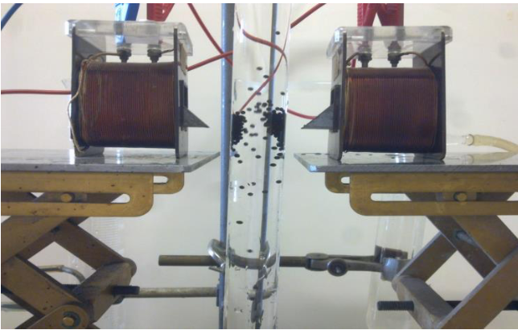

<html>
<head>

</head>

<body style="background-color:rgb(44, 195, 161);">
  
  <article class="article">
  <h1>Peut-on vraiment se passer des perturbateurs endocriniens?</h1>
  <h2>Les perturbateurs endocriniens sont partout </h2>
 
 Dans une étude publiée fin avril, l’UFC-Que choisir insiste sur l’omniprésence des perturbateurs endocriniens dans notre environnement. Comme l’explique le docteur Gérald Kierzek «la protection n’est pas simple puisque les 
perturbateurs endocriniens sont partout ». Les perturbateurs endocriniens seraient présents dans plus de 400 produits du quotidien  (aliments, médicaments, produits ménagers, cosmétiques...).

  

<strong>1.) Médicaments : </strong>

 L’INSERM a montré le rôle potentiel de perturbateurs endocriniens des antalgiques (comme le paracétamol, les anti-inflammatoires non stéroïdiens tels que l’aspirine et l’indométacine). 
Conséquences possibles: cryptorchidie chez le foetus ( absence de descente des testicules), baisse de la production de testostérone. 

<a href="http://www.inserm.fr/actualites/rubriques/actualites-recherche/les-antalgiques-sur-le-banc-des-perturbateurs-endocriniens">Cliquez ici pour plus de renseignements </a> 

<strong>2.) Cosmétiques: </strong>

L’UFC-Que-Choisir a dressé en février 2016 la liste des produits cosmétiques contenant des perturbateurs endocriniens. Maquillage, parfums, vernis, déodorant, produit pour nourrisson, une liste inquiétante qui a doublé depuis sa création. 

<a href=" https://www.quechoisir.org/comparatif-ingredients-indesirables-n941/">Liste des 400 produits à éviter </a> 

<strong>3.) Jouets en plastique: </strong>

La plupart des jouets en PVC (polychlorure de vinyle: une des matières plastiques les plus utilisés au monde), contiennent des perturbateurs endocriniens notamment du phtalates. 
Conséquences possibles : infertilité, mauvais développement des organes génitaux, cancer.
Réglementation : l’UE réglemente l’utilisation de phtalates dans les jouets depuis 2005, leur présence est limitée à 0,1%. 

<a href="http://benhur.teluq.uquebec.ca/SPIP/pe/spip.php?article36">Pour plus de renseignements cliquez ici</a> 
  

<a href="http://www.wecf.eu/download/2009/November/W.163Franceimpresion.pdf ">Liste de conseils aux parents </a> 

<strong>4.) Meubles et produits ménagers /Moquette/ Air intérieur : </strong>
 

Les vernis utilisés pour les meubles, la vaisselle en plastique, les ustensiles de cuisines, les produits ménagers peuvent contenir du Bisphénol A, des phtalates, benzène et bien d’autres. Même s'ils ne sont pas ingérés de manière directe, nos aliments s’en imprègnent, en particulier quand ils sont chauffés. Le Plan de la qualité de l’air intérieur publié en 2013 témoigne de l’omniprésence des ces molécules volatiles à l’intérieur d’une maison. 
 

<a href=" http://www.ouest-france.fr/monde/perturbateurs-endocriniens-quand-vos-meubles-polluent-votre-sante-3706746">Pour plus de renseignements cliquez ici</a> 

<strong>5.) L’eau du robinet : </strong>

L’association génération future publie un rapport en 2016 qui témoigne de la présence de perturbateurs endocriniens inquiétants dans l’eau du robinet (glyphosate et atrazine). Ce rapport met également en avant la présence de résidus médicamenteux à des niveaux faibles dans l’eau du robinet. On peut également insister sur la présence de l’herbicide atrazine produit par Monsanto, interdit depuis 2003 mais qui reste toujours la molécule la plus présente dans les nappes phréatiques.

Conséquences potentiels : cancer
Réglementation: en 2010 la réglementation autorise une eau 5 fois polluée qu’auparavant.
L’eau en bouteille n’est pas une solution à cause des plastifiants utilisées comme contenant. 
 

<a href=" http://www.liberation.fr/futurs/2017/01/13/les-perturbateurs-endocriniens-poison-dans-l-eau-du-robinet_1540972">Pour plus de renseignements cliquez ici</a> 

<strong>6.) Fruits et Légumes : </strong>

Les pesticides présents sur les fruits et légumes représentent les perturbateurs endocriniens les plus importants (pyriméthanil, Iprodione..). L’Association génération future a montré notamment la présence de 9,4 résidus de pesticide en moyenne dans les mueslis non bio. Un chiffre alarmant qui ne tient pas compte de “l’effet cocktail nocif” dû à la présence de cette multitude de perturbateurs. 
Conséquences possibles : cancers, obésité, diabète 
 

<a href="https://www.sciencesetavenir.fr/sante/des-perturbateurs-endocriniens-dans-les-mueslis-aux-fruits-faut-il-s-inquieter_107363">Pour plus de renseignements cliquez ici</a> 

<h2>Comment s'en protéger?</h2>

Barbara Demeneix s'intéresse particulièrement à l’impact des perturbateurs endocriniens sur les femmes enceintes et prouve la manière dont il impact le développement du cerveau de leurs enfants. Elle conseille à ces femmes de:  
- manger bio 
- utiliser le moins de plats préparés contenus dans des plastiques 
- de ne surtout pas faire réchauffer au micro ondes des plats contenus dans les plastiques  
- éteindre les appareils électronique la nuit (ordinateur, portable, télévision..)  
- ne pas utiliser des crèmes et cosmétique qui contiennent du parabène et des phtalates 
- éviter les poêles en téflon mais plutôt des poêles en acier 

   
   
 Jean-Paul Curtay, nutrithérapeute donne différents conseils à retrouver sur le site :<a href="https://www.wedemain.fr/Les-perturbateurs-endocriniens-sont-partout-comment-les-eliminer-de-nos-vies_a1393.html ">Ici</a> 

   
   

 <h2>Effet cocktail des perturbateurs endocriniens:</h2>
 

Il est de plus en plus difficile de se protéger des perturbateurs endocriniens car on ne connaît pas tous leurs dangers. Les scientifiques ont une idée précise des effets néfastes de ces substances de manière isolée mais il a été prouvé qu’une fois ces substances réunies dans un même milieu, leur effet peut être décuplé voir centuplé. Il s’agit de l’effet cocktail.
L'Institut de recherche en cancérologie de Montpellier a ainsi étudié l’effet de 40 molécules  sur le récepteur humain PXR (qui contrôle la toxicité dans l’organisme). Les résultats ont montré que prises deux à deux, les composés chimiques ont une action 100 fois supérieure à leur action individuelle. C’est le cas pour le transnonachlor (présent dans le pesticide chlordane) et l'éthinylestradiol (présent dans les pilules contraceptives).Cette découverte remet en cause les différents seuils de toxicité en vigueur et pose des problèmes fondamentaux.
Tout d’abord, il devient quasiment impossible de se protéger de ces substances puisqu’on ne connaît même pas les risques que l’on encourt au contact de plusieurs de ces produits. De plus, les substituts créés par les chimistes, formés d’un mélange de produits chimique aux propriétés semblables à celles du produit de base, sont parfois plus dangereux que ce dernier. 
Enfin, il devient très difficile d’instaurer une législation claire se basant sur les seuils de toxicité puisque nous ne les connaissons pas tous et qu’il diffère selon le mélange de substances dans l’objet. Cette découverte a induit un déplacement du centre de gravité de la controverse. 
  

<h2> Comment les détecter? </h2>

WatchFrog: La biologie au service de la détection des perturbateurs endocriniens

 
La directive 2000/60/CE appliquée par l’Union Européenne depuis le 22 octobre 2000 a pour objectif de “mettre fin à la détérioration de l’état des masses d’eau pour parvenir au bon état des rivières et eaux souterraines”. En particulier, cette directive impose à chaque état d'analyser l’eau de leur bassin et d’élaborer des stratégies pour l’améliorer. Compte tenu de l’importance accrue du problème des perturbateurs endocriniens, il a donc fallu créer des tests pour les détecter. 
Ainsi en 2006, deux chercheurs du CNRS (Barbara Demeneix et Grégory Lemkine) créent une méthode unique et innovante pour détecter les perturbateurs endocriniens et fondent alors une start-up, WatchFrog. 
L’idée est d’utiliser des larves d’amphibiens qui deviennent fluorescentes en présence de micropolluants. Le laboratoire utilise en effet des larves et des alevins au stade ‘post-oeuf’ (entre 0 et 8 jours, qui ne ressentent donc pas la douleur) dotés de bio-marqueurs qui s’allument au contact de perturbateurs endocriniens. Cette technique permet de plus de déterminer l’effet indésirable d’un ‘cocktail’ de différentes molécules. 

 
L’idée est d’utiliser des larves d’amphibiens qui deviennent fluorescentes en présence de micropolluants. Le laboratoire utilise en effet des larves et des alevins au stade ‘post-oeuf’ (entre 0 et 8 jours, qui ne ressentent donc pas la douleur) dotés de bio-marqueurs qui s’allument au contact de perturbateurs endocriniens. Cette technique permet de plus de déterminer l’effet indésirable d’un ‘cocktail’ de différentes molécules. 
Le laboratoire testent les échantillons envoyés par les entreprises et analyse sur le produit présente des perturbateurs endocriniens et si ces derniers sont à une dose réellement problématique et néfaste pour l’homme. Cette méthode est utilisée pour analyser l’eau mais également les aliments, les produits cosmétiques et les emballages. 

L’entreprise travail maintenant en partenariat avec Véolia, et a mis sur le marché une FrogBox: une boîte avec des têtards directement utilisable par le client. La FrogBox est disponible auprès des municipalités. 

<a href="http://www.watchfrog.fr/">Site Watchfrog </a> 

 <a href="http://eur-lex.europa.eu/resource.html?uri=cellar:5c835afb-2ec6-4577-bdf8-756d3d694eeb.0001.02/DOC_1&format=PDF">Directive européenne 2000/60/CE:  </a> 

<h2> Peut-on les remplacer? </h2>

 La première méthode pour se protéger des perturbateurs endocriniens consiste évidemment en une modification de nos habitudes de consomations et d’autres gestes simples disponibles sur <a href="https://www.wedemain.fr/Les-perturbateurs-endocriniens-sont-partout-comment-les-eliminer-de-nos-vies_a1393.html ">ce lien.</a> 

 
Toutefois, certaines molécules ont des propriétés particulières et essentiels dont on ne peut pas se passer. Les scientifiques sont donc à la recherche de solutions pour les remplacer par des molécules aux mêmes propriétés. 

<U>
→Une alternative aux phtalates:  </U>

 Les phtalates sont un groupe de produits chimiques utilisés principalement comme plastifiants des matières plastiques: il est donc ajouté aux matières plastiques comme le PVC pour le rendre plus souple, flexible et plus résistant. Ils sont essentiels à la fabrication des bottes, des textiles imperméables, des jouets ou encore des emballages alimentaires.. mais ils sont aussi utilisés dans les médicaments et les amalgames dentaires. -
 
 
Des expériences sur les animaux ont prouvé que les phtalates en concentration élevés conduisent à une baisse de la fertilité, à une atrophie testiculaire ou encore à une réduction du poids du foetus. 
Depuis 2005, l’AGRICE finance un programme de recherches sur les alternatives possibles aux phtalates. Il existe en effet d’autres composés comme les monoglycerides acétylés, les esters d’acide gras, citrates d’alkyl (triéthyl citrate), l’adipate de di-2-éthylhexyle, les phosphates d’alkyle-aryle mais ces produits sont trop chers, ne permettent pas d’obtenir une souplesse aussi importante et peuvent pour la plupart être aussi néfaste que les phtalates. 
Des start-ups biotechnologiques comme Novance, Roquette ou Danisco proposent des alternatives végétales qui pour l’instant semble remplir les caractéristiques souhaitées.

 
Certaines industries ne préfèrent pas attendre une réglementation plus stricte de l’UE et se tournent dès maintenant vers la production et la vente de produits sans perturbateurs endocriniens. Ils basent leur stratégie marketing sur la dangerosité des phtalates, comme le montre la vidéo ci-dessous sur l’entreprise ayant lancé il y a peu une gamme de vaisselle jetable biodégradable en bambou ou en pulpe de canne à sucre. 

<iframe width="544" height="306" src="//embedftv-a.akamaihd.net/aae7c4daf3395f1ec02caf23135ffd8f" frameborder="0" scrolling="no" allowfullscreen></iframe> <a href="http://www.francetvinfo.fr/france/vaisselle-jetable-quelles-solutions-pour-remplacer-le-plastique_1836841.html" target="_blank">Vaisselle jetable : quelles solutions pour remplacer le plastique ?</a>

<U> 
→ Une alternative aux parabènes:   </U> 
 

Les propriétés antibactérienne et antifongique du parabène en font un conservateur idéal pour les produits cosmétiques, les aliments et les médicaments. En 2010, leur utilisation est controversée : ils activent les récepteurs des oestrogènes, et agissent possiblement sur la fertilité et les tumeurs comme le cancer du sein. Le benzyl alcool DHA aussi appelé Cosgard ou Geogard 221 est un produit de substitution couramment utilisé. Il empêche notamment le développement de levures et moisissures dans les produits contenant de l’eau et ai certifié “écologiquement correctes” selon les normes de l’UE. 

<a href="http://www.consoglobe.com/geogard-221-alternative-aux-parabens-cg ">Plus d'informations sur ce lien.</a> 

<strong> Remarque:</strong> 

Dans les cosmétiques en particulier, une mention “sans paraben” ne garantit pas de l’absence de substances tout aussi dangereuse comme le methylisothiazolinone. 

<strong> Conclusion: </strong> 

Aujourd’hui, on constate qu’il n’existe pas suffisamment de recherches sur les produits de substitution et que la plupart de ceux qui existent sont souvent aussi dangereux que les produits de base.  Ce manque peut être expliqué par la mauvaise volonté des industriels mais aussi des parlementaires européens. En effet, comme d’autres facteurs environnementaux peuvent également expliquer l’augmentation de certaines pathologies, les lobbies industriels empêchent les législateurs d’instaurer une réglementation plus stricte. Il y a quelques années, les députés français souhaitent interdire tout simplement les produits contenant des phtalates et des parabènes mais l’idée fut abandonnée sous la pression des industrielles de la chimie et du plastique. De plus, tant qu’il n’existe pas de produits de substitution satisfaisant il est très dur d’invoquer le principe de précaution et d’interdire les produits dangereux car cela entraînerait de grave répercussions sur l’économie du pays. Or on constate que les industriels rechignent souvent à investir dans le secteur Recherche et Développement dans le but de se préparer à une prochaine interdiction car cela est très coûteux. De plus, pourquoi investir dans la recherche de produit moins toxiques mais beaucoup moins efficaces tant qu’il n’existe pas de réglementation stricte? 

<h2>Peut-on les supprimer? </h2>

Il existe de nombreuses méthodes pour éliminer les perturbateurs endocriniens contenus dans l’eau. Philippe Bréant, directeur du programme Eau Potable à Veolia expliquait dans une conférence en janvier 2012 les différentes méthodes actuellement utilisées.   

Au sein de l’Union Européenne, seule une partie des produits chimiques sont actuellement contrôlés mais la législation s’intensifie d’années en années. Une cinquantaine de paramètres, comme les bactéries (indiquant une contamination fécale), les pesticides et les nitrates, sont donc à surveiller obligatoirement.  

 
La clarification est l’étape du cycle de l’eau qui permet d’éliminer les principales matières organiques dissoutes d’une eau brute. En fonction des polluants présents dans l’eau, les méthodes utilisées diffèrent. L’épuration de l’eau se termine par la filtration, qui permet de supprimer la plupart des perturbateurs endocriniens. 3 matériaux sont fréquemment utilisés: le sable (à base de silice qui permet la rétention des particules), l’anthracite (à base de carbone obtenu par calcination de matière végétale) et le charbon actif (également à base de carbone). 
Toutefois, la filtration se fait de plus en plus au moyen de membranes. Cette technique est plus efficace mais elle reste onéreuse. 
Les membranes sont utilisés pour réaliser une osmose inverse.  

Explication de l’osmose: 

 Supposons qu’une membrane fine et semi-perméable sépare deux liquides. Les concentrations des deux solutions ne sont pas identiques de chaque côté de la paroi, créant ainsi une pression osmotique.  On observe alors un transfert de solvant de la solution la moins concentrée vers la solution la plus concentrée. En effet, la membrane va laisser passer le solvant pour équilibrer les concentrations. 

 
L’osmose inverse consiste à inverser le passage du solvant en appliquant une pression supérieure à la pression osmotique du côté de la solution à traiter, c’est à dire, dans notre cas, l’eau brute. Cette technique permet de contenir les polluants (perturbateurs endocriniens) à l'extérieur de la paroi (à droite sur le schéma de droite ci-dessous) et d’obtenir une eau filtrée à gauche. 

<a href="http://www.fndae.fr/documentation/PDF/fndae14.pdf ">Plus d'informations sur ce lien.</a> 
  

 De nombreuses chimistes travaillent aujourd’hui sur des solutions de traitement de l’eau plus rapides et efficaces. Nous avons rencontré Agnès Bée, directrice adjointe de l’UFR de Chimie de l’Université Pierre et Marie Curie, qui nous a présenté un prototype originale afin d’éliminer les perturbateurs endocriniens de notre eau. Layala Obeid, une de ces étudiantes à présenter récemment une thèse sur cette nouvelle méthode qui utilisent des nouveaux matériaux magnétiques appelés “magsorbants” pour extraire les polluants.  

Ces “magsorbants” sont des billes magnétiques de taille millimétrique constituée d’alginate et de chitosane (bio-polymères végétales et de faibles coûts) dans lesquelles sont encapsulées des nanoparticules magnétiques.
 

 Ces polymères ont des propriétés absorbantes et permettent de capter les différents polluants présents dans l’eau. Les billes étant magnétiques elles peuvent être retirés du milieu à dépolluer très facilement au moyen d’un gradient de champ magnétique (ou plus simplement d’un aimant). 
 

<a href="https://tel.archives-ouvertes.fr/tel-01207492/document">Lien vers la thèse.</a> 
  

<strong>Éliminer les perturbateurs endocriniens dans notre corps: </strong> 
 

1. Les perturbateurs endocriniens sont solubles dans les graisses (on dit qu’ils sont liposolubles). Un des moyens les plus efficace pour s’en prémunir est de limiter ou réduire le tissu adipeux de votre corps. Une pratique régulière du sport voir même un régime amaigrissant permet de limiter les lieux où ces substances se logent. 
 
 

2. La prise de taurine (dérivé d’acide aminé découvert dans la bile de boeuf) permet de digérer plus rapidement les lipides et donc évacuer le cholestérol et les toxiques liposolubles (perturbateurs endocriniens) par les selles. Toutefois, sans une consommation suffisante en fibres, les toxiques risquent d’être réabsorbées dans le tube digestif avant d’atteindre le rectum. 
 

<h2>Mais peut on finalement réellement s’en passer? </h2>

<strong>Barbara Demeneix : </strong>
 
  «Ces substances sont présentes dans ce qu’on boit, ce qu’on mange, ce qu’on respire ou ce qu’on se met sur la peau. En clair, nous sommes tous exposés», alerte Barbara Demeneix, endocrinologue au Muséum national d’histoire naturelle et auteure de l’ouvrage le Cerveau endommagé - Comment la pollution altère notre intelligence et notre santé mentale (Odile Jacob, 2016).   
 

<strong>Agnès Bée : </strong>
 
   “Pour pouvoir éliminer les perturbateurs endocriniens, il faut trouver une solution pour les remplacer, ce qui n’est pas toujours facile. Interdire les PE n’est pas résoudre le problème.”   

<strong>Marine Jobert </strong>
  
<a href="http://www.perturbateurs-endocriniens.fr/">Podcast disponible sur ce lien. </a> 
 

 « Ceux qui tergiversent autour d’hypothétiques produits de substitution montrent qu’ils prennent le problème dans le mauvais sens, puisqu’on découvre aujourd’hui que des produits de substitution sont eux-mêmes des perturbateurs endocriniens ! Ce qu’il faut, c’est se désintoxiquer de la chimie, et ce dans tous les secteurs. »   

<strong>Dr Patrick Levy, toxicologue, médecin conseil de l'Union des Industries Chimiques (UIC) lors d’un débat avec Barbara Demeneix: </strong>
  
  
“La définition des perturbateurs endocrinien de l’OMS fait consensus pour les scientifiques mais pas consensus pour un contexte réglementaire, elle n’est pas suffisamment discriminante. Elle est beaucoup trop large. Elle ne permet pas de différencier des perturbateurs avérés et ceux qui n’ont qu’une activité biologique réversibles et sans effet durables. On ne peut pas faire cette discrimination. Nous souhaitons un cadre réglementaire efficace.” 
 

</article>

</body>
</html>
