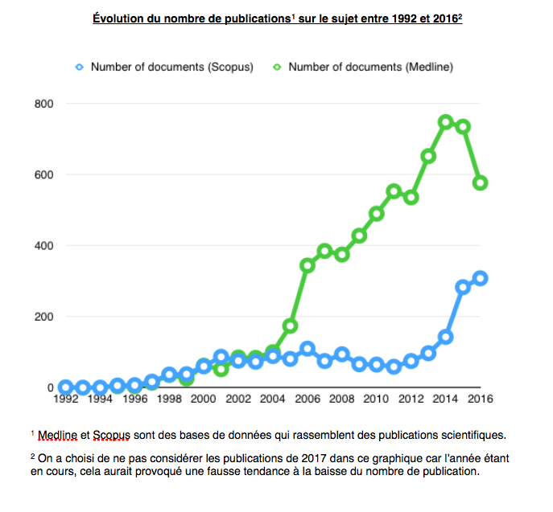

<html>
<head>

</head>

<body style="background-color:#FCB559;">

<article class="article">

<ul>
  <li><a href="#apogée">L'apogée de l'industrie chimique</a></li>
  <li><a href="#impacts"> Impacts et études des produits chimiques</a></li> 
  <li><a href="#position">Vers une position scientifique déterminée</a></li> 
  <li><a href="#émergence">L’émergence du fait scientifique</a></li> 
  
</ul>

  <h1 align="center">La découverte scientifique de la perturbation endocrinienne</h1>  

Les perturbateurs endocriniens relèvent aujourd’hui d’une controverse de législation à la vue de l’enjeu de santé publique qu’ils posent. Cependant, avant d’être une controverse de réglementation, la découverte de ces substances et de leurs effets a été l’objet de découvertes scientifiques controversées pendant près d’un demi-siècle.
 

<h2>L’apogée de l’industrie chimique</h2>

L’industrie chimique s’est développée à partir de la première moitié du XXème siècle et connaît son âge d’or après la Seconde Guerre mondiale. Dès lors, les chimistes, pour satisfaire les besoins croissants de l’industrie, créent toujours plus de nouvelles molécules dont les potentiels effets dangereux pour l’Homme ou les écosystèmes sont soit non testés, soit avec les tests classiques de l’époque, c’est-à-dire que si la molécule ne provoque pas l’empoisonnement, celle-ci est considérée comme non nocive. Or, nous allons voir que ce principe ne s’applique pas aux perturbateurs endocriniens.
 

Ainsi, l’industrie chimique a produit parmi les multiples nouvelles molécules des substances aux effets particuliers, les perturbateurs endocriniens, qui agissent sur les systèmes hormonaux des animaux ou des humains et ont des conséquences néfastes sur leurs métabolismes et leurs comportements. Seulement, il a fallu près de 30 ans, pour que les scientifiques et en particulier une zoologiste, Theo Colborn, identifient ces substances et leurs mécanismes d’action sur les organismes.
 

<h2>Impacts et études des produits chimiques</h2>  

À partir des années 50, suite à l'observation de changements dans les écosystèmes menaçant leur équilibre, sont soulevés les premiers questionnements sur la toxicité des produits chimiques. L’une des premières à s’intéresser à cette problématique de l’impact des produits chimiques est <a href="https://controverses.github.io/perturbateurs-endocriniens/annexe.md/fichesacteurs.html">Rachel Carson</a>, une zoologiste et biologiste américaine : dans son ouvrage <em>Silent Spring</em> publié en 1962, elle penche sur la question de la contamination par les pesticides des animaux et notamment des oiseaux. Elle dénonce en particulier l’usage d’une molécule, le DDT, qu’elle identifie comme cancérigène et perturbatrice des mécanismes de reproduction.
 

 <strong>Le DDT</strong>   

Le Dichlorodiphényltrichloroéthane, plus communément appelé DDT, est une molécule chimique synthétisée pour la première fois en 1874 et utilisée à partir des années 1930 comme insecticide. Elle connaît un succès important à partir de la Seconde Guerre Mondiale. Cependant, à partir des années 60, la dénonciation de ses effets nocifs sur les écosystèmes conduit à son interdiction dans les années 1970. Celle-ci est a posteriori reconnue comme perturbatrice endocrinienne.
 

En effet, on peut prendre pour exemple le déclin de la population de pygargues à tête blanche, une espèce d’aigles vivant en Amérique du nord qui peuplaient dans les années 1950 la côte ouest de la Floride. À cette époque, un ornithologue de passion, Charles Broley, remarqua que cette espèce commençait à avoir un comportement anormal. Une partie des rapaces, à la saison venue, n’effectuait pas les rituels de parade et de nidification et ne s’occupait pas de la reproduction. Puis au milieu des années 1950, il estima que près de 80% des pygargues à tête blanche de Floride étaient devenues stériles. De plus, les coquilles des œufs des pygargues devenant trop fines, de nombreux œufs ne donnaient pas lieu à des naissances. Il s’avéra en fait que ces animaux étaient contaminés par le DDT, insecticide largement répandu dans la région.
 

Autre exemple : dans les années 80, les scientifiques se rendirent compte qu'autour du lac Apoka (toujours en Floride), seulement 18% des œufs d’alligators avaient éclos et que seulement la moitié des nouveau-nés survivaient. De plus, au moins 60% des alligators mâles avaient des pénis atrophiés. Lou Guillette, biologiste étudiant la reproduction, comprit en s'intéressant à la question que ces anomalies avaient un lien avec l’accident d’une usine chimique proche du lac survenu en 1980 : cette catastrophe avait entraîné le déversement dans le lac de dicofol, une substance dont la composition se rapproche de celle du DDT.
 

Ainsi, les exemples de perturbations des écosystèmes liées aux produits chimiques se multipliaient et ces changements de comportements ou de métabolismes menaçaient le plus souvent la survie des espèces.Seulement, si les scientifiques de l’époque font le lien entre produits chimiques et anomalies des l’écosystème, ils ne comprennent pas encore que les mécanismes à l’œuvre sont de type hormonaux. Dans le cas des alligators du Lac Apoka par exemple, Lou Guillette ne comprenait pas pourquoi les alligators dont la population avait été durement impactée lors de l’incident chimique continuaient à souffrir d’anomalies après que l’eau ait retrouvé sa pureté. Il lui faut donc attendre le début des années 1990 et l’émergence de l’idée d’une perturbation endocrinienne par les produits chimiques pour que Guillette puisse trouver dans ce mécanisme une explication au phénomène qu'elle avait observé.

En parallèle des études de terrain sont menées les premières expériences en laboratoire sur des substances à effet hormonal. La première étude sur les éventuels effets indésirables des produits chimiques sur le système endocrinien remonte à 1950 avec Verlus Frank Lindeman et Howard Burlington qui remarquèrent que des doses de DDT pouvaient empêcher des coqs de se développer correctement. Ils en conclurent alors que le DDT avait un potentiel effet oestrogénique. Plusieurs scientifiques, notamment aux États-Unis, se sont également intéressés à l’impact des produits chimiques mais leurs études restent isolées et ne concluent pas sur l’existence d’un phénomène de perturbation endocrinienne qui expliquerait les modifications suspectes des écosystèmes observées.

<h2>L’émergence du fait scientifique de la perturbation endocrinienne</h2> 

La découverte de l’existence de perturbateurs endocriniens dans les produits chimiques fut réalisée à la fin des années 1980 par une zoologiste, <a href="https://controverses.github.io/perturbateurs-endocriniens/annexe.md/fichesacteurs.html">Theo Colborn</a>, lors de sa participation au projet d’évaluation de la santé des Grands Lacs. Pharmacienne de formation, cette dernière reprend ses études dans les années 1980 et en sort diplômée en zoologie de l’Université du Wisconsin. En 1987, elle est engagée en tant que chercheuse dans le programme d’évaluation de la santé des Grands Lacs et entame alors un long travail de collecte et d’analyse des études concernant les anomalies des écosystèmes de cette région, ce qui va l’amener à réunir plus de 2000 articles scientifiques et près de 500 rapports officiels. Pour cette raison, il nous serait impossible d’étudier toutes les recherches qui ont permises à Colborn de découvrir que les mécanismes à l’œuvre étaient des perturbations du système endocrinien, mais nous citerons 3 études qui semblent avoir été essentielles dans son travail. 

 

Les travaux de Glen Fox et Michael Fry ont été une référence importante dans les découvertes de Colborn. Glen Fox, biologiste, avait enquêté sur des femelles goéland des Grands Lacs qui nichaient anormalement à deux femelles. Il avait aussi recueilli des embryons et des oisillons parmi lesquels 5 des 7 mâles présentaient des anomalies génitales de type féminisation. Michael Fry, écotoxicologue, avait quant à lui étudié comment le DDT et d’autres molécules chimiques pouvaient perturber le développement sexuel des oiseaux. Suite à ses expérimentations sur des goélands, il avait conclu que les doses de DDT présentes dans les Grands Lacs étaient suffisantes pour perturber le développement sexuel des goélands mâles en provoquant leur féminisation. En regroupant leurs travaux, Fry et Fox conclurent donc que les goélands des Grands Lacs avaient été bel et bien exposés à des doses de DDT suffisantes pour féminiser une partie des goélands mâles qui ne présentaient dès lors plus d’intérêt pour la reproduction, poussant les goélands femelles à nicher ensemble. Ce phénomène étrange avait alors pris le nom de “goélands homosexuels”. Cette étude complétée par d’autres du même acabit poussa Theo Colborn sur la piste de la perturbation endocrinienne : elle enquêta dès lors sur les dérèglements des systèmes hormonaux des espèces perturbées par les produits chimiques contaminant les Grands Lacs.
 

Cependant, si désormais la perturbation endocrinienne semblait être une clef de l’explication des mécanismes d’intoxication des écosystèmes par les produits chimiques, le fait que celle-ci ait des conséquences sur la descendance des oiseaux contaminés davantage que sur les contaminés restait une caractéristique à expliquer. Sur ce point, c'est l’étude des Jacobson qui a en grande partie contribué aux découvertes de Colborn.
 

Sandra et Joseph Jacobson, physiologistes, ont mené une étude sur les enfants des femmes qui avaient mangé du poisson provenant des Grands Lacs, et ont remarqué que les mères qui avaient mangé de ces poissons accouchaient d’enfants à la circonférence de tête et au poids inférieurs à ceux des mères n’en ayant pas consommé. Or, le cordon ombilical des femmes consommatrices de ces poissons contenait du PCB, une substance chimique présente dans l’eau des Grands Lacs, dans des proportions importantes, et plus cette dose était forte, plus les tests neurologiques de leurs enfants étaient mauvais. Cela semblait donc indiquer que les produits chimiques contaminaient aussi la descendance des contaminés via la période de gestation, ce qui permettait d’expliquer les observations faites sur les nouveau-nés des espèces contaminées des Grands Lacs. 

Aussi, quelques années après le début de ses recherches, Theo Colborn arrivait à sa première conclusion, qui devait marquer le début de l’émergence du fait scientifique de la perturbation endocrinienne. Elle conclut, comme elle le raconte dans son livre <em>L’Homme en voie de disparition</em>, que toutes les espèces des Grands Lacs présentant des anomalies (chez les individus reproducteurs ou leur progéniture) avaient été contaminées par les produits chimiques via leur alimentation à base de poisson et que les mécanismes à l’œuvre étaient d'origine hormonale via une perturbation du système endocrinien.
 

Dans cette conclusion, elle soulève avant tout la question de la perturbation endocrinienne mais aussi le fait que la concentration en produits chimiques augmente le long de la chaîne alimentaire du fait du stockage de ces derniers dans les graisses animales, et qu'ils peuvent également contaminer les embryons durant la période de gestation et ainsi altérer leur développement. Ce dernier point, mis en lumière par l’étude des Jacobson, put être expliqué par Colborn grâce aux travaux de Frederick Vom Saal, biologiste. Il avait en effet montré à la fin des années 1970 que des variations hormonales durant la gestation d’une souris pouvaient avoir des conséquences sur la souris une fois née. En effet, parmi les souris de laboratoires avec lesquelles il travaillait, il avait remarqué qu’environ une souris sur six avait un comportement agressif, comportement propre aux mâles. Lors de ses recherches, il se rendit compte que cela était dû au fait que ces souris étaient placées dans le ventre de la mère entre deux mâles et étaient donc soumises à une dose de testostérone, hormone masculine, plus forte. De plus, ces souris agressives présentaient aussi des différences morphologiques et une puberté plus tardive. De même, dans un article de 1980, Vom Saal démontre qu’un phénomène équivalent est présent pour les souris mâles en gestation exposées à des doses plus élevées d’œstrogènes, hormones féminines. Ainsi, Colborn écrit-elle : “Ceux-ci [les travaux de Vom Saal] éclairent le rôle essentiel des hormones dans le développement des deux sexes, ainsi que l'extrême sensibilité des embryons de mammifère à la moindre variation des concentrations hormonales pendant la gestation. Ils ont également démontré que les hormones organisent ou programment définitivement nos cellules, nos organes, notre cerveau et notre comportement avant la naissance, influençant de diverses manières la vie des individus.”

Ainsi, en faisant le lien entre de multiples études isolées et les observations de scientifiques de terrain, le travail de Theo Colborn a été déterminant dans la découverte du rôle joué par les produits chimiques dans les anomalies des écosystèmes et la mise en lumière du phénomène de perturbation endocrinienne. Cette thèse fit peu à peu consensus auprès des scientifiques.
 

Cependant, du fait que certaines études en laboratoire utilisèrent des doses de perturbateurs endocriniens bien plus élevées que ce que l’on ne trouve dans la nature, certains scientifiques exprimèrent leur méfiance, du fait que l’on ne pouvait pas appliquer ces conclusions aux écosystèmes réels. Aussi, l’impact des perturbateurs endocriniens sur les Hommes était-il contesté : les scientifiques se sont confrontés à l’impossibilité de faire des expérimentations humaines. Ainsi, le lien de causalité entre perturbateurs endocriniens et troubles de l’organisme a été plus difficile à démontrer dans le cas humain car certains ont remis en question les conclusions que l’on pouvait tirer de l’expérimentation animale en ce qui concerne les humains. Pourtant, les mammifères et les humains ont des systèmes endocriniens très proches car ces métabolismes physiologiques primaires ont peu changé lors de l’évolution, et il a donc été jugé raisonnable d’étendre les conclusions des expériences sur des mammifères au cas humain.
 

De plus, les scientifiques rencontrent toujours des difficultés à étudier les cas d’exposition à des perturbateurs endocriniens pour des populations humaines, car ils manquent souvent de données, de statistiques, et de groupes témoins. On peut ici prendre pour exemple la catastrophe de Seveso : en 1976, une usine chimique a explosé, dispersant un nuage de dioxine, substance chimique perturbatrice endocrinienne, au-dessus de la ville de Seveso. Voulant analyser si l’incidence de fausses couches, de malformations génitales et de cancer a augmenté après l’accident, les scientifiques se heurtent au manque de statistiques menées avant l’accident et à la difficulté d’évaluer le degré de contamination des individus en fonction de leur lieu d’habitat. Ainsi, l’analyse de l’exposition humaine aux perturbateurs endocriniens est très difficile car les scientifiques manquent de moyens pour établir des études fiables, d’autant plus que les perturbateurs endocriniens remettent en question la toxicologie classique, ce que nous allons voir à présent.
 

 <strong>La dioxine</strong>   

La dioxine est une substance perturbatrice endocrinienne. Il y a pour le moment 419 types de composés apparentés à la dioxine qui est la 2,3,7,8 - tétrachlorodibenzodioxine (TCDD), dont 30 sont considérés comme particulièrement toxiques. Le plus dangereux étant la molécule originelle, la TCDD. La dioxine est une molécule fabriquée naturellement en de très faible quantité comme lors de l’activité d’un volcan mais celle-ci est aussi produite par les activités industrielles de l’Homme puisqu’elle est principalement issue des combustions. Cette molécule et ses dérivés sont classés parmi les 10 produits chimiques les plus dangereux par l’OMS. 

<h2>Vers une position scientifique déterminée</h2> 

L'événement clef de la découverte du phénomène de perturbation endocrinienne est la conférence de Wingspread qui s’est tenue du 26 au 28 juillet 1991 et qui a rassemblé 21 chercheurs sur le thème de l’action des produits chimiques sur le système endocrinien. Cette conférence aboutit à une déclaration signée notamment par 20 chercheurs, parmi lesquels Theo Colborn.
La déclaration est disponible <a href="http://reseau-environnement-sante.fr/wp-content/uploads/2016/01/LA_DECLARATION_DE_WINGSPREAD.pdf"> ici </a> (traduite en français)

Cette conférence, à l’initiative de Theo Colborn, acte véritablement la découverte de ce fait scientifique et fait état, à l’époque, d’un consensus entre les scientifiques majeurs dans ce domaine. Le terme même de perturbateurs endocriniens, que nous employions dans nos précédents paragraphes de manière anachronique, a été inventé à cette occasion. Ainsi, au sein de la déclaration de Wingspread, les scientifiques témoignent des avancées scientifiques sur le sujet dans une première et une troisième partie :

<blockquote>“Un grand nombre de produits chimiques de synthèse libérés dans la nature, ainsi que quelques composés naturels, sont capables de dérégler le système endocrinien des animaux, y compris [celui de] l’homme.”</blockquote>

<blockquote>“Les effets varient selon les espèces et les composés. Toutefois, on peut faire quatre remarques : a. les composés concernés peuvent avoir des effets très différents sur l'embryon et sur l'adulte; b. les effets se manifestent surtout sur la génération suivante, et non chez les parents exposés ; c. la période d'exposition au cours du développement de l'organisme est cruciale, déterminant l'ampleur et la nature des effets ; d. la période d'exposition la plus critique correspond à la vie embryonnaire, mais les effets peuvent ne pas se manifester avant l'âge adulte.”</blockquote>
 

<blockquote>“Les études en laboratoire confirment les développements sexuels anormaux observés dans la nature et permettent de comprendre les mécanismes biologiques mis en jeu.”</blockquote>
 

<blockquote>“Les humains sont également affectés par ces composés.”</blockquote>

Puis dans une seconde partie, ils expriment leurs hypothèses quant à la situation globale de l’environnement terrestre et des populations animales et humaines face aux perturbateurs endocriniens.

<blockquote>“À moins que la contamination de l'environnement par les perturbateurs hormonaux soit rapidement contrôlée et réduite, des dysfonctionnements généralisés à l'échelle de la population sont possibles. Les dangers potentiels, tant pour les animaux que pour l'homme, sont nombreux, en raison de la probabilité d'une exposition répétée ou constante à de nombreux produits chimiques connus pour dérégler le système endocrinien.” </blockquote>

Enfin, dans une quatrième et une cinquième partie, ils donnent leurs recommandations pour la recherche et les études à entreprendre. Ainsi, la conférence de Wingspread acte la perturbation endocrinienne comme fait scientifique et appelle les chercheurs à se pencher sur le sujet, d’autant plus qu’il s'agit d'un enjeu sanitaire mondial.
Ainsi, si l’établissement de la question des perturbateurs endocriniens comme fait scientifique se situe au début des années 1990 aux États-Unis, en France, le sujet met plus de temps à émerger et à être reconnu. Le premier rapport sur les perturbateurs endocriniens du Ministère de la Santé date seulement de 1994, et la première conférence organisée sur le sujet par l’INSERM a lieu en 1996.
 

 <strong>Mais finalement comment ça marche les perturbateurs endocriniens ?</strong>    

Les hormones sont des molécules qui permettent de transmettre des messages chimiques aux différentes parties de l’organisme, celles-ci interviennent dans de très nombreux domaines tels que la croissance, la reproduction et la gestation, la différenciation cellulaire, les émotions, … Le système endocrinien est l’ensemble des organes qui sécrètent et régulent les hormones de l’organisme, il est ainsi composé chez l’humain de : l’hypophyse, la thyroïde, le thymus, les glandes surrénales, le pancréas, les ovaires et les testicules.   

Ainsi, ce système endocrinien est composé d’hormones, de récepteurs et d’émetteurs d’hormones. Seulement les perturbateurs endocriniens viennent altérer le fonctionnement de celui-ci. Ces perturbateurs peuvent avoir trois effets :    

1. Mimer l'action d'une hormone par leur structure moléculaire similaire 
2. Bloquer l'action d'une hormone en saturant son récepteur 
3. Interférer avec l'action de l'hormone   

Ainsi, les perturbateurs endocriniens peuvent avoir des actions directes en empêchant la transmission de certaines informations via les hormones ou en en transmettant une autre. Ces actions peuvent avoir lieu de la gestation à la mort. Les perturbateurs endocriniens peuvent aussi provoquer des anomalies dans l’expression des gènes (associés aux fonctions de reproduction) qui seront transmises aux générations suivantes.
 

Aujourd’hui, les perturbateurs endocriniens sont la source d’un consensus scientifique sur leur existence et leurs définitions. On peut citer ici la définition donnée par l’OMS dans son rapport “IPCS (International Program on Chemical Safety) Global Assessment of the State-of-the-Science of endocrine disruptors” de 2002 :
 

<blockquote>“An endocrine disruptor is an exogenous substance or mixture that alters function(s) of the endocrine system and consequently causes adverse health effects in an intact organism, or its progeny, or (sub)populations.  A potential endocrine disruptor is an exogenous substance or mixture that possesses properties that might be expressed to lead to endocrine disruption in an intact organism, or tis progeny, or (sub) populations." </blockquote>

De même, leurs mécanismes d’action et leurs effets sur les organismes s’ils restent des sujets de la recherche actuelle, ne sont plus aujourd’hui sujet à controverse. Ainsi, dans un rapport intitulé “State of the Science of Endocrine Disrupting Chemicals” de 2013 sur les effets pour l’homme de l’exposition aux perturbateurs endocriniens chimiques du Programme des Nations Unies pour l’Environnement (PNUE) et de l’OMS, ils résument dans le communiqué de presse :
 

<blockquote>“Cette étude du PNUE et de l’OMS, la plus complète à ce jour sur le sujet, met en lumière certains liens entre l’exposition aux perturbateurs endocriniens chimiques et plusieurs problèmes de santé. Ces substances chimiques peuvent notamment contribuer à la survenue de la cryptorchidie (absence d’un ou des deux testicules dans le scrotum) chez le jeune garçon, du cancer du sein chez la femme, du cancer de la prostate, de troubles du développement du système nerveux et d’un déficit de l’attention/d’une hyperactivité chez l’enfant, ainsi que du cancer de la thyroïde.”.</blockquote>
 

De manière plus affirmée, <a href="https://controverses.github.io/perturbateurs-endocriniens/annexe.md/fichesacteurs.html">l’Endocrine Society</a>, société savante dédiée à la recherche en endocrinologie, dans son rapport de 2015 écrit il n’y a plus “aucun doute sur la contribution des perturbateurs endocriniens au fardeau croissant des maladies chroniques liées à l’obésité, au diabète, à la reproduction, à la thyroïde, aux cancers et aux fonctions neuroendocriniennes et neurodéveloppementales”.
 

Ainsi, il ne faut pas oublier que les perturbateurs endocriniens restent le sujet de nombreuses études scientifiques actuelles comme le montre le graphique ci-contre relatant de l'évolution du nombre de publications scientifiques sur le sujet depuis 1992. Cependant, on peut aujourd’hui dire que l’existence de perturbateurs endocriniens n’est plus remise en question tout comme le fait qu’ils aient des conséquences néfastes sur les écosystèmes et les Hommes. Ainsi, la controverse basée aujourd’hui sur les perturbateurs endocriniens n’est pas de nature scientifique mais bel et bien de nature réglementaire comme nous le verrons dans la deuxième partie.
 
   
   

 

   
</article>

</body>
</html>

