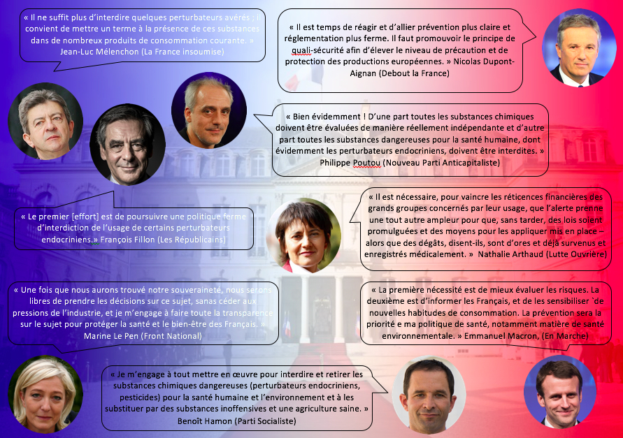

<html>
<head>

</head>

<body style="background-color:#FCB559;">

<article class="article">

<ul>
  <li><a href="#livres">Livres de vulgarisation</a></li>
  <li><a href="#retentissements">Les retentissements des scandales sanitaires</a></li> 
  <li><a href="#action">Une action scientifique directe et militante</a></li> 
  <li><a href="#débat">Les perturbateurs endocriniens intègrent peu à peu le débat public</a></li> 
</ul>

  <h1 align="center">L’émergence du fait des perturbateurs endocriniens dans le débat public</h1>
  

  
  

Ainsi, les problématiques liés aux perturbateurs endocriniens ont peu à peu été portées dans l’espace public par les scientifiques, permettant une progressive prise de conscience des enjeux à l’œuvre. En effet, les études scientifiques, les congrès et les rapports officiels sont souvent non accessibles à un public non averti et face à l’ampleur de la crise sanitaire provoquée par les perturbateurs endocriniens, les scientifiques se sont mobilisés pour faire entendre leurs avertissements.

<h2>Livres de vulgarisation</h2> 

Une voie pour faire connaître les perturbateurs endocriniens à un plus large public est la rédaction de livre de vulgarisation scientifique. De nombreux chercheurs et spécialistes en ont rédigé à partir de leurs recherches pour sensibiliser une plus grande part de la population. Le premier ouvrage sur les dangers des pesticides est le <em>Printemps silencieux</em> écrit par Rachel Carson en 1962. Ce livre a entraîné l’interdiction du DDT aux États-Unis. Cette victoire d’un individu contre les lobbies de l'industrie chimique a déclenché au début des années 1960 la naissance du mouvement écologiste.
 

C’est dans cette même veine que l’américaine <a href="https://controverses.github.io/perturbateurs-endocriniens/annexe.md/fichesacteurs.html">Theo Colborn</a> a écrit en 1996 son livre <em>L’Homme en voie de disparition</em> (en langue originale, <em>Our Stolen Future</em>). Ce livre retrace l’enquête qu’elle a menée en tant que chercheuse sur la piste de la perturbation endocrinienne. Elle tire ainsi la sonnette d’alarme quant aux conséquences sur l’Homme et l’environnement de notre pollution aux produits chimiques. Le livre a eu un impact relativement important aux Etats-Unis, car premier en son genre mais aussi grâce à la préface signée par le vice-président américain alors en fonction, Al Gore.

 

En 2015, le fondateur de <a href="https://controverses.github.io/perturbateurs-endocriniens/annexe.md/fichesacteurs.html">Générations Futures</a> a co-écrit avec la journaliste Marine Jobert un livre intitulé <em>Perturbateurs endocriniens, la menace invisible.</em> Dans une interview diffusée sur le site internet du livre, la co-auteur Marine Jobert explique indirectement pourquoi avoir choisi d’écrire un livre pour changer les choses, plutôt qu’un autre moyen. Selon elle, “cette révolution sur notre dépendance à la chimie qu’il faut, selon moi, opérer ne trouvera pas sa source chez les politiques, et encore moins dans les entreprises. Ce sont les gens qui doivent exiger de ne plus être empoisonnés par des perturbateurs endocriniens quand ils se livrent à des actes aussi anodins que manger, boire, se vêtir, se soigner, ou tout simplement respirer.” Le livre est la solution qu’elle a trouvée comme étant la plus efficace pour toucher un grand public, qui à ses yeux, s’il se mobilise, peut avoir une action forte et efficace contre les perturbateurs endocriniens.
 

Tous les livres de vulgarisation scientifique que nous avons trouvés sur les perturbateurs endocriniens cherchent à informer de manière scientifique et alarmante la population sur les dangers de long-terme que représentent les perturbateurs endocriniens, auxquels nous sommes exposés au quotidien. Ces livres, de manière générale, ne se veulent cependant pas fatalistes face aux épidémies d'obésité, de diabète, de troubles du comportement ou de cancers hormono-dépendants en partie causés par les perturbateurs endocriniens. Ils cherchent plutôt à stimuler notre curiosité et à nous pousser à mieux nous renseigner pour mieux nous protéger et à nous investir dans leur combat.
 

<h2>Les retentissements des scandales sanitaires</h2> 

Aussi, des scandales sanitaires ont eux-mêmes donnés lieu à une popularisation des dangers des perturbateurs endocriniens. Ainsi, par exemple, les pénis atrophiés des alligators du Lac Apoka (lien vers I)A) apoka) ont été un cas d’étude scientifique qui a été médiatisé à l’époque. Mais l’impact est d’autant plus fort qu’il touche les populations humaines et ainsi plusieurs scandales ou accidents ont participé à la tragique popularisation du phénomène des perturbateurs endocriniens. On peut citer par exemple, la catastrophe de Seveso (lien vers le paragraphe correspondant en I)A)) ou encore le scandale du Distilbène.

 <strong>Le cas du Distilbène</strong>   

En 1938, un médecin anglais, Edward Richard Dodds, réussit à synthétiser un oestrogène artificiel, le diéthylstilbestrol alias distilbène (DES) qui imite l’hormone naturelle d’oestradiol. Le distilbène va alors être produit sous forme de médicament tout d’abord pour traiter les femmes victimes de fausses couches répétées, puis à partir des années 50, celui-ci est largement distribué pour de nombreux problèmes allant du risque de prématurité pour une grossesse au traitement de l’acné ou à l’accompagnement de la ménopause. Celui-ci est considéré comme inoffensif autant pour les personnes auquel il est administré que pour les foetus s’il s’agit de femmes enceintes.  

Cependant, entre 1966 et 1969, un phénomène anormal va se produire à l'hôpital général de Boston puisque 8 cas de cancer du vagin chez des femmes de moins de 30 ans vont être diagnostiqués alors que ces cancers sont extrêmement rares et apparaissent chez les femmes ménopausées. Les professeurs Herbst et Ulfelder vont alors se pencher sur les causes de cette anomalie épidémiologique et en avril 1971, dans le New England Journal of Medicine, ils identifient le responsable, le distilbène que les mères de ces filles avaient pris lors de leurs grossesses puisque 7 des mères sur 8 avaient été traitées par ce médicament durant les 3 premiers mois de leurs grossesses.  

Dès lors, en 1971, la Food and Drug Administration, l’agence de réglementation sanitaire américaine, a interdit ce médicament. En France, il faut attendre 1977 pour que la même interdiction ait lieu. Mais entre 1948 et 1971, on estime que près de 6 millions de femmes européennes et américaines se sont vues administrer du distilbène. En France, entre 1950 et 1971, l’Association de Défense des victimes du Distilbène évalue à 160 000 le nombre de foetus exposés au distilbène. Les conséquences pour les contaminés in-utero sont multiples : malformations génitales, problèmes de fertilité, propension élevée au développement de cancers d’origine hormonale (cancers de l’utérus, du vagin et du sein entre autres), grossesses extra-utérine, fausses couches, prématurité, ... Et cela ne semble pas s’arrêter à la génération suivant la contamination des femmes enceintes puisque plusieurs études démontrent des anomalies pour les petits-enfants des femmes qui avaient pris du distilbène.  

Cette affaire du distilbène eut des retentissements importants, car elle concernait une molécule considérée comme miraculeuse et touchait non pas les femmes enceintes mais leurs enfants ce qui heurta l’opinion publique. De plus, elle fut l'occasion de questionnements sur la dangerosité des hormones puisqu’elle constituait l’exemple que des substances chimiques à effet hormonal administrées à des doses très faibles pouvaient avoir des effets dangereux sur l’Homme. Enfin, cela mis fin à l’idée selon laquelle les produits contaminant la femme enceinte ne pouvaient pas contaminer le foetus grâce à la barrière formée par le placenta. Désormais, les scientifiques reconnaissent que le foetus est soumis aux mêmes produits toxiques que ceux auxquels la mère est soumise, et c’est d’ailleurs une période de grande vulnérabilité, puisque le foetus est en pleine construction. 

<h2>Une action scientifique directe et militante</h2> 

Les scientifiques au-delà de leur fonction d’information s’engagent dans un combat contre les perturbateurs endocriniens en interpellant directement les instances de régulation afin de protéger la population. Une des premières actions collectives de grande ampleur de scientifiques sur les perturbateurs endocriniens est l’Appel de Prague de 2005. Il s’agit d’un document présentant une synthèse des connaissances et des propositions de recherche sur la question. Le message clef de cet Appel peut être résumé par cette phrase : « Au vu de l’ampleur des risques associés aux perturbateurs endocriniens, nous croyons fermement que les incertitudes scientifiques ne devraient pas retarder la mise en œuvre du principe de précaution visant à réduire les expositions aux risques des perturbateurs endocriniens ».
 

Cet engagement des scientifiques s’est poursuivi depuis avec notamment l’importante Déclaration de Berlaymont (du nom de siège de la Commission Européenne), datant de 2013, signée par 90 chercheurs scientifiques menant des recherches sur les perturbateurs endocriniens. Par cette déclaration ils félicitent et remercient la Commission Européenne d’avoir financé des recherches sur les perturbateurs endocriniens, qui, bien que des incertitudes demeurent, accrédite l’hypothèse que des dommages graves et irréversibles sont causés par les perturbateurs endocriniens. Ils demandent ainsi à ce que “la Commission européenne mette en œuvre des mesures réglementaires” et que cette entreprise réglementaire ne soit pas retardée ni par les incertitudes scientifiques, ni par les intérêts commerciaux qui prendraient le pas sur les préoccupations concernant les risques associés aux perturbateurs endocriniens. 

En novembre 2016, une centaine de scientifiques ont interpellé la Commission Européenne. Des scientifiques spécialistes des perturbateurs endocriniens se sont alliés avec des scientifiques spécialistes du réchauffement climatique pour co-signer cet appel à la Commission européenne qui l’encourage à réglementer efficacement sur les perturbateurs endocriniens. Ils se sont alliés par intérêts communs car les substances qui contiennent des perturbateurs endocriniens sont en général aussi responsables du réchauffement climatique comme les dérivés des combustibles fossiles. Ils accusent la manufacture du doute : certains scientifiques produisent des études qui sont destinées à ralentir la législation en introduisant un doute sur les effets des perturbateurs endocriniens mais ils sont payés par les industries qui ont des intérêts économiques. Enfin, le 7 avril 2017, une lettre ouverte signée par une quinzaine de scientifiques américains et européens a été adressée à l’Union Européenne afin qu’une définition légale, précise et indiscutable soit retenue pour que les travaux de réglementation puissent enfin aboutir.

<h2>Les perturbateurs endocriniens intègrent peu à peu le débat public</h2> 

Les perturbateurs endocriniens ont donc intégré peu à peu le débat public grâce à une popularisation des enjeux à l’œuvre via l’action d’information ou de militantisme des scientifiques. Le fait, au départ scientifique des perturbateurs endocriniens, devient alors l’objet de débats réglementaires et politiques qui s’inscrivent dans l’espace public. On peut ici prendre l’exemple de la campagne présidentielle française 2017. 

La première mention des perturbateurs endocriniens dans cette campagne a été faite par Benoît Hamon au cours de la campagne pour les primaires de la gauche. Nous avons rencontré son responsable environnement, François Gemenne, qui nous a expliqué comment les perturbateurs endocriniens étaient devenus un des thèmes phares du programme de Benoît Hamon. C’est à la suite d’une rencontre avec l’épistémologue, Alfred Spira, chercheur à l’INSERM, que Benoît Hamon a commencé à s'intéresser aux perturbateurs endocriniens. Il en a ensuite fait un axe de santé publique de son programme, qu’il considère comme un enjeu majeur de santé publique. Alfred Spira est alors devenu le responsable santé de sa candidature. Il s’agit d’un intérêt partagé. Le candidat gagne en crédibilité grâce à la notoriété des scientifiques qui l’entourent et le chercheur voit ses recherches mises sur le devant de la scène. Bien que Benoît Hamon semble convaincu par la lutte contre les perturbateurs endocriniens qu’il propose, il s’agit également d’une technique politique pour pouvoir se différencier des autres candidats. Cette mesure a été aussi choisie pour ancrer les primaires de la gauche dans la dimension écologique, mais elle s’est aussi imposée dans le processus générale de l’élection présidentielle. On trouve ainsi dans le programme de Benoit Hamon pour la présidentielle la proposition suivante : “J’interdirai les PERTURBATEURS ENDOCRINIENS et proposerai des ALTERNATIVES AUX PESTICIDES, en commençant par les plus dangereux.”. Emmanuel Macron a également intégré les perturbateurs endocriniens dans son programme : “Nous placerons la France en tête du combat contre les perturbateurs endocriniens et les pesticides. Ils sont l’une des principales causes de l’augmentation des cancers des enfants depuis 20 ans.” 

Les perturbateurs endocriniens étant un sujet qui est revenu à plusieurs reprises dans cette campagne présidentielle, 60 Millions de consommateurs a posé une question à tous les candidats à ce sujet : “Envisagez-vous des mesures pour limiter l’exposition des consommateurs aux perturbateurs endocriniens ?” Leur réponse se trouvent dans l'infographie ci-dessous :
 

 

<em>N.B. À la date de publication de cet article, trois des onze candidats n'ont pas répondu : François Asselineau (Union populaire républicaine), Jacques Cheminade (Solidarité et progrès), Jean Lassalle (Résistons !).</em>

Le Parlement cherche aussi à s’informer sur le sujet des perturbateurs endocriniens puisque ce sont eux qui sont appelés à mettre en place un cadre législatif strict réduisant leur utilisation afin d’en éviter la diffusion massive. Plusieurs conférences ont aussi été organisées au Sénat depuis plusieurs années. Une des premières conférences qui a eu lieu était sur “Perturbateurs endocriniens : à la reconquête de la santé publique” en 2012, animée par le professeur allemand Andreas Kortenkamp, professeur de toxicologie humaine à l’Institut de l’Environnement de l’Université de Brunel. Plus récemment, le 11 avril dernier, la commission des affaires européennes du Sénat a organisé un colloque sur “Les pouvoirs publics face aux perturbateurs endocriniens”. Des acteurs d’origine très différentes (industrie, chercheurs scientifiques, médecins, association de consommateurs et de producteurs agricoles, Laboratoires, membres de la Commission Européenne). Ces colloques sont l’occasion pour les scientifiques de faire un état des recherches scientifiques sur les perturbateurs endocriniens. Elles permettent aussi aux scientifiques d’exposer leurs préoccupations et de faire des recommandations sur la législation à adopter sur les perturbateurs endocriniens. Ils proposent notamment d’établir des critères bien définis, qui sont nécessaires pour déterminer si une substance doit être considérée ou non comme un perturbateur endocrinien.

Les travaux qui sont réalisés sur les perturbateurs endocriniens impliquent de nombreux acteurs qui sont en constante interaction, aussi bien dans une perspective de coopération que de conflits. Cette volonté d’unir les capacités des différents acteurs impliqués dans cette controverse est visible dans la création en 2009 du Réseau environnement Santé (RES). Ce réseau regroupe à la fois des associations de professionnels de santé, de scientifiques et de malades, des ONG, ainsi que des adhérents individuels. L’objectif principal du RES est d’inscrire la santé environnementale au cœur des politiques publiques. Ces membres cherchent ainsi à encourager le dialogue entre acteurs scientifiques et acteurs politiques et à “mettre dans le débat public les connaissances scientifiques disponibles et faire en sorte que les acteurs institutionnels et économiques mettent en œuvre le principe de précaution pour établir les réglementations et transformer les procédés industriels.” Dès le début ce réseau s’est intéressé aux perturbateurs endocriniens, puisqu’en 2010, la première campagne qu’ils ont lancée a abouti à l’interdiction dans les biberons du Bisphénol A.

 
</article>
</body>
</html>
