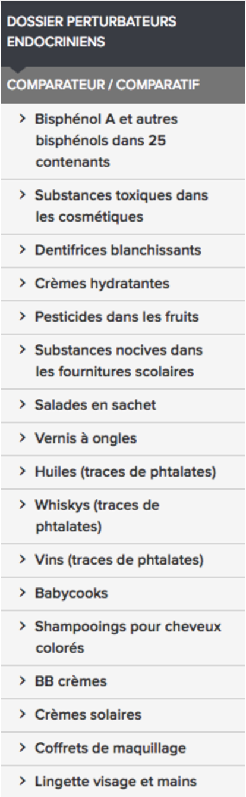

<html>
<head>

</head>

<body style="background-color:rgb(139, 201, 222);">
  
  <article class="article">
  
<ul>
  <li><a href="https://controverses.github.io/perturbateurs-endocriniens/senpasser/omnipresence.html">Un constat</a></li>
  <li><a href="#acteurs"> De nouveaux acteurs dans la controverse</a></li> 
  
</ul>
  
  <h1>De nouveaux acteurs dans la controverse? </h1>
  <h2>Un constat </h2>
  
 
 <strong> Barbara Demeneix, endocrinologue au Muséum national d’histoire naturelle et auteur de l’ouvrage Le Cerveau endommagé (2016) : </strong> 

<blockquote> « Ces substances sont présentes dans ce qu’on boit, ce qu’on mange, ce qu’on respire ou ce qu’on se met sur la peau. En clair, nous sommes tous exposés » </blockquote> 
 

 <strong> Agnès Bee, chercheuse à l’Université Pierre et Marie Curie :</strong>
 
 <blockquote>“Pour pouvoir éliminer les perturbateurs endocriniens, il faut trouver une solution pour les remplacer, ce qui n’est pas toujours facile. Interdire les Perturbateurs endocriniens n’est pas résoudre le problème.” </blockquote> 

 <strong> Marine Jobert, journaliste, auteur de Les Perturbateurs endocriniens (2015) :</strong> 

 <blockquote>  « Ceux qui tergiversent autour d’hypothétiques produits de substitution montrent qu’ils prennent le problème dans le mauvais sens, puisqu’on découvre aujourd’hui que des produits de substitution sont eux-mêmes des perturbateurs endocriniens ! Ce qu’il faut, c’est se désintoxiquer de la chimie, et ce dans tous les secteurs. »  </blockquote> 
  

 Nous sommes aujourd’hui entourés au quotidien de produits chimiques qui, selon les recherches scientifiques, nuisent à notre santé et à celles des futures générations. Le nombre de nouvelles substances chimiques, avec des effets potentiels sur notre santé, augmente chaque année. Il apparaît difficile de s’en débarrasser puisque, d’après une étude réalisée par Générations Futures en février 2017 sur les cheveux de certaines personnalités françaises, on retrouve encore aujourd’hui des perturbateurs endocriniens dont la commercialisation est interdite depuis des dizaines d’années. Cela signifie que, même si on arrêtait totalement la production de perturbateurs endocriniens, on ne sait pas pendant combien de temps il sera encore possible d’en trouver partout dans la nature.
 

 De plus, certains produits fortement suspectés de contenir des perturbateurs endocriniens sont devenus indispensables à notre vie quotidienne, comme le paracétamol. On se retrouve face à un choix difficile : soit se passer d’évolutions majeures de notre société pour éviter de subir des dysfonctionnements endocriniens, soit conserver ces produits mais avec des risques sur la santé sur le long terme qui sont encore très mal connus.

 L’effet cocktail, un principe tout à fait nouveau, rajoute encore à la difficulté de mettre en œuvre des solutions concrètes pour se protéger des perturbateurs endocriniens. En effet, Les scientifiques ont une idée précise des effets néfastes de ces substances de manière isolée mais, une fois ces substances sont réunies dans un même milieu, leur effet peut être décuplé. Or, les scientifiques n’ont pas les moyens d’étudier les effets de chaque combinaison de différents perturbateurs endocriniens. De plus, les substituts créés par les chimistes sont parfois plus dangereux que le produit de base. Ils peuvent également créer avec le produit qu’ils remplacent un effet cocktail nouveau, encore plus dangereux que l’effet du premier produit. 
 

 

 
Face à ce constat, on observe plusieurs réactions sur un continuum entre deux attitudes extrêmes :
<li>Certains considèrent qu’il n’y a plus rien à faire face à un environnement qui est à ce jour tellement pollué qu’on ne peut plus y remédier. Il faudrait alors arrêter les recherches et vivre sans y penser</li>
<li>D’autres, au contraire, considèrent qu’il est nécessaire de se débarrasser des perturbateurs endocriniens, à cause de leurs effets sur la santé. Ils se mobilisent pour trouver des alternatives. </li> 
 

 Les recherches que nous avons menées sur le sujet des perturbateurs endocriniens nous ont prouvé la difficulté (à la fois à l’échelle française et européenne) d’établir une législation stricte, protectrice des individus mais également des intérêts économiques.
Face à ce manque de réglementation des politiques et des gouvernements, de nouveaux acteurs entrent en scène : les individus, la société civile et les médias. Il semble en effet possible d’introduire à l’échelle individuelle ou à l’échelle associative de nouveaux niveaux de lutte contre les effets néfastes des perturbateurs endocriniens. 
 

<h2>De nouveaux acteurs dans la controverse</h2>

<h3>Comment s'en protéger à l'échelle individuelle? </h3>

  Les scientifiques et les professionnels de santé ont diffusé à travers les médias, et parfois par le biais d’associations de consommateurs, des conseils aux individus pour éviter au maximum l’exposition à des perturbateurs endocriniens.
Par exemple, Barbara Demeneix s'intéresse à l’impact des perturbateurs endocriniens sur les femmes enceintes. En effet, d’après ses recherches, les perturbateurs endocriniens, auxquels les femmes enceintes s’exposent, ont des impacts sur le développement du cerveau des enfants. Dans une émission radio sur RFI intitulé « Cerveau, santé et pollution » (juillet 2016), elle a notamment conseillé aux femmes enceintes de manger des produits biologiques ou de ne pas utiliser des crèmes et cosmétique qui contiennent du parabène et des phtalates.

La première méthode pour se protéger des perturbateurs endocriniens est donc individuelle et consiste en une modification des habitudes de consommation et d’autres gestes simples disponibles sur <a href="https://www.wedemain.fr/Les-perturbateurs-endocriniens-sont-partout-comment-les-eliminer-de-nos-vies_a1393.html. ">Ce lien</a> 

<h3>Les associations de consommateurs </h3>

 Pour permettre au message des scientifiques d’être efficace, des associations se sont saisies de ce problème de santé. Elles permettent de diffuser à grande échelle les problèmes scientifiques soulevés ces vingt dernières années. Les associations ont la capacité d’organiser un large panel d'événements pour sensibiliser sur le sujet. Certaines produisent aussi des rapports synthétiques à partir des données des scientifiques. Elles sensibilisent l’opinion publique à travers des messages phares. 

L’association qui est particulièrement active et militante quant aux perturbateurs endocriniens en France s’appelle <a href="http://www.generations-futures.fr/ ">Générations futures </a>. Cette association a été créée en 1996 et s’est très rapidement spécialisée dans la lutte contre les pesticides en étant parmi les premières à dénoncer leur présence massive dans les aliments. Or, les pesticides contiennent de nombreux perturbateurs endocriniens. Le fondateur de <i>Générations Futures</i>, et aujourd’hui son actuel son porte-parole, François Veillerette, a dit dans une interview en 2015 :

<i>Il est nécessaire de “toucher le grand public qui ignore encore trop souvent tout de cette problématique de santé publique pour qu’à son tour le public exige une action législative forte et protectrice de la part des pouvoirs publics sur les perturbateurs endocriniens”. </i>

 Générations Futures a développé de nombreux modes d’action pour faire avancer la lutte contre les perturbateurs endocriniens. L’un des axes de travail réside dans l’action et la mise en place de campagnes thématiques. En 2006, Générations Futures créé la Semaine Pour les Alternatives aux Pesticides. En partenariat avec de nombreux scientifiques, ils ont également rédigé environ 25 rapports scientifiques dont une série spécifiquement consacrée aux perturbateurs endocriniens, appelée “EXPPERT”, lancée en mars 2013. Le <a href="http://www.generations-futures.fr/2011generations/wp-content/uploads/2017/02/EXPPERT-9-FV-220216.pdf ">dernier volet </a> de cette série a été publié le 23 février 2017. L’association a entrepris d’analyser les cheveux de sept personnalités du monde de l’écologie (dont Yannick Jadot et José Bové). L’association précise que le but du rapport est d’<i>”éclairer les questionnements que nourrissent le public et notre organisation sur la présence de résidus de perturbateurs endocriniens dans l’environnement, l’alimentation et nos organismes.” </i>. 

Ce rapport montre l’importance de l’action de telles associations dans une controverse de santé publique. Générations Futures a pris l’initiative de commander ce rapport et a su efficacement interpeller le public grâce à l’engagement de personnalités connues. L’efficacité de tel rapport est démontrée par le nombre de médias qui ont repris ses grandes lignes : Le Parisien, Le Figaro, Europe 1, France Info, Libération… Au total, plus d’une quinzaine de médias différents, aussi bien des journaux que les radios ou chaînes de télévision, ont repris ce rapport. L’association est alors une aide précieuse aux scientifiques car elles savent bien mieux qu’eux toucher le grand public et savoir quels ressorts utiliser pour les sensibiliser et rendre le sujet plus visible.
Générations Futures ne veut pas uniquement se limiter à de l’information et de la sensibilisation mais souhaite également participer activement aux avancées scientifiques en la matière. C’est pourquoi ils font aujourd’hui partie du comité d’orientation du Programme National de Recherche sur les Perturbateurs Endocriniens.

Enfin, le travail réalisé par l’association est également une source précieuse d’informations pour les politiques qui cherchent à faire avancer la législation dans ce domaine. Pour exemple, José Bové travaille beaucoup avec Générations Futures. 

Si Générations Futures est une association particulièrement dédiée au combat contre les pesticides et les perturbateurs endocriniens, d’autres associations (lien vers fiches acteurs), aux combats plus généralement liés à l'environnement, participent à la sensibilisation du public sur la question.

Des associations de prévention des consommateurs ont également commencé à s’intéresser au sujet des perturbateurs endocriniens en réalisant des analyses de produits. Le journaliste pour Le Monde, Stéphane Foucart, expliquait au cours du Colloque sur les perturbateurs endocriniens à l’ENS (21 avril 2017), que “le sujet des PE est assez insaisissable car il n’y a pas de catégorie intelligible pour le commun des mortels, c’est-à-dire pour les personnes autres que des scientifiques”. Il explique alors que “la première question que se pose un lecteur, et donc le journaliste, est ‘où est ce que ce qu’on les trouve ?’” C’est principalement à cette question que répondent ces associations, qui cherchent alors à éclairer les consommateurs sur le nouveau danger que représentent les perturbateurs endocriniens. 

 L’UFC-Que choisir a publié une base de données montrant la présence de 185 perturbateurs endocriniens dans les produits cosmétiques (voir photo ci-contre).

<a href="http://www.60millions-mag.com/">60 millions de Consommateurs</a> multiplient les enquêtes et les articles sur le sujet depuis 2014. Ils ont ainsi publié en avril 2017 <a href="http://www.60millions-mag.com/2017/04/20/cocktail-de-produits-toxiques-dans-les-cheveux-de-nos-enfants-11105">une enquête scientifique menées sur des enfants, vivant en ville ou à la campagne.</a>. 

<a href="http://www.inrs.fr/">L'Institut national de recherche et de sécurité (INRS)</a>, créé sous l’égide de la CNAMP (Caisse nationale de l'assurance maladie des travailleurs salariés), rédige des fiches-produits, servant de documents de référence sur les dangers liés aux substances chimiques. 

Finalement, les associations permettent de médiatiser le problème et l’impact des perturbateurs endocriniens sur notre santé. 

<h3>Médias</h3>

 Les journalistes se sont d’abord intéressés aux perturbateurs endocriniens lors des différents scandales liés au changement de sexe de certains poissons et au bisphénol A présents notamment dans les tétines en plastique des biberons. 

<iframe width="640" height="360" src="https://www.youtube.com/embed/IF46GJ0qOcQ" frameborder="0" allowfullscreen></iframe>

Cet intérêt s’est accru depuis 2013, année à partir de laquelle la Commission Européenne a commencé à débattre de ce sujet. Cette évolution s’est renforcée lorsque Benoît Hamon, alors candidat au primaire de la gauche, a fait des perturbateurs endocriniens un des points clefs de son programme.

La conférence donnée par le journaliste pour Le Monde, Stéphane Foucart, sur “ Les Perturbateurs Endocriniens et les médias : un rendez-vous manqué ?” a permis de fournir de nombreuses clefs pour comprendre la place des médias dans la controverse sur les perturbateurs endocriniens. 

1.	En faisant une analyse du nombre d’articles scientifiques comparés aux nombres d’articles de journaux au cours du temps, on s’aperçoit qu’il y a un écart de plus d’une décennie entre le moment où la communauté scientifique commence à produire des connaissances (milieu des années 1990) et le moment où les journalistes commencent à parler de ce sujet. Les médias ont mis un temps considérable à s’intéresser au sujet.  
2.	Il souligne la présence d’un biais énorme : le tiers de la totalité des articles publiés dans le New York Times sur le sujet des Perturbateurs Endocriniens est le fait d’un seul journaliste. C’est « inquiétant » selon lui que, dans un grand journal, le tiers de la couverture de cette question importante repose sur un seul journaliste. En effet, si on enlève de la rédaction les personnes qui s’y intéressent, le sujet disparaît 
3.	La majorité des articles sur les Perturbateurs Endocriniens sont écrits juste après qu’une régulation soit mise en place, et non pas quand un danger réel est mis au jour. L’intuition de base serait que les médias mettent le sujet sur l’agenda des politiques, mais c’est au contraire les politiques qui font que le sujet est abordé dans les médias. Par exemple, les scientifiques ont mis au jour que les canapés contiennent des perturbateurs endocriniens mais, comme il n’y a pas eu de réglementation sur le sujet, les journaux n’en parlent pas 
4.	L’expertise sur le sujet est extrêmement fragmentée. Certains scientifiques et experts s’occupent juste de la chaîne alimentaire par exemple. D’autres s’occupent des cosmétiques. Or, les perturbateurs endocriniens sont présents partout. Il devient difficile de faire émerger un message d’ensemble cohérent. 
5.	Les perturbateurs endocriniens ne créent pas de victimes, à proprement parler (hormis pour le dystilbène). Ceux qui ont à subir leurs effets sont nombreux, mais, comme le souligne Stephane Foucart, il n’y a pas de « victime pour venir pleurer devant la caméra ». Or, l’émotion est un moyen très puissant pour amener le public à s’intéresser à un sujet. Il est également difficile d’attribuer la faute de l’omniprésence des perturbateurs endocriniens à une seule entité. 
6.	Il explique que le journaliste doit faire face à de nombreux obstacles, parmi lesquels le manque de temps et d’argent pour lire les articles scientifiques. Le sujet étant si vaste et complexe, pour beaucoup, les Perturbateurs Endocriniens restent un sujet difficilement traitable dans un article destiné à être lu par le grand public.  
7.	Pour finir, le travail de recherche qui est nécessaire est délicat puisque tous les acteurs ont un intérêt dans cette controverse et vont ainsi avoir tendance à la décrire avec un certain point de vue. Par exemple, Stéphane Foucart précise qu’il préfère ne pas travailler avec des associations car ses articles risquent alors d’être critiqués comme étant non objectifs par la communauté scientifique. 

  
  </article>
  </body>
  
 </html>
