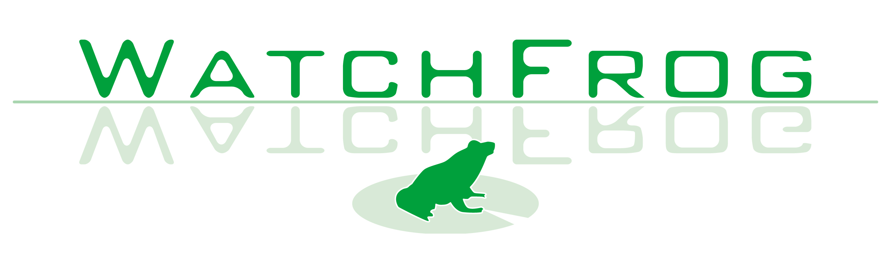
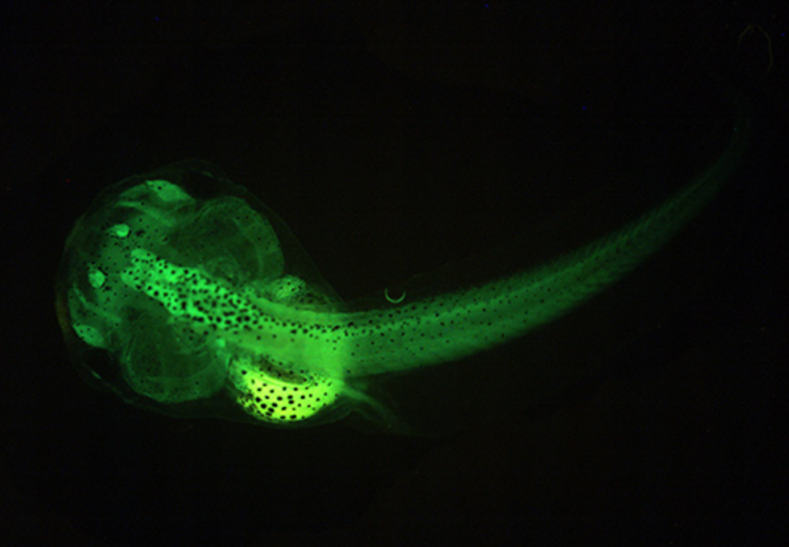
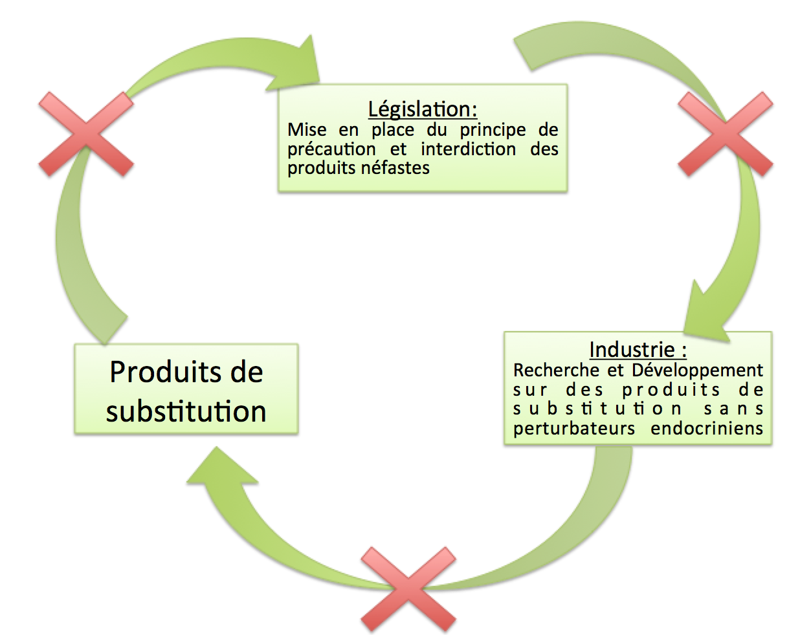
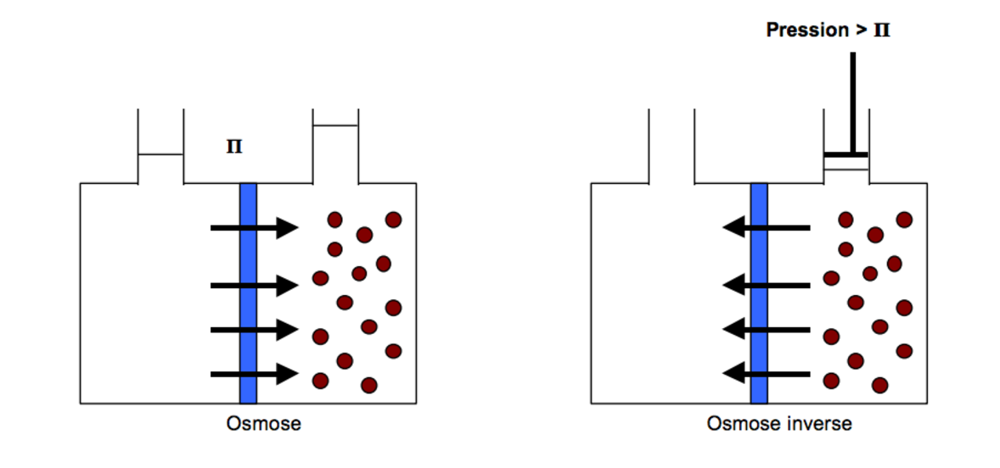
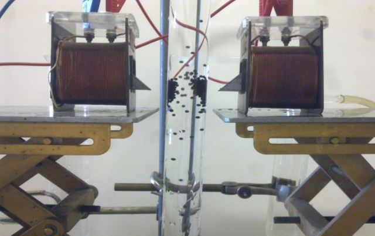

<html>
<head>

</head>

<body style="background-color:rgb(139, 201, 222);">
  
  <article class="article">
  <h1>Peut-on réellement s'en passer? </h1>
  
  <h2>Comment les détecter? </h2>
  
  
  Un des premiers combats des parties prenantes au sujet face à la présence grandissante des perturbateurs endocriniens dans notre vie quotidienne est de pouvoir les détecter.
  
  

WatchFrog: La biologie au service de la détection des perturbateurs endocriniens

 

En 2006, deux chercheurs du CNRS (Barbara Demeneix et Grégory Lemkine) créent une méthode unique et innovante pour détecter les perturbateurs endocriniens et fondent une start-up, WatchFrog. L’idée est d’utiliser des larves d’amphibiens qui deviennent fluorescentes en présence de micropolluants. Le laboratoire utilise en effet des larves et des alevins au stade ‘post-oeuf’ dotés de bio-marqueurs qui s’allument au contact de perturbateurs endocriniens. Cette technique permet de plus de déterminer l’effet indésirable d’un ‘cocktail’ de différentes molécules. 

 
Le laboratoire teste les échantillons envoyés par les entreprises et analyse le produit afin de déterminer s’il présente des perturbateurs endocriniens et si leur dose est réellement problématique et néfaste pour l’homme. Cette méthode est utilisée pour analyser l’eau mais également les aliments, les produits cosmétiques et les emballages. 

L’entreprise travaille maintenant en partenariat avec Véolia, et a mis sur le marché une FrogBox : une boîte avec des têtards directement utilisable par le client. En effet, Bruno Tisserand (Veolia) déplorait lors d’un colloque Adebiotech en 2014 le manque d’outils pour la mise en évidence des risques potentiels des perturbateurs endocriniens. 

<a href="http://www.watchfrog.fr/">Site Watchfrog </a> 

 <a href="http://eur-lex.europa.eu/resource.html?uri=cellar:5c835afb-2ec6-4577-bdf8-756d3d694eeb.0001.02/DOC_1&format=PDF">Directive européenne 2000/60/CE:  </a> 

<h2>Peut-on remplacer les perturbateurs endocriniens ?  </h2>

 Certaines molécules ont des propriétés particulières et essentielles, qui sont devenues essentielles dans notre vie quotidienne. Par exemple, le Bisphénol A était principalement présents dans les contenants alimentaires. Suite à son interdiction, il a bien fallu le remplacer par une autre molécule. Les scientifiques sont donc à la recherche de substituts aux mêmes propriétés. 

<U>
→Une alternative aux phtalates:  </U>

Les phtalates sont un groupe de produits chimiques, ajoutés aux matières plastiques pour les rendre plus souples, flexibles et résistantes. Ils sont essentiels à la fabrication des bottes et des textiles imperméables par exemple.
Des expériences sur les animaux ont prouvé que les phtalates en concentration élevés conduisent à une baisse de la fertilité, à une atrophie testiculaire ou encore à une réduction du poids du fœtus.
Depuis 2005, l’ADEME (Agence de l’Environnement et de la Maîtrise de l’Energie) finance un programme de recherches sur les alternatives possibles aux phtalates. Cependant, la plupart des produits trouvés n’ont pas les mêmes performances économiques et technologiques. Des start-ups biotechnologiques comme Novance, Roquette ou Danisco proposent des alternatives végétales qui pour l’instant semblent remplir les caractéristiques souhaitées. 

Certaines industries ne préfèrent pas attendre une réglementation plus stricte de l’UE et se tournent dès maintenant vers la production et la vente de produits sans perturbateurs endocriniens. Ils basent leur stratégie marketing sur la dangerosité des phtalates, comme le montre la vidéo ci-dessous sur l’entreprise ayant lancé il y a peu une gamme de vaisselle jetable biodégradable en bambou ou en pulpe de canne à sucre.  

<iframe width="544" height="306" src="//embedftv-a.akamaihd.net/aae7c4daf3395f1ec02caf23135ffd8f" frameborder="0" scrolling="no" allowfullscreen></iframe> <a href="http://www.francetvinfo.fr/france/vaisselle-jetable-quelles-solutions-pour-remplacer-le-plastique_1836841.html" target="_blank">Vaisselle jetable : quelles solutions pour remplacer le plastique ?</a>

<U>
→Une alternative aux parabènes  </U>

 Les propriétés antibactérienne et antifongique du parabène en font un conservateur idéal pour les produits cosmétiques, les aliments et les médicaments. En 2010, leur utilisation est controversée : ils activent les récepteurs des oestrogènes, et agissent possiblement sur la fertilité et les tumeurs comme le cancer du sein. Le benzyl alcool DHA aussi appelé Cosgard ou Geogard 221 est un produit de substitution couramment utilisé. Il est certifié “écologiquement correcte” selon les normes de l’UE. 

<a href="http://www.consoglobe.com/geogard-221-alternative-aux-parabens-cg ">Plus d'informations sur ce lien.</a> 

Aujourd’hui, les associations de consommateurs constatent qu’il n’existe pas suffisamment de recherches sur les produits de substitution et que la plupart de ceux qui existent sont souvent aussi dangereux que les produits de base.  
Mais, tant qu’il n’existe pas de produits de substitution satisfaisant, il est très dur d’invoquer le principe de précaution et d’interdire les produits dangereux car cela entraînerait des répercussions économiques. En parallèle, tant qu’il n’y a pas de réglementation stricte, les industriels rechignent souvent à investir dans le secteur Recherche et Développement pour rechercher des substituts car cela est très coûteux. 

<h2>Peut-on les supprimer ?   </h2>

 
	Si on ne peut pas empêcher la production de certains perturbateurs endocriniens à cause d’un manque de réglementation, on peut se demander s’il est possible de les supprimer après leur production.
Aujourd’hui, il existe de nombreuses méthodes pour éliminer les perturbateurs endocriniens contenus dans l’eau. Philippe Bréant, directeur du programme Eau Potable à Veolia expliquait dans une conférence en janvier 2012 les différentes méthodes. 

Au sein de l’Union Européenne, seule une partie des produits chimiques est actuellement contrôlée mais la législation s’intensifie d’années en années. 
L’épuration de l’eau se termine par la filtration, qui permet de supprimer la plupart des perturbateurs endocriniens. Trois matériaux sont fréquemment utilisés : le sable, l’anthracite et le charbon actif. La filtration se fait de plus en plus au moyen de membranes, une technique plus efficace mais également plus onéreuse. Les membranes sont utilisées pour réaliser une osmose inverse. 

 <strong>Explication de l’osmose : </strong>   Supposons qu’une membrane fine et semi-perméable sépare deux liquides. Les concentrations des deux solutions ne sont pas identiques de chaque côté de la paroi, créant ainsi une pression osmotique.  On observe alors un transfert de solvant de la solution la moins concentrée vers la solution la plus concentrée. La membrane va laisser passer le solvant pour équilibrer les concentrations.   L’osmose inverse consiste à inverser le passage du solvant en appliquant une pression supérieure à la pression osmotique du côté de la solution à traiter, c’est à dire, dans notre cas, l’eau brute. Cette technique permet de contenir les polluants (perturbateurs endocriniens) à l'extérieur de la paroi (à droite sur le schéma de droite ci-dessous) et d’obtenir une eau filtrée à gauche. 

 De nombreuses chimistes travaillent aujourd’hui sur des solutions de traitement de l’eau plus rapides et efficaces. Nous avons rencontré Agnès Bée, directrice adjointe de l’UFR de Chimie de l’Université Pierre et Marie Curie, qui nous a présenté un prototype original afin d’éliminer les perturbateurs endocriniens de notre eau. Elle a notamment supervisé la thèse de Layala Obeid, sur cette nouvelle méthode qui utilise des nouveaux matériaux magnétiques appelés “magsorbants” pour extraire les polluants. 

<a href="http://www.fndae.fr/documentation/PDF/fndae14.pdf ">Lien vers la thèse de Layala Obeid</a> 
  

 <strong>Explication des magsorbants </strong>   Les “magsorbants” sont des billes magnétiques de taille millimétrique constituées d’alginate et de chitosane (bio-polymères végétales et de faibles coûts) dans lesquelles sont encapsulées des nanoparticules magnétiques.
Ces polymères ont des propriétés absorbantes et permettent de capter les différents polluants présents dans l’eau. Les billes étant magnétiques, elles peuvent être retirées du milieu à dépolluer très facilement au moyen d’un gradient de champ magnétique (ou plus simplement d’un aimant).
 

   
 

  </article>
  </body>
  <html>
